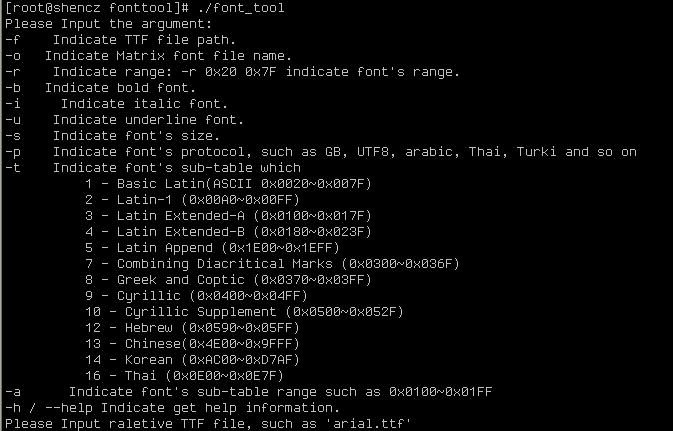
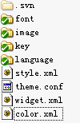
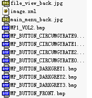

# 丰富的组件支持

能支持包括button、edit和combobox等控制组件和listview、box以及window等容器组件支持。

从使用分类还能支持text、image等这种不可聚焦组件支持，也可以支持包括button、notepad等可聚焦组件支持。

所有组件属性均能在XML或者JSON脚本中描述。

所有组件具体介绍见下一章组件介绍部分。

# 可裁减点阵字库及矢量字库支持


## 字库工具使用
用户可根据方案情况自行选择使用矢量字库或者点阵字库，使用点阵字库可以不将所有UNCODE编码的文字全部放入 而只使用需要的字库编码，同样的GB-2312字库也可以考虑方案的具体情况裁减掉三级字库。以UNICODE标准为例， 用户可根据方案和市场情况选择点阵字库支持。

命令行的点阵字库生成工具使用如下：



所有的点阵字库都是由相应的矢量字库\*.ttf文件生成的，第一个-f选项后面跟着对应的ttf文件名，以arial.ttf为例。输出文件名跟在-o选项后面，文件名不能中间带有空格字符，文件名小于10个字符。生成的字库必须从对应的ttf文件中选择对应的字库范围，比如0x20到0xFFFF就在-r选项后面选”0x20 0xFFFF”。矢量字库是支持文字的加粗、斜体和下划线特效的，其中-b、-i、-u选项分别表示加粗、斜体和下划线特效。正如选择字体一样，要选择字体的字号，-s表示字体的字号，其中不同字体， 不同字号生成的点阵宽高是不同的 。根据方案应用，有UTF8表示和GB2312表示的文字取字方式，两者不兼容，其中-p选项可选择GB2312或UTF8，其中arabic和UTF8是一样的，只是增加了阿拉伯字符集。由于各个方案所需要选择的子字符集是不一样的，工具设计了一些常用的字符集供选择，只需要在-t选项后输入相应的标号即可。另外，为了满足某些小语种需求，-a选项后跟子字符集区域使用”~”连接，如：老挝文，0x0E80~0x0EFF，具体参见编码范围表。

|   编码范围      |            字符集                            |
| ----------------|     ---------------------------              |
|【0020-007F】    |   Basic Latin 基本拉丁字母                   |
|【00A0-00FF】    |   Latin-1 Supplement 拉丁字母补充-1          |
|【0100-017F】|Latin Extended-A 拉丁字母扩充-A |
|【0180-023F】| Latin Extended-B 拉丁字母扩充-B |
|【0250-02AF】| IPA Extensions 国际音标扩充 |
|【02B0-02EF】| Spacing Modifier Letters 进格修饰字符 |
|【0300-036F】|Combining Diacritical Marks 组合音标附加符号 |
|【0370-03FF】| Greek and Coptic 希腊字母 |
|【0400-04FF】| Cyrillic 西里尔字母 |
|【0500-052F】| Cyrillic Supplement 西里尔字母补充 |
|【0530-058F】| Armenian 亚美尼亚文 |
|【0590-05FF】| Hebrew 希伯来文 |
|【0600-06FF】| Arabic 基本阿拉伯文 |
|【0700-074F】| Syriac 叙利亚文 |
|【0750-077F】| Arabic Supplement 阿拉伯文补充 |
|【0780-07BF】| Thaana 塔纳文 |
|【07C0-07FF】| N’Ko |
|【0900-097F】| Devanagari 天城体梵文字母 |
|【0980-09FF】|Bengali 孟加拉国文 |
|【0A00-0A7F】| Gurmukhi 古尔穆基文 |
|【0A80-0AFF】| Gujarati 古吉拉特文 |
|【0B00-0B7F】| Oriya 奥里亚文 |
|【0B80-0BFF】| Tamil 泰米尔文 |
|【0C00-0C7F】| Telugu 泰卢固文 |
|【0C80-0CFF】| Kannada 卡纳达文 |
|【0D00-0D7F】| Malayalam 马拉亚拉姆文 |
|【0D80-0DFF】| Sinhala 僧伽罗文 |
|【0E00-0E7F】| Thai 泰文 |
|【0E80-0EFF】| Lao 老挝文；寮国文 |
|【0F00-0FFF】| Tibetan 藏文 |
|【1000-109F】| Myanmar 缅甸文 |
|【10A0-10FF】| Georgian 格鲁吉亚文 |
|【1100-11FF】| Hangul Jamo 谚文字母 |
|【1200-137F】| Ethiopic 埃塞俄比亚文 |
|【1380-139F】| Ethiopic Supplement 埃塞俄比亚文补充 |
|【13A0-13FF】| Cherokee 切罗基文 |
|【1400-167F】| Unified Canadian Aboriginal Syllabics 加拿大土著统一音节文字 |
|【1680-169F】| Ogham 欧甘文 |
|【16A0-16FF】| Runic 北欧古文 |
|【1700-171F】| Tagalog 他加禄文 |
|【1720-173F】| Hanunoo 哈努诺文 |
|【1740-175F】| Buhid 布什德文 |
|【1760-177F】| Tagbanwa 塔格巴努亚文 |
|【1780-17FF】| Khmer 高棉文 |
|【1800-18AF】| Mongolian 蒙古文 |
|【1900-194F】| Limbu 林布文 |
|【1950-197F】| Tai Le 傣哪文；德宏傣文 |
|【1980-19DF】| New Tai Lue 新傣仂文 |
|【19E0-19FF】| Khmer Symbols 高棉符号 |
|【1A00-1A1F】| Buginese 布吉文 |
|【1B00-1B7F】| Balinese 巴利文 |
|【1D00-1D7F】| Phonetic Extensions 音标扩充 |
|【1D80-1DBF】| Phonetic Extensions Supplement 音标扩充补充 |
|【1DC0-1DFF】| Combining Diacritical Marks Supplement 组合音标附加符号 |
|【1E00-1EFF】| Latin Extended Additional 拉丁字母扩充附加 |
|【1F00-1FFF】| Greek Extended 希腊文扩充 |
|【2000-206F】| General Punctuation 一般标点符号 |
|【2070-209F】| Superscripts and Subscripts 下标及上标 |
|【20A0-20CF】| Currency Symbols 货币符号 |
|【20D0-20FF】| Combining Diacritical Marks for Symbols 符号用组合附加符号 |
|【2100-214F】| Letterlike Symbols 似字母符号 |
|【2150-218F】| Number Forms 数字形式 |
|【2190-21FF】| Arrows 箭头符号 |
|【2200-22FF】| Mathematical Operators 数学运算符号 |
|【2300-23FF】| Miscellaneous Technical 混合专门符号 |
|【2400-243F】| Control Pictures 控制图像 |
|【2440-245F】| Optical Character Recognition 光学字符识别 |
|【2460-24FF】| Enclosed Alphanumerics 括号字母数字 |
|【2500-257F】| Box Drawing 制表符 |
|【2580-259F】| Block Elements 区块组件 |
|【25A0-25FF】| Geometric Shapes 几何形状 |
|【2600-26FF】| Miscellaneous Symbols 混合什锦符号 |
|【2700-27BF】| Dingbats 什锦符号 |
|【27C0-27EF】| Miscellaneous Mathematical Symbols-A 混合数学符号-A |
|【27F0-27FF】| Supplemental Arrows-A 补充性箭头符号-A |
|【2800-28FF】| Braille Patterns 盲文；盲人点字 |
|【2900-297F】| Supplemental Arrows-B 补充性箭头符号-B |
|【2980-29FF】| Miscellaneous Mathematical Symbols-B 混合数学符号-B |
|【2A00-2AFF】| Supplemental Mathematical Operators 补充性数学运算符号 |
|【2B00-2BFF】| Miscellaneous Symbols and Arrows 混合什锦符号和箭头符号 |
|【2C00-2C5F】| Glagolitic 格拉戈尔字母 |
|【2C60-2C7F】| Latin Extended-C 拉丁字母扩充-C |
|【2C80-2CFF】| Coptic 科普特文 |
|【2D00-2D2F】| Georgian Supplement 格鲁吉亚文补充 |
|【2D30-2D7F】| Tifinagh 提非纳格字母 |
|【2D80-2DDF】| Ethiopic Extended 埃塞俄比亚文扩充 |
|【2E00-2E7F】| Supplemental Punctuation 补充性标点符号 |
|【2E80-2EFF】| CJK Radicals Supplement 中日韩部首补充 |
|【2F00-2FDF】| Kangxi Radicals 康熙部首 |
|【2FF0-2FFF】| Ideographic Description Characters 汉字结构描述字符 |
|【3000-303F】| CJK Symbols and Punctuation 中日韩符号和标点 |
|【3040-309F】| Hiragana 平假名 |
|【30A0-30FF】| Katakana 片假名 |
|【3100-312F】| Bopomofo 注音符号 |
|【3130-318F】| Hangul Compatibility Jamo 谚文兼容字母 |
|【3190-319F】| Kanbun 汉文标注号 |
|【31A0-31BF】| Bopomofo Extended 注音符号扩充 |
|【31C0-31EF】| CJK Strokes 中日韩笔画部件 |
|【31F0-31FF】| Katakana Phonetic Extensions 片假名音标扩充 |
|【3200-32FF】| Enclosed CJK Letters and Months 中日韩括号字母及月份 |
|【3300-33FF】| CJK Compatibility 中日韩兼容字符 |
|【3400-4DBF】| CJK Unified Ideographs Extension A 中日韩统一表意文字扩充A |
|【4DC0-4DFF】| Yijing Hexagram Symbols 易经六十四卦象 |
|【4E00-9FFF】| CJK Unified Ideographs 中日韩统一表意文字 |
|【A000-A48F】| Yi Syllables 彝文音节 |
|【A490-A4CF】| Yi Radicals 彝文字母 |
|【A700-A71F】| Modifier Tone Letters 声调符号 |
|【A720-A7FF】| Latin Extended-D 拉丁字母扩充-D |
|【A800-A82F】| Syloti Nagri |
|【A840-A87F】| Phags-pa 八思巴字母 |
|【AC00-D7AF】| Hangul Syllables 谚文音节 |
|【D800-DB7F】| High Surrogates 高半代用区 |
|【DB80-DBFF】| High Private Use Surrogates 高半专用代用区 |
|【DC00-DFFF】| Low Surrogates 低半代用区 |
|【E000-F8FF】| Private Use Area 专用区 |
|【F900-FAFF】| CJK Compatibility Ideographs 中日韩兼容表意文字 |
|【FB00-FB4F】| Alphabetic Presentation Forms 字母变体显现形式 |
|【FB50-FDFF】| Arabic Presentation Forms-A 阿拉伯文变体显现形式-A |
|【FE00-FE0F】| Variation Selectors 字型变换选取器 |
|【FE10-FE1F】| Vertical Forms 竖式标点 |
|【FE20-FE2F】| Combining HalF】 Marks 组合半角标示 |
|【FE30-FE4F】| CJK Compatibility Forms 中日韩相容形式 |
|【FE50-FE6F】| Small Form Variants 小写变体 |
|【FE70-FEFF】| Arabic Presentation Forms-B 阿拉伯文变体显现形式-B |
|【FF00-FFEF】| Halfwidth and Fullwidth Forms 半角及全角字符 |
|【FFF0-FFFF】| Specials 特殊区域 |
|【10000-1007F】  | Linear B Syllabary 线形文字B音节文字 |
|【10080-100FF】  | Linear B Ideograms 线形文字B表意文字 |
|【10100-1013F】  | Aegean Numbers 爱琴数字 |
|【10140-1018F】  | Ancient Greek Numbers 古希腊数字 |
|【10300-1032F】  | Old Italic 古意大利文 |
|【10330-1034F】  | Gothic 哥特文 |
|【10380-1039F】  | Ugaritic 乌加里特楔形文字 |
|【103A0-103DF】  | Old Persian 古波斯文 |
|【10400-1044F】  | Deseret 犹他大学音标 |
|【10450-1047F】  | Shavian 肃伯纳字母 |
|【10480-104AF】  | Osmanya |
|【10800-1083F】  | Cypriot Syllabary 塞浦路斯音节文字 |
|【10900-1091F】  | Phoenician 腓尼基字母 |
|【10A00-10A5F】  | Kharoshthi 佉卢字母 |
|【12000-123FF】  | Cuneiform 楔形文字 |
|【12400-1247F】  | Cuneiform Numbers and Punctuation 楔形文字数字及标点 |
|【1D000-1D0FF】  | Byzantine Musical Symbols 东正教音乐符号 |
|【1D100-1D1FF】  | Musical Symbols 音乐符号 |
|【1D200-1D24F】  | Ancient Greek Musical Notation 古希腊音乐谱记号 |
|【1D300-1D35F】  |  Tai Xuan Jing Symbols 太玄经符号 |
|【1D360-1D37F】  |  Counting Rod Numerals 算筹记数式 |
|【1D400-1D7FF】  |  Mathematical Alphanumeric Symbols 数学用字母数字符号 |
|【20000-2A6DF】  |  CJK Unified Ideographs Extension B 中日韩统一表意文字扩充B |
|【2F800-2FA1F】  |  CJK Compatibility Ideographs Supplement 中日韩兼容表意文字补充 |
|【E0000-E007F】  | Tags 语言编码卷标 |
|【E0100-E01EF】  | Variation Selectors Supplement 字型变换选取器补充 |
|【FFF80-FFFFF】  | Supplementary Private Use Area-A 补充专用区-A |
|【10FF80-10FFFF】| Supplementary Private Use Area-B 补充专用区-B |

## DVB标准支持的字符集标准

为支持DVB方案，从SDT和EIT中解出的部分信息采用ISO/IEC 8859标准，点阵字库也可以根据方案需求配置ISO/IEC 8859字库工具使用

ISO/IEC 8859-1Latin alphabet No. 1

ISO/IEC 8859-2Latin alphabet No. 2

ISO/IEC 8859-3Latin alphabet No. 3

ISO/IEC 8859-4Latin alphabet No. 4

ISO/IEC 8859-9Latin alphabet No. 5

ISO/IEC 8859-10Latin alphabet No. 6

ISO/IEC 8859-13Latin alphabet No. 7 (Baltic Rim)

ISO/IEC 8859-14Latin alphabet No. 8 (Celtic)

ISO/IEC 8859-15Latin alphabet No. 9

ISO/IEC 8859-16Latin alphabet No. 10

|    Language       |      Covered by alphabet(s)          |
|  ---------------  |   -----------------------            |
|Albanian           |   1 2 5 8 9 10                       |
|Basque             |   1 5 8 9                            |
|Breton             |   1 5 8 9                            |
|Catalan            |   1 5 8 9                            |
|Cornish            |   1 5 8                              |
|Croatian           |   2 1 0                              |
|Czech              |   2                                  |
|Danish             |   1 4 5 6 8 9                        |
|Dutch              |   1 5 9                              |
|English            |   1 2 3 4 5 6 7 8 9 10               |
|Esperanto          |   3                                  |
|Estonian           |   4 6 7 9                            |
|Faroese            |   1 6 9                              |
|Finnish            |   1 4 (5) 6 7 (8) 9 10               |
|French             |   1 3 5 8 9 10                       |
|Frisian            |   1 5 9                              |
|Galician           |   1 5 8 9                            |
|German             |   1 2 3 4 5 6 8 9 10                 |
|Greenlandic        |   1 4 5 6 8 9                        |
|Hungarian          |   2 10                               |
|Icelandic          |   1 6 9                              |
|Irish Gaelic       |   1 5 6 8 9 10                       |
|(new orthography)  |  |
|Irish Gaelic       |   8                                  |
|(old orthography)  |  |
|Italian            |   1 3 5 8 9 10                       |
|Latin              |   1 2 3 4 5 6 7 8 9 10               |
|Latvian            |   4 7                                |
|Lithuanian         |   4 6 7                              |
|Luxemburgis        |   1 5 8 9                            |
|Maltese            |   3                                  |
|Manx Gaelic        |   8                                  |
|Norwegian          |   1 4 5 6 7 8 9                      |
|Polish             |   2 7 10                             |
|Portuguese         |   1 3 5 8 9                          |
|Rhaeto-Romanic     |   1 5 8 9                            |
|Romanian           |   2 10                               |
|Scottish Gaelic    |   1 5 8 9                            |
|Slovak             |   2                                  |
|Slovenian          |   2 4 6 10                           |
|Sorbian            |   2                                  |
|Spanish            |   1 5 8 9                            |
|Swedish            |   1 4 5 6 8 9                        |
|Turkish            |   3 5                                |
|Welsh              |   8                                  |
|Cyrillic           |   ISO/IEC 8859-5                     |
|Arabic             |   ISO/IEC 8859-6                     |
|Greek              |   ISO/IEC 8859-7                     |
|Hebrew             |   ISO/IEC 8859-8                     |

**带”()”说明此字符集字库不能完全支持此种语言。**

# 支持与应用业务逻辑独立的XML脚本支持

XML作为一种通用的，可扩展的描述型语言已被广泛使用。XML语言描述同样适用于GUI的设计。

GUI的XML描述很简单，采用”<属性>描述</属性>”的描述方式来描述某一组件的某一属性。

在GXGUI中一个主题包如下：




## theme.xml详解

theme.xml(部分方案使用theme.conf): 描述了主要的配置文件及其路径, 以及GA开关、双缓冲和抗闪烁滤波开关，其中双缓冲消耗和当前屏幕同样大小的buffer，主要应用于高清且内存紧张的方案。

````xml

<?xml version="1.0" encoding="GB2312" standalone="no"?>
<config>
        <file_keymap>key/keymap_abs-s.xml</file_keymap>
        <file_widget>widget.xml</file_widget>
        <file_style>style.xml</file_style>
        <file_i18n>language/i18n.xml</file_i18n>
        <file_image>image/image.xml</file_image>
        <file_font>font/font.xml</file_font>

        <ga>enable</ga>
        <antiflicker>enable</antiflicker>
        <double_buffer>enable</double_buffer>
</config>

````

## widget.xml详解

````xml

<?xml version="1.0" encoding="GB2312" standalone="no"?>
<interface>
  <width>1280</width>
  <height>720</height>
  <bpp>16</bpp>
  <osd_trans>#00FF00</osd_trans>
  <gui_trans>#FF00FF</gui_trans>
  <osd_alpha_global>#0000C0</osd_alpha_global>
  <osd_alpha_color color="#CECECE">#0000FF</osd_alpha_color>
  <osd_alpha_color color="#909092">#0000FF</osd_alpha_color>
  <osd_alpha_color color="#F39A1D">#0000FF</osd_alpha_color>
  <osd_alpha_color color="#010101">#0000FF</osd_alpha_color>
  <osd_alpha_color color="#16A2C6">#0000FF</osd_alpha_color>
  <osd_alpha_color color="#A8CA08">#0000FF</osd_alpha_color>
  <osd_alpha_color color="#F4F4F4">#0000F0</osd_alpha_color>
  <osd_alpha_color color="#54585F">#0000EE</osd_alpha_color>
  <osd_alpha_color color="#646C74">#0000EE</osd_alpha_color>
  <osd_alpha_color color="#CBD4D7">#000050</osd_alpha_color>
  <widget class="window" style="default" name="wnd_main_menu"/>
  <widget class="window" style="default" name="wnd_full_screen"/>
</interface>

````

- XML描述了一个1280 * 720的界面；
- 方案色深16位色（一般为RGB565）；
- 其中OSD透明色为0x00FF00（VPU的Color Key, 向视频或图片层透明）；
- 其中GUI透明色为0xFF00FF（OSD内部透明）；
- 初始OSD全局透明度为0xC0（97 / (0~127)）；
- 若方案为索引色(<bpp>8</bpp>)，针对osd_alpha_color这几种颜色，固化透明度，即调整全局透明度不影响这几种颜色；
- 窗口包含wnd_main_menu窗口和wnd_full_screen，具体描述在对应的wnd_main_menu.xml、wnd_full_screen.xml。


## style.xml详解

描述了可供通用使用的风格描述，如果发现部分组件需要重新写的部分比较多，则可以保存为风格，在widget的style属性 中就可以使用通用属性名，其格式与widget相同，widget.xml的style = "default"。

## color.xml详解

为了是方案与业务逻辑分开，考虑到各方案色表、图片不同，所以为颜色创建color描述表，每个主题包可以各不相同。

````xml
<?xml version="1.0" encoding="UTF-8" standalone="yes"?>
<colors>
        <color name="red">#DCE4EC</color>
        <color name="green">#4A4C55</color>
        <color name="yellow">#e99421</color>
        <color name="white">#a6a7a7</color>
        <color name="trans">#000000</color>
</colors>

````

从这个xml描述中很好理解，颜色名和颜色值一一对应。


## font.xml详解

该文件夹中放置一个或多个点阵或矢量字库

````xml
<?xml version="1.0" encoding="GB2312" standalone="no"?>
<fonts>
        <font>
                <name>Arial</name>
                <file>Arial</file>
                <size>24</size>
        </font>
        <font>
                 <name>Black</name>
                 <file>Hei</file>
                 <size>24</size>
        </font>

        <font>
                 <name>Song</name>
                 <file>song.ttf</file>
                 <size>20</size>
        </font>
</fonts>
````

支持TTF矢量字库，还可以放入矢量字，应用视具体情况而定。在应用中操作只 需指定name就可以了。

## image.xml详解



````xml

<?xml version="1.0" encoding="ISO-8859-1" standalone="yes"?>
<images>
        <image id="MP_BUTTON_CIRCUMGYRATE180">MP_BUTTON_CIRCUMGYRATE180.bmp</image>
        <image id="MP_BUTTON_CIRCUMGYRATE270.bmp">MP_BUTTON_CIRCUMGYRATE270.bmp</image>
        <image id="file_view_back">file_view_back.jpg</image>
</images>

````

图片的ID名字可与文件名相同也可不同。

## key.xml详解

````xml
<?xml version="1.0" encoding="GB2312" standalone="no"?>
<keymap>
        <key name="GUIK_PRINT">0xbfff</key>
        <key name="GUIK_SCROLLOCK">0xcc97</key>
		<virtualkey name="GUIK_RED">0xbffd</virtualkey>
</keymap>
````
- 为了消除各方案的差异性，所有的键值都以统一的虚拟键值在GUI系统中运行，而应用 见到的全部为实际键值，这样能有效地做到应用与GUI的独立性。
- 部分方案，需要一些公共模块，这些公共模块使用了不同的键值名，比如物理键值0xbffd实际方案中命名为GUIK_M，而移植模块命名为GUIK_RED。针对这类一键二名采用了virtualkey的概念。当内部获取键值的时候，使用find_virtualkeys接口获取。

## Language详解

````xml
<?xml version="1.0" encoding="utf-8" standalone="yes"?>
<i18n>
    <language id= "English">English.xml</language>
    <language id= "Arabic">Arabic.xml</language>
    <language id= "Farsi">Farsi.xml</language>
    <language id= "French">French.xml</language>
    <language id= "Spain">Spain.xml</language>
    <language id= "Portuguese">Portuguese.xml</language>
    <language id= "Turkish">Turkish.xml</language>
    <language id= "Vietnamese">Vietnamese.xml</language>
    <language id= "Russian">Russian.xml</language>
    <language id= "German">German.xml</language>
</i18n>
````

````xml

<?xml version="1.0" encoding="utf-8" standalone="yes"?>
    <language name="German">
        <font>German</font>
	    <tran id="Factory Reset"                >Fabrik Zurücksetzen</tran>
        <tran id="System Information"                >System Information</tran>
        <tran id="Media Centre"                >Mediazentrum</tran>
    </language>

````

- 一种语言对应一个XML文件，在设置语言时采用的语言名（包括大小写）必须与XML中的完全一致；
- 每种语言的XML可以有一个font，切换语言时，是针对一些语言需要特殊字库支持的情况。

