# GUI Designer 使用指南
GUI Designer 是配合 [GxGUI](../../gxgui/index.md) 使用的界面编辑工具，输出是[主题包](../../gxgui/them.md)文件夹，内含界
面描述信息的 XML ，图标文件、字库文件等界面信息。

## 从创建一个 GUI 界面工程开始
### 前期准备
需要由美工提供该界面的基本图标元素，即图片，将 create_image.sh 脚本文件复制到图片文件目录下，并通过执行脚本生成 ID 与图
片路径对应 XML 文件，即 image.xml，该文件目录作为图标元素的导入路径。
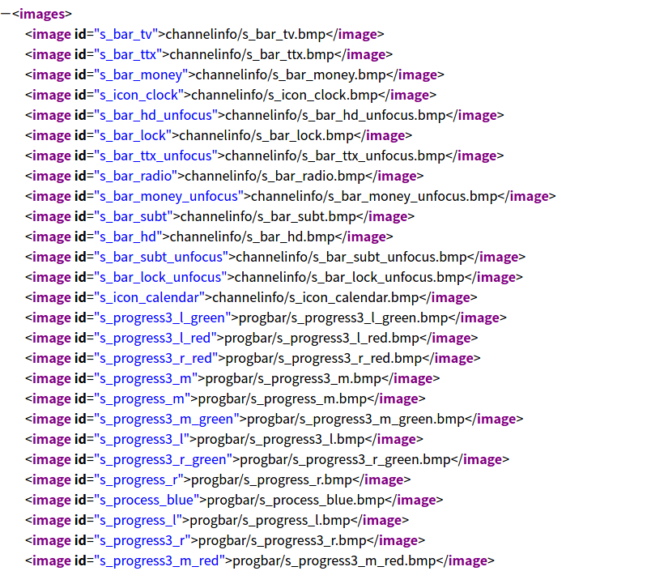

选定所需的矢量字文件（ttf 文件）或点阵字文件，其中点阵字文件通过[点阵字生成工具](../../gxgui/tools/font_tool,md)生成，并
编写字体描述（font.xml）文件（以矢量字的字体描述文件为例）：

```
<?xml version="1.0" encoding="UTF8" standalone="no"?>
<fonts>
	<font>
		<name>font_main</name>
		<file>arial.ttf</file>
		<style>bold</style>
		<size>39</size>
	</font>
	<font>
		<name>font_22</name>
		<file>arial.ttf</file>
		<size>17</size>
	</font>
	<font>
		<name>font_prog</name>
		<file>arial.ttf</file>
		<size>21</size>
	</font>
</fonts>
```
- name ：字体名，在同一工程中必须唯一。
- file ： 字体文件路径，可以是矢量字文件，也可以是点阵字文件。
- style ：提供粗体（bold）、斜体（italic）、下划线（underline）和正常（normal）字效。其中该项不设置，默认为正常（normal）。
- size ：字号，不同字体文件字号不同，如何从字号获取文字垂直像素数可见[点阵字生成工具](../../gxgui/tools/font_tool,md)。

### 生成一个空的界面工程
- 点击“文件” -> “新建主题”，即弹出界面，根据需要指定“主题包”名
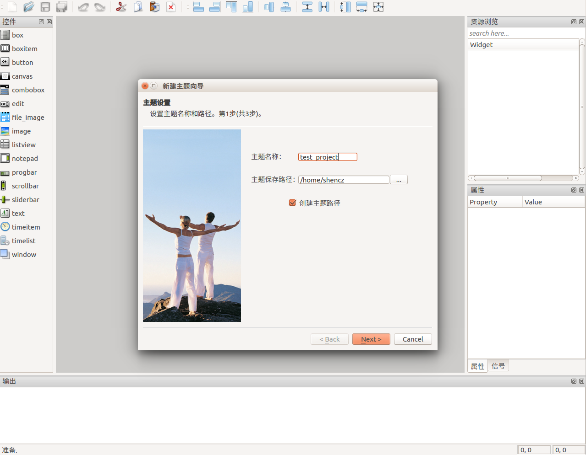
- 点击“Next” 到下一步设置，即主题基础属性的设置，主要有屏幕大小、屏幕高度、分辨率和[GUI 透明色]()、[OSD 透明色]()，工具
和 [GxGUI]() 中所有颜色都用 #RRGGBB 或 #AARRGGBB 的格式表示，既可手动编辑，也可通过 Select Color 窗口编辑：

手动编辑颜色：

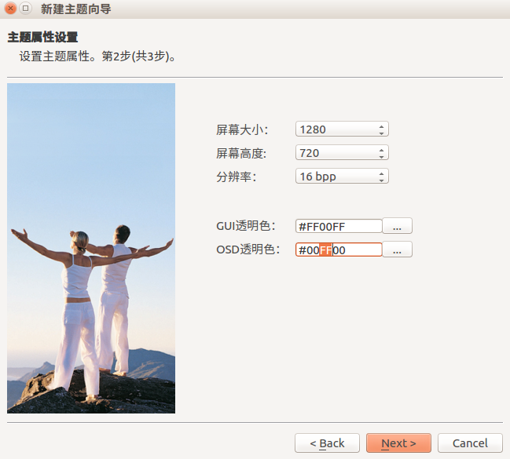


使用 Select Color 窗口编辑颜色：
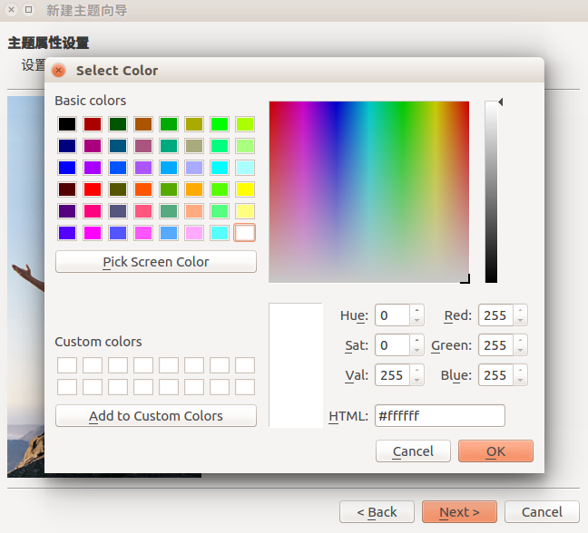

- 点击 “Next” 到下一步设置，即基本图标元素和字体元素的加载设置，选择前期准备中完成的图标元素所在的路径和字体描述文件（
font.xml 和 相应的 ttf 文件）
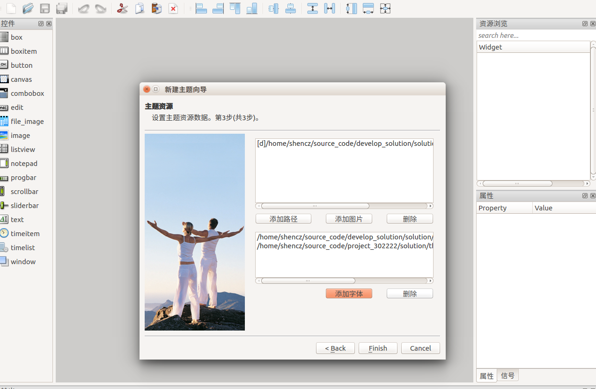
完成以上操作后，工程的基本框架就已经完成。

## 创建一个窗口
在完成以上工程基本框架的设置后，就可以创建以窗口为单位的控件群了。
- 新窗口创建基础框架（Form），单击左上角的 “新建 Form” 图标或使用 CTRL + N 快捷键，新建一个 Form 用以编辑窗口：
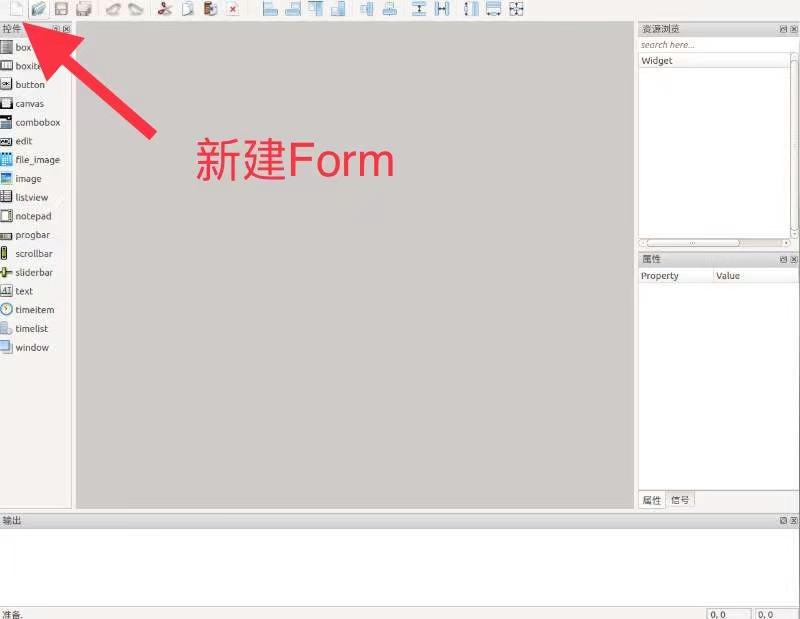
- 所有对话框都以窗口（Form）为最基础[容器组件]()，第一步都是拖曳窗口（windown）控件，并调整窗口（window）控件的位置和宽
高（一般手动在控件属性信号栏调整数值较为准确，也可以通过鼠标拖放）：
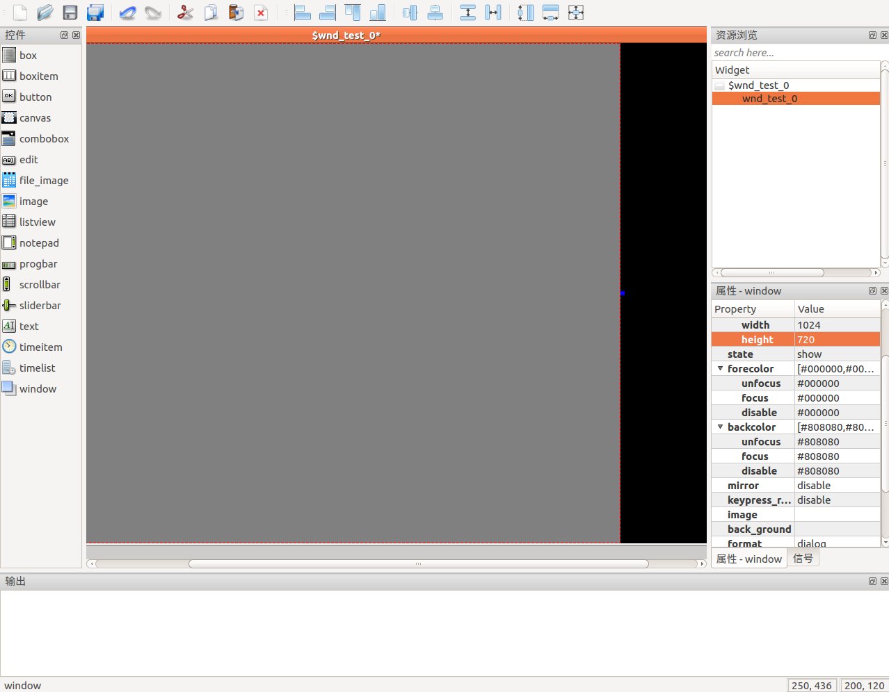
- 添加控件至当前 window 对话框，[各类组件]()按照容器、非容器方式添加包含和被包含关系。添加、删除等有效操作均会在输出框输
出
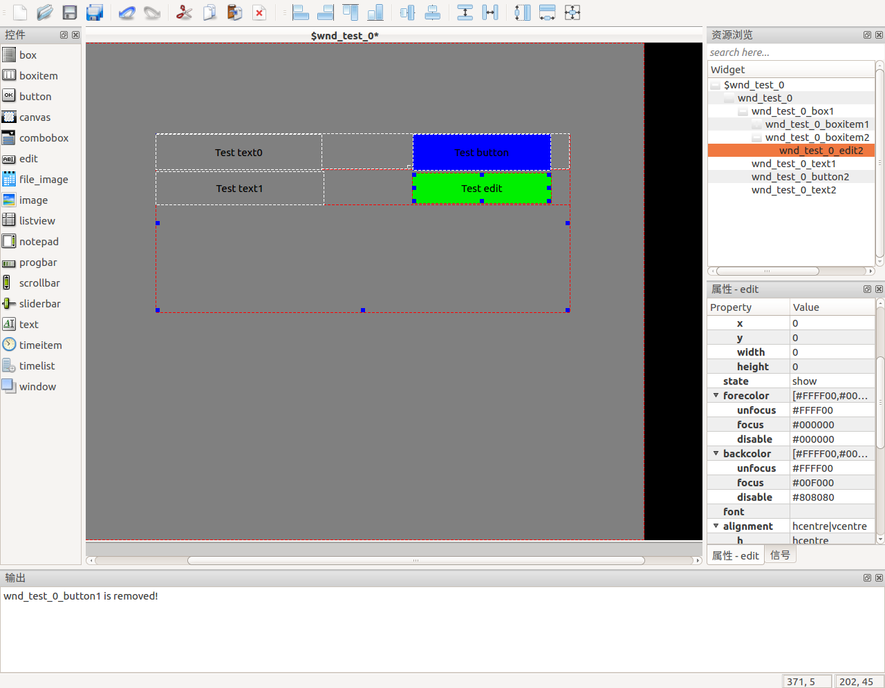
- 选择右下角的控件属性信号栏，根据实际应用需求，添加[信号]()
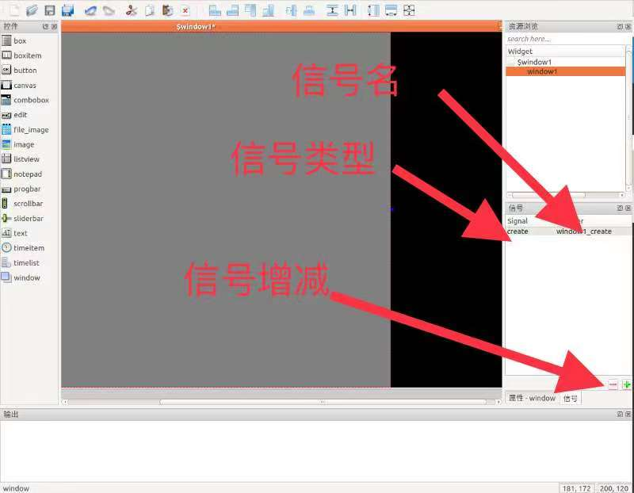
- 颜色（color.xml）管理，[目前的版本](./readme.md#修订记录)版本不能在工具中直接编辑颜色 ID 与颜色值，只能通过[手动添加]()
- 风格（style.xml）管理，[目前的版本](./readme.md#修订记录)版本不能在工具中直接编辑风格，只能通过[手动添加]()

## 调整属性、信号
经过以上对方案窗口、控件的设计，方案的界面工程基本成形，在某些应用场景下需要对某窗口的某控件属性进行修改：
- 在菜单栏或功能栏中选择打开已有方案界面工程（或使用快捷键 CTRL + O）的 theme.conf 或 theme.xml
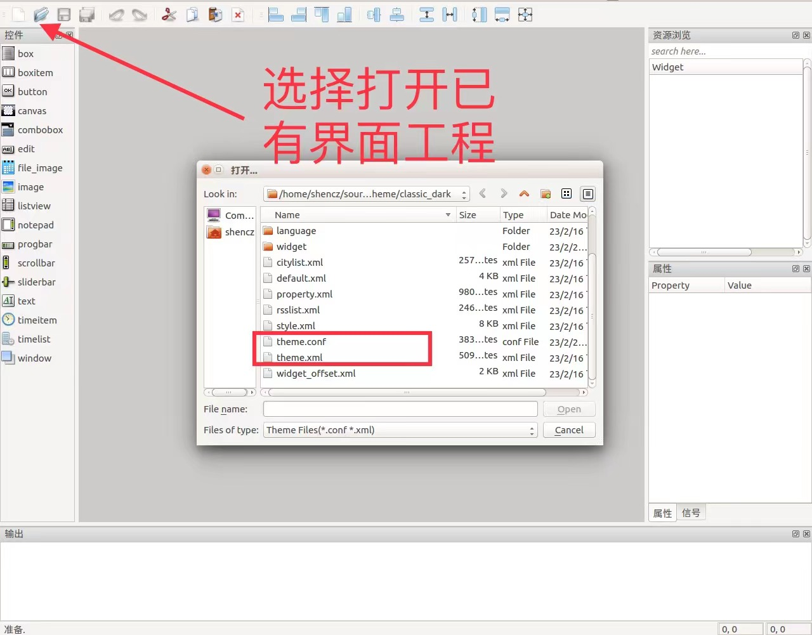
- 从资源浏览栏中，选择需要修改的控件，并在控件属性信号栏修改相应属性
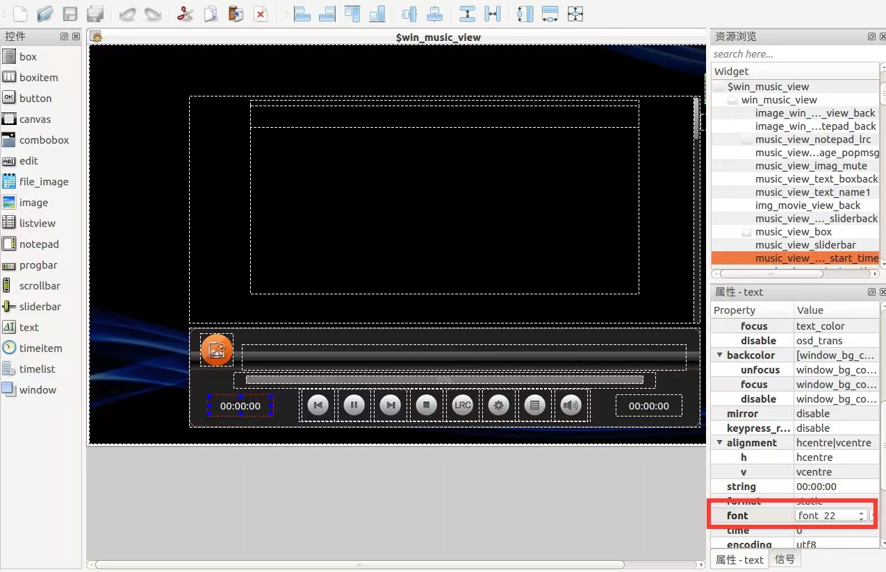
- 在属性函数名修改或增加后，需要通过控件属性信号栏进行修改
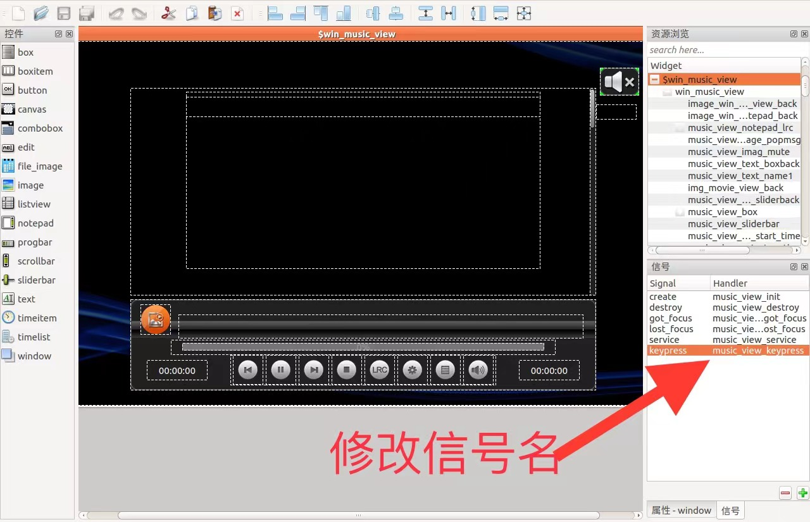
