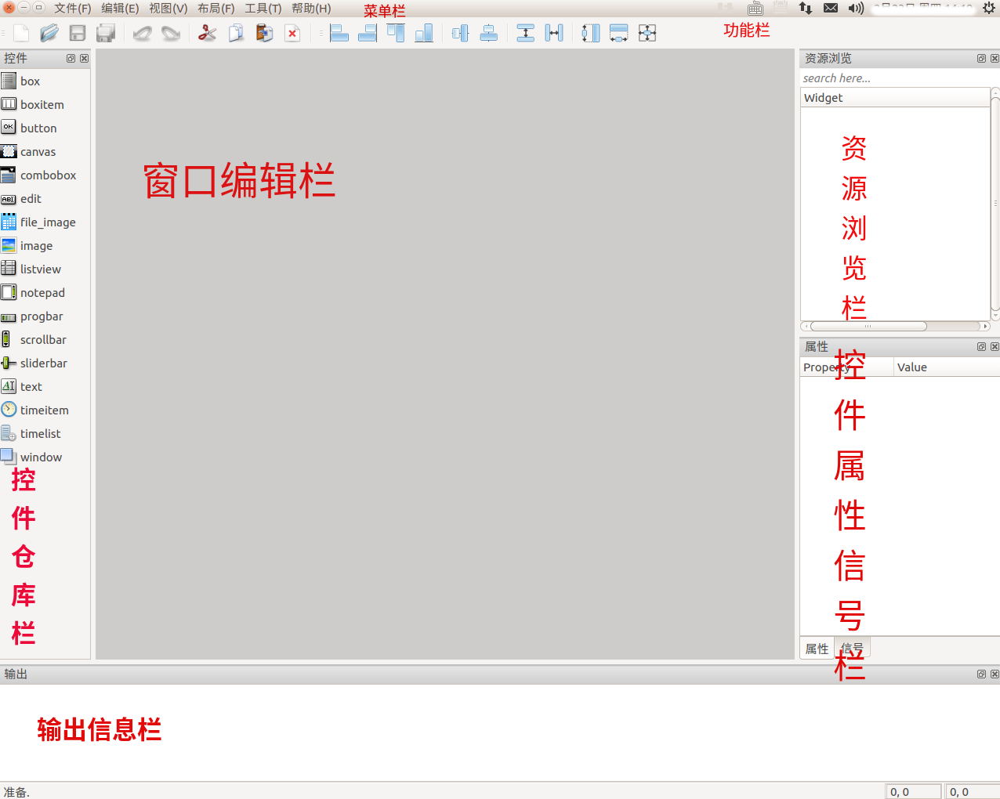

# GUI Designer 简介
GUI Designer 是由杭州杭州国芯微股份有限公司开发，为 [GoXceed 平台](../../gxddk/goxceed/index.md) 下的 [GxGUI](../../todo)
设计的，可视化界面设计和开发工具。

可通过在 Linux 的 PC 环境下执行 ./GuiDesigner.sh 或在 Windows 的 PC 环境下双击 GuiDesigner.exe 图标，打开 GUI Designer
工具：

- 菜单栏：

  【文件】子栏提供界面工程的创建、打开和保存等功能

  【编辑】子栏提供窗口编辑栏内容的复制、剪切和粘贴等功能

  【视图】子栏提供其余各窗口栏的开关功能

  【布局】子栏提供等同于功能栏中组件布局方式的功能

  【工具】子栏目前提供 RGB565 格式 BMP 和 RGB888 格式 BMP 互转的功能

  【帮助】子栏提供提供 GUI Designer 简介以及版本信息链接和详细帮助信息（链接至此文档）

- 功能栏：提供工程文件打开、保存，编辑功能的剪切、复制、粘贴以及一些其他布局和撤销、重做等常用功能
- 控件仓库栏：也称工具窗口，提供 [GxGUI 各控件图标](../../GxGUI/index.md) 供编辑界面时拖曳
- 资源浏览栏：提供各窗口下子控件的树状关系
- 控件属性信号栏：提供资源浏览栏中各组件相关属性、属性值以及信号名的可编辑信息
- 窗口编辑栏：通过从控件仓库栏拖曳组件，调整组件大小以及通过控件属性信号栏的编辑、调整属性、信号名等一系列操作，来实现窗
口的可视化编辑
- 输出信息栏：输出窗口组件编辑中的相关提示信息

