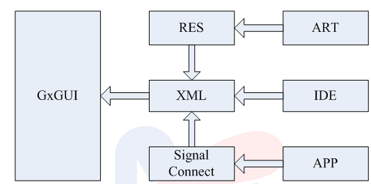
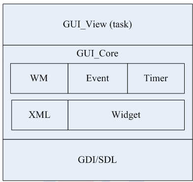

# GXGUI 子系统介绍

在GoXceed平台上，需要支持包括DVB机顶盒、IPTV机顶盒、手持设备及其他多媒体设备。所以GUI子系统在整个 平台中有着重要的地位。GXGUI系统完成了对底层图形接口的用户级抽象，即作为用户不关心矩形、点、线、字 或图这些的具体绘制单元，而只需要关心组件的功能、组件的属性、组件的操作，很好地完成了界面逻辑与具体 应用逻辑的分离，加上GXIDE的使用，使得界面的开发会更加简单、便捷。

在使用GUI作为应用方案开发时总体结构与建议分工如图所示：

由图可见整个应用开发由美工和应用开发工程师共同完成，其中美工设计整个界面的效果、布局，针对组件分割 : 图片单元，操作GXIDE来完成XML文件可以由美工来完成，作为应用工程师只关心在界面下的应用业务逻辑。

|  内部组成 |        说明        |
|-----------|--------------------|
|  ART      | 整体界面设计与切图提供   |
|  RES      | 美工开发的资源文件，包括图片、字库、字符串等。 |
|  IDE      | 可视化视图开发集成环境。生成一套主题(Theme)文件。 |
|  XML      | （Extensible Markup Language）是一种扩展性语言。IDE生成的一系列文件，包括widget.xml、style.xml、image.xml、font.xml、i18n.xml等。|
|  APP      | XML中声明的各类信号句柄。APP实现其功能，并通过信号连接函数与其绑定。 |
# GXGUI 内部结构关系

** GUI View作为服务级对GUI_Core完成调用，GUI_Core中包括: **

|  模块   |           说明           |
|---------|--------------------------|
| WM      | （Window Manage）窗体管理，包括窗体创建、关闭以及移动等一系列窗口级行为的处理 |
| Event   | GxGUI的事件机制。Event包括按键、GxBUS上的消息、鼠标等 |
| Timer   | GxGUI的定时器 |
| XML     | XML的解析和管理部分 |
| Widget  | GxGUI各个控件的具体实现 |
| Widget_Xml | GUI Designer工具所需XML |

在整个GUI动态运行的单位时间内都只有一个焦点窗口，单个焦点窗口只有单个焦点组件。

