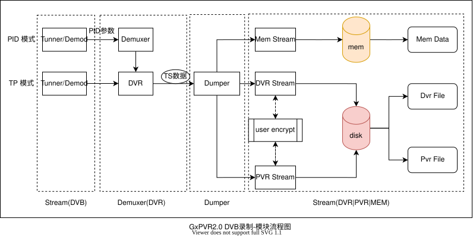
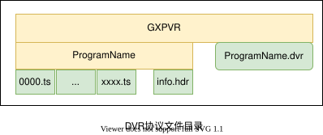
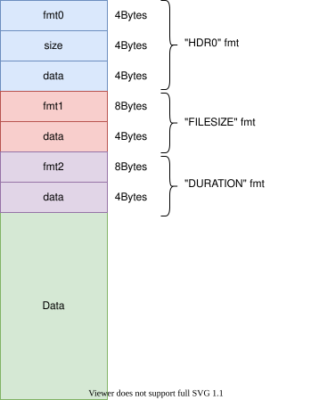
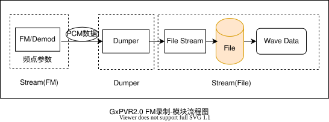
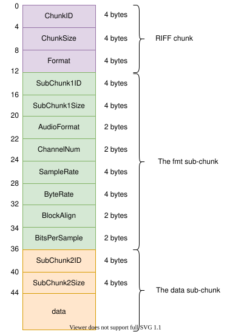
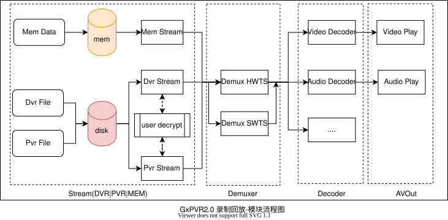

## 录制基础
- 录制功能使用说明,参考[录制功能](../gxplayer/feature/2-1.录制.md#录制功能)

### 背景知识
- 国芯微播放器实现录制功能的一般性流程:
	- 
	- Source Stream: 原始数据获取.
	- Demuxer: 原始数据解复用成中间数据,可以是TS,PES,ES数据等.
	- Muxer:中间数据混合成目标数据.
	- Sink Stream: 目标数据的存储.
- 根据录制节目来源可以分为:
	- DVB录制: 支持DVB-S/S2,DVB-T/T2,DVB-C等协议,其录制的数据为TS格式.
	- FM 录制: 支持FM数据的录制,其录制的数据为WAV格式.
	- NET录制: 不支持.
- 根据录制节目储存形式可以分为:
	- FILE储存:
		- 存放节目数据的协议,可分为:
			- 分卷录制(DVR): 文件后缀为".dvr".
			- 分段录制(PVR): 文件后缀为".pvr".
	- MEM 储存: 支持mem协议储存.
- 国芯微播放器支持录制功能,分成以下内容讲述:
	- DVB录制,包括:
		- 分卷录制(DVR).
		- 分段录制(PVR).
		- 内存录制(MEM).
	- FM 录制.

### DVB录制
- DVB录制-模块流程图
	- 
	- DVB录制-模块说明:
		- Source Stream - Stream(DVB): 锁频控制等.
		- Demuxer - Demuxer(DVR): 录制参数配置(TP或者pid)等,输出为TS格式数据.
		- Muxer - Dumper: TS格式数据读写控制等.
		- Sink Stream - Stream (DVR|PVR|MEM): TS格式数据的分段|分卷|内存储存,用户加密等.
- DVB录制-安全录制与非安全录制:
	- 安全录制: 从 Demuxer(DVR)模块读取TS数据被加密,无法读取正确TS数据,目的是为了防止节目内容泄露.
	- 非安全录制: 从 Demuxer(DVR)模块读取TS数据是正确TS数据,可以被其他设备播放.
	- 安全录制与非安全录制: 由芯片决定,具体是使用芯片方案使用的demux id所对应芯片的demux id特性决定.录制可以配置不同demux id,不同芯片不同方案会对该配置的模式进行限定. 
- [DVB录制开发手册:DVB录制-Buffer分布图](2-2.GxPVR开发手册.md#DVB录制-Buffer分布图)

#### 分卷录制(DVR)
- DVR录制储存目录
	- 
	- 相关文件说明:
		- ProgramName.dvr: 存储录制时刻(timems)和录制位置(filepos),用于回放时间和数据索引.
		- info.hdr: 录制节目信息储存文件,例如播放节目pid,用户私有表信息等.
		- xxxx.ts: 节目内容数据,该数据可加密可非加密.
- DVR录制支持场景
	- 支持录制,回放,时移.
	- 支持安全录制和非安全录制.
	- 支持用户加密录制,一般用于key不发生变化情况.
	- 支持用户配置录制分卷大小,分卷个数,录制时长.

#### 分段录制(PVR)
- PVR录制储存目录
	-  
	- 相关文件说明:
		- info.hdr: 录制节目信息储存文件,例如播放节目pid,用户私有表信息等.
		- ProgramName.pvr(PVR): 所有录制节目协议储存文件,用于回放,时移等操作,是所有filename.seg(SEG)的集合.
		- filename.lst(LST):录制节目事件集合协议文件,用于用户节目编辑等操作,一个filename.lst(LST)可以包含多个filename.evt(EVT).
		- filename.evt(EVT):录制节目事件协议文件,用于用户节目编辑等操作,一个filename.evt(EVT)可以包含多个filename.seg(SEG).
		- filename.seg(SEG):录制节目分段协议文件,记录对应目录的录制节目TS文件数据,一个filename.seg(SEG)可以包含多个录制节目TS文件数据,每个TS文件数据可以对应一个不同的加密key,也允许无加密key.
- PVR录制支持场景
	- 支持录制,回放,时移.
	- 支持安全录制和非安全录制.
	- 支持用户加密录制: 可用于key发生变化情况.
	- 支持节目编辑功能.
- [DVB录制开发手册:DVB录制-分段录制-协议解析](./2-2.GxPVR开发手册.md#DVB录制-分段录制-协议解析)

#### 内存录制(MEM)
- PVR录制MEM存储录制结构
	- 
	- 相关文件说明:
		- fmt0: "HDR0",储存节目信息.
		- size: hdr大小.
		- data: hdr数据.
		- fmt1: "FILESIZE",描述字段.
		- data: 节目数据大小.
		- fmt2: "DURATION",描述字段.
		- data: 节目数据时长.
- MEM存储录制支持场景
	- 支持录制,回放.
	- 支持安全录制和非安全录制.

### FM录制
- FM录制-模块流程图
	- 
	- FM录制-模块说明:
		- Source Stream - Stream(FM): 锁频控制等.
		- Muxer - Dumper: PCM格式数据读写控制等.
		- Sink Stream - Stream (File): Wav数据格式存储等.
- FM录制-WAV存储格式
	- 
	- 相关描述说明:
		- ChunkID: "RIFF" .
		- ChunkSize: 0xffffffff.
		- Format: "WAVE".
		- SubChunk1ID: "fmt".
		- SubChunk1Size: 0xffffffff.
		- AudioFormat: 0x1, PCM / 非压缩格式.
		- ChannelNum: 0x1, 1 channel.
		- SampleRate: 44100, 44.1kHz.
		- ByteRate: 11025, 11.025kBps.
		- BlockAlign: 2.
		- BitsPerSample: 16.
- FM录制支持场景
	- 支持录制,回放.

## 回放基础

- 回放功能使用说明,参考[回放功能](../gxplayer/feature/2-2.回放.md#回放功能)

### 背景知识

- 根据回放节目来源可以分为:
	- DVB录制文件或者内存: DVR文件,PVR文件,MEM存储内存.
	- FM 录制: wav文件.
	- NET录制: 不支持.
- 国芯微播放器实现回放功能的一般性流程:
	- 
	- Source Stream: 回放数据获取.
	- Demuxer: 原始数据解复用成ES数据,可以硬件解复用,也可以是软件解复用.
	- AVDeocder:音视频解码器,分别解码成PCM/YUV数据,供AVout播放.
	- AVout: 解码后数据播放控制.
- 国芯微播放器支持回放功能,分成以下内容讲述:
	- DVB回放 
		- DVR文件回放.
		- PVR文件回放.
		- MEM内存回放.
	- FM回放
		- 相当于wav文件播放,属于通用文件播放不做介绍.

### DVB回放
- DVB回放-模块流程图
	- 
	- DVB回放-模块说明:
		- Source Stream - Stream(DVR|PVR|MEM): 分段,分卷,内存储协议解析,用户解密等.
		- Demuxer - Demuxer : 配置过滤条件,获取TS数据,通过Demux HW|SW拆包,过滤出ESA/ESV.
		- Decoder - Decoder: 音视频解码器解码控制.
		- AVout - AVout:  音视频解码器播放控制.
- DVB回放支持场景
	- 支持暂停/恢复.
	- 支持快进/快退.
	- 支持倍进/倍退.
	- 支持字幕播放: dvb-subtilte,dvb-teletext,dvb-magazine等.
	- 支持AD音频播放.
	- 支持PVR录制文件,PVR(.pvr),LST(.lst),EVT(.evt),SEG(.seg)文件单独播放.
- [DVB回放开发手册:DVB回放-Buffer分布图](./2-2.GxPVR开发手册.md#DVB回放-Buffer分布图)
