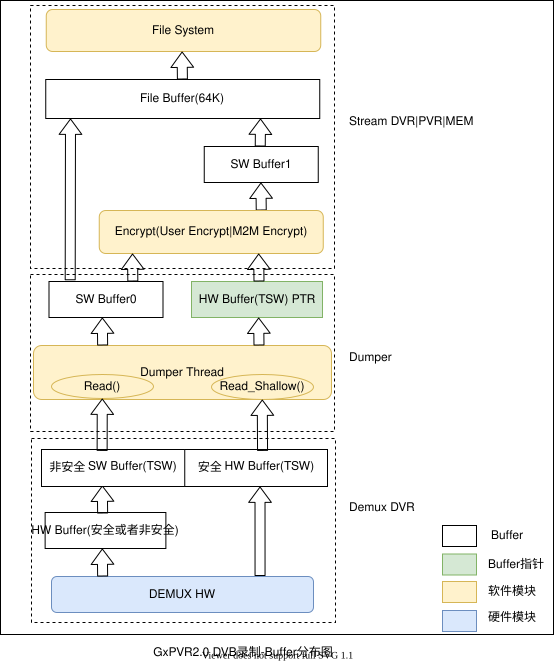
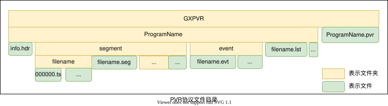
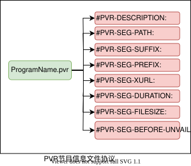
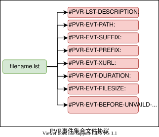
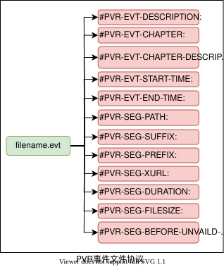
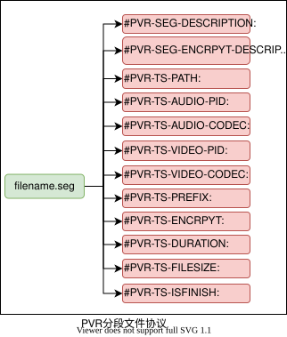
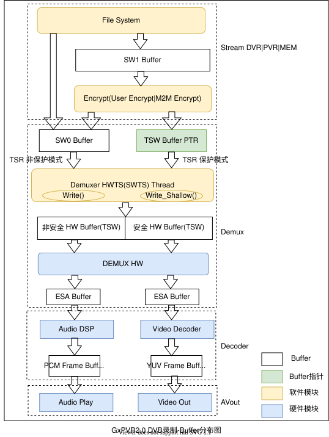

### DVB录制-Buffer分布图

- DVB录制-Buffer说明:
		- Demux DVR模块下的Buffer:
			- 录制TS数据缓冲Buffer,包含HW Buffer和SW Buffer.
			- read        模式下: HW Buffer和SW Buffer.HW Buffer较小(188KB),SW Buffer较大(3MB),用户可配置.
			- shallow read模式下: HW Buffer.HW Buffer较大(3MB),用户可配置.
		- Dumper模块下的Buffer:
			- 录制TS数据中转,无数据缓冲,包含SW1 Buffer和HW BUffer PTR.
			- read        模式下: SW0 Buffer.
			- shallow read模式下: HW BUffer PTR.
		- Stream DVR|PVR|MEM模块下的Buffer:
			- 用户加密数据    : SW1  Buffer,无数据缓冲.
			- 文件系统大小对齐: File Buffer,缓冲数据,加快文件写速度.File Buffer默认64KB,用户不可配置.
- read和shallow read两种模式说明
	- read模式
		- PVR驱动有两个Buffer,一个HW buffer,一个SW Buffer.
		- 该方式优势在于:
			- HW Buffer  连续物理内存,可以申请后不释放,不需要较大连续物理内存.
			- SW Buffer非连续物理内存,可以随时释放.
		- 该模式可以用于安全录制和非安全录制, 数据流程:
			- Demux DVR把数据从HW Buffer搬移到SW Buffer.
				- 安全录制  : 搬移到SW Buffer已被加密,SW Buffer与HW Buffer的数据不一致.
				- 非安全录制: 搬移到SW Buffer未被加密,SW Buffer与HW Buffer的数据一致.
			- Dumper读取SW Buffer的数据到SW Buffer0,并把SW Buffer0数据写入Stream(DVR|PVR|MEM).
			- 录制为分段录制和分卷录制时,使用Stream(DVR|PVR),支持用户加密
				- 需要用户加密时  ,通过用户加密把数据加密到SW Buffer1,再把SW Buffer1数据拷贝到File Buffer.
				- 不需要用户加密时,把SW Buffer0数据拷贝到File Buffer.
				- 当File Buffer满64kB时,File Buffer一次性写入文件系统.
			- 录制为内存储存录制时,使用Stream(MEM),不支持用户加密.
	- shallow read模式
		- PVR驱动只有一个HW Buffer.
		- 该方式优势在于:
			- 可以减少一次从HW Buffer到SW Buffer的内存拷贝.
		- 该模式可以仅用于安全录制和非安全录制, 数据流程:
			- Dumper模块读取HW Buffer的PTR(指针),并把PTR传给Stream(DVR|PVR),此时PTR指针不可访问.
			- 给Stream(DVR|PVR)根据用户加密配置判别数据是否进行用户加密:
				-   需要用户加密时,通过用户加密把HW Buffer PTR对应数据加密,加密数据存放到SW Buffer1,再把SW Buffer1数据拷贝到File Buffer.
				- 不需要用户加密时,通过 M2M模块对HW Buffer PTR对应数据加密,加密数据存放到SW Buffer1,再把SW Buffer1数据拷贝到File Buffer.
		- 该模式不支持stream MEM录制.
	- 以上两种模式不需要用户直接配置,由以下决定:
		- 安全录制
			- gxloader的cmdline有配置"tswmem"字段,使用shallow read模式.
			- gxloader的cmdline无配置"tswmem"字段,使用read模式.
		- 非安全录制
			- 直接使用read模式.
		- 安全录制与非安全录制: 由芯片的demux id对应demux特性决定,录制可以配置使用demux id.

### DVB录制-分段录制-协议解析

- PVR录制储存目录
	- 
	- PVR - 节目协议文件:
		- 
		- 文件协议定义:
			- #PVR-DESCRIPTION:描述流媒体文件的唯一标识，可用于自定义内容扩展.
			- #PVR-SEG-PATH:描述分段信息流媒体文件相对路径.
			- #PVR-SEG-SUFFIX:描述分段信息流媒体文件后缀.
			- #PVR-SEG-PREFIX:描述分段信息流媒体文件前缀唯一标识.
			- #PVR-SEG-XURL:描述分段信息流媒体文件相对路径唯一标识,用于两个录制文件编辑.
			- #PVR-SEG-DURATION：描述分段信息流媒体文件录制总时长.
			- #PVR-SEG-FILESIZE:描述分段信息流媒体文件录制总大小.
			- #PVR-SEG-BEFORE-UNVAILD-SEQNO:描述失效的分段信息流媒体文件索引.
	- LST - 事件集合协议文件:
		- 
		- 文件协议定义:
			- #PVR-LST-DESCRIPTION:描述事件信息集流媒体文件的唯一标识，可用于自定义内容扩展,
			- #PVR-EVT-PATH:描述事件信息流媒体文件相对路径.
			- #PVR-EVT-SUFFIX:描述事件信息流媒体文件后缀.
			- #PVR-EVT-PREFIX:描述事件信息流媒体文件前缀.
			- #PVR-EVT-XURL:描述事件信息流媒体文件相对路径唯一标识.
			- #PVR-EVT-DURATION:描述事件信息流媒体文件录制总时长.
			- #PVR-EVT-FILESIZE:描述事件信息流媒体文件录制总大小.
			- #PVR-EVT-BEFORE-UNVAILD-SEQNO:描述失效的事件信息流媒体文件索引.
	- EVT - 事件协议文件:
		- 
		- 文件协议定义:
			- #PVR-EVT-DESCRIPTION:描述事件信息流媒体文件的唯一标识，可用于自定义内容扩展.
			- #PVR-EVT-CHAPTER:描述事件信息流媒体文件的节目事件名称，例如：<家有儿女>第一集.
			- #PVR-EVT-CHAPTER-DESCRIPTION:描述事件信息流媒体文件的节目事件内容扩展信息，例如：节目简介、主演等信息、事件节目起始时间.
			- #PVR-EVT-CHAPTER-START-TIME:描述事件信息流媒体文件的节目事件起始时间，例如：9点10分.
			- #PVR-EVT-END-TIME:描述事件信息流媒体文件的节目事件结束时间，例如：10点10分.
			- #PVR-SEG-PATH:描述分段信息流媒体文件相对路径.
			- #PVR-SEG-SUFFIX:描述分段信息流媒体文件后缀.
			- #PVR-SEG-PREFIX:描述分段信息流媒体文件前缀.
			- #PVR-SEG-XURL:描述分段信息流媒体文件相对路径.
			- #PVR-SEG-DURATION:描述分段信息流媒体文件录制的总时长.
			- #PVR-SEG-FILESIZE:描述分段信息流媒体文件录制的总大小.
			- #PVR-SEG-BEFORE-UNVAILD-SEQNO:描述失效的分段信息流媒体文件索引.
	- PVR分段文件协议(SEG(.svr)):
		- 
		- 文件协议定义:
			- #PVR-SEG-DESCRIPTION:描述分段信息流媒体文件的唯一标识，可用于自定义内容扩展.
			- #PVR-TS-PATH:描述TS数据文件相对路.
			- #PVR-TS-SUFFIX:描述TS数据文件后缀.
			- #PVR-TS-AUDIO_PID:描述TS数据文件的音频PID.
			- #PVR-TS-AUDIO_CODEC:描述TS数据文件的音频编码格式.
			- #PVR-TS-VIDEO-PID:描述TS数据文件的视频PID.
			- #PVR-TS-VIDEO_CODEC:描述TS数据文件的视频编码格式.
			- #PVR-TS-PREFIX：描述TS数据文件前缀.
			- #PVR-TS-ENCRPYT:描述TS数据文件加密密钥、算法等.
			- #PVR-TS-DURATION:描述TS数据文件的录制总时长.
			- #PVR-TS-FILESIZE:描述TS数据文件的录制总大小.
			- #PVR-TS-ISFINISH:描述TS数据文件是否完成.

### DVB回放-Buffer分布图
- DVB回放-Buffer分布图
	- 
	- Stream DVR|PVR|MEM模块下的Buffer:
		- 用户解密的临时buffer: SW1 Buffer.
	- Demux 模块下的buffer:
		- write 模式下: 读取数据SW0 Buffer,注入到安全或者非安全HW Buffer,以及过滤后的音视频数据ESA Buffer,ESV Buffer.
		- shallow write 模式下: 读取数据指针HW Buffer PTR,写入到安全HW Buffer,以及过滤后的音视频数据ESA Buffer,ESV Buffer.
	- Decoder 模块下的buffer:
		- 音频解码数据PCM Buffer, 视频解码数据YUV Buffer.
- write和shallow write两种模式说明
	- write和shallow write模式,用户不需要配置,根据回放文件信息自动选择,和录制时read和Shallow read模式相匹配.
	- write         模式: 可以在安全和非安全回放使用.
	- shallow write 模式: 仅用于安全模式回放.
