## 音频基础

### 声音
  - 声音是由物体振动产生的声波,通过介质(空气或固体,液体)传播并能被人或动物听觉器官所感知的波动现象.
  - 动物发音和听觉频率范围
    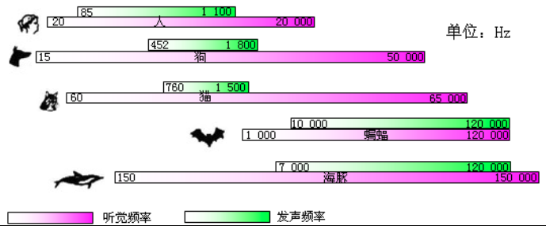
  - 声音的三要素
    - 响度
      - 人耳对声音强弱的主观感受,用声压计量,单位Pa.
      - 人耳可以听到的强度最小的声音,到强度大到能够引起痛觉的声音,声强的绝对值相差一千万亿倍.
      - 根据人耳对声音强弱变化响应的特性,使用对数量来表示声音的大小,声压级SPL = 20 *Lg P(e) / P(ref), p(ref)标准声压.
    - 音高
      - 人耳对声音频率高低的主观感受,对声音频率的听觉感知不是线性的.
    - 音色
      - 人耳对多种频率,多种强度复合声波综合作用的主观感受.

### 音频
  - 人类能够听到的所有声音都称之为音频,人类耳朵能听到的声波频率为20Hz-20000Hz.

### 语音
  - 人类通过发音器官发出来的,具有一定意义的,目的是用来进行社会交际的声音,人类说话的声波频率85Hz-1100Hz.

### 音频采集过程
  - 音频通过采集设备,从连续的模拟信号通过模数转换器(ADC),转换成离散的数字信号,并通过编码存储与计算机等设备上.

### 音频数字化过程
  - 采样
    - 音频的采样是按照固定的频率,在时间轴上对模拟信号的振幅进行取值.这个频率就是是采样率,单位为(Hz),表示每秒钟取得的采样的个数.
    - 采样率越高,采样个数越多,还原的曲线就越平滑,越接近于最初的曲线,但需要储存容量越大.
      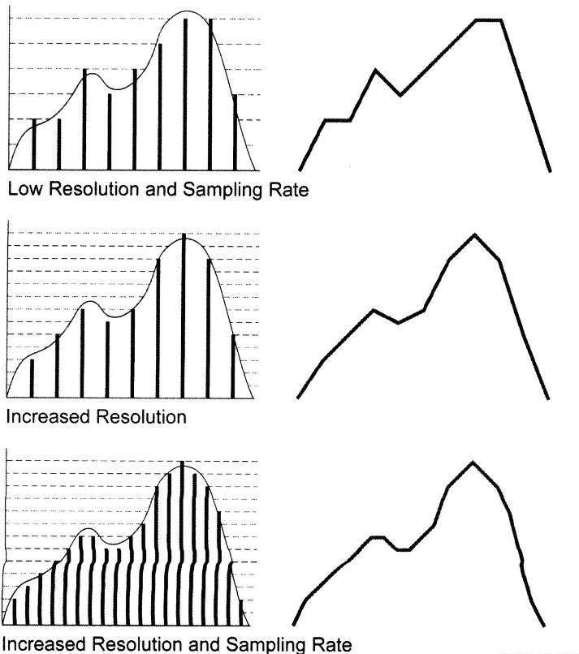
    - 奈奎斯特采样定理: 采样频率要大于信号最高频率的2倍,才能完整的保留信号的信息.
  - 量化
    - 为了更高效地保存和传输每个采样点的数值,将这些振幅值进行规整,这一过程称为量化.
    - 量化的过程会损失一定的精度,按照精度可以将量化分为8位量化,16位量化,32位量化等.
  - 编码
    - 将量化后离散整数序列转化为计算机实际储存所用的二进制字节序列的过程叫做音频编码.

### 脉冲调制编码
  - PCM(Pulse Code Modulation,脉冲编码调制)音频数据是未经压缩的音频采样数据裸流,它是由模拟信号经过采样,量化,编码转换成的标准数字音频数据.
  - 描述PCM数据的参数:
    - 采样频率: 通常8kHz(电话),44.1kHz(CD),48kHz(DVD).
    - 量化位数: 通常8bit,16bit,24bit.
    - 通道个数: 常见的音频有立体声(stereo)和单声道(mono)两种类型,立体声包含左声道和右声道.
  - 描述PCM数据的格式:
    - 大小端.
    - 交织/非交织.
      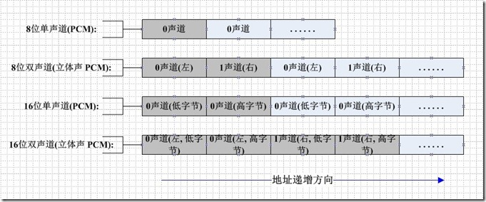

### 音频压缩编码
  - 音频压缩编码方法的分类:
    - 波形编码
      - 脉冲编码调制(PCM).
      - 差分脉冲编码调制(DPCM).
      - 自适应差分脉冲编码调制(ADPCM).
    - 自带编码(SBC).
    - 自适应变换编码(ATC).
    - 混合编码
      - 线性预测编码(LPC).
      - 脉冲激励线性预测编码(MPLPC).
      - 码本激励线性预测编码(CELPC).
  - 音频压缩编码标准
    - "MPEG12A": 包含MPEG-1和MPEG-2下Audio音频标准,MPEG-2下AAC标准定义除外.
      - MP3: 全名MPEG-1 Audio Layer 3.
      - MPEG-1 支持采样率: 32kHz/44.1kHz/48kHz.
      - MPEG-1(Layer 1): 简单编码,用于数字盒式录像带.
      - MPEG-1(Layer 2): 算法复杂度中等,用于数字音频广播.
      - MPEG-1(Layer 3): 编码复杂,用于互联网上高质量声音,既缩写MP3.
      - MPEG-2 BC: MPEG-1 标准的扩展,增加16kHz/22.05kHz/24kHz采样率,支持5.1声道.
    - "MPEG4-AAC": 包含MPEG-2 AAC和MPEG4-AAC.
      - MPEG-4 AAC就是MPEG-2 AAC,只是在MPEG-2 AAC中增加一些新工具,提高低比特率下的编码质量.
      - AAC不同Profile(类),Object(对象):
        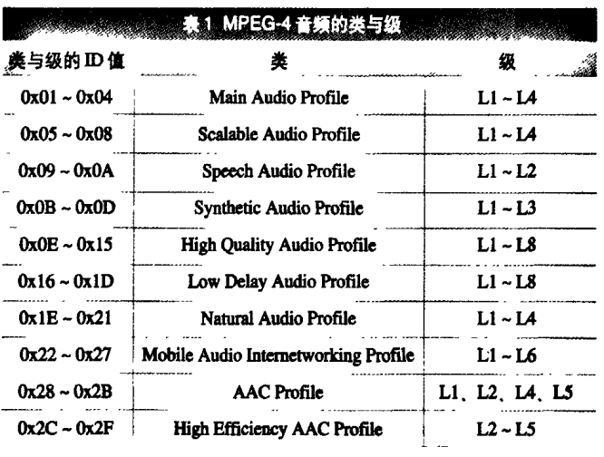
        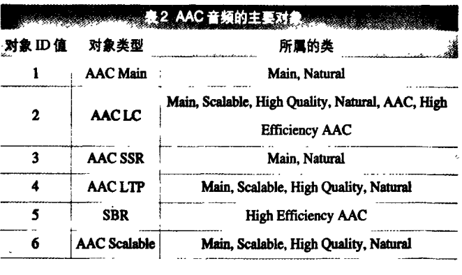
        - 常用的三种规格:
          - LC-AAC(Main).
          - HE-AAC(AACPlus v1). 
          - HE-AACV2(AACPlus v2).支持单声道或多声道.
            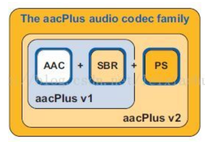
      - AAC不同的封装: ADTS和LATM区别.
        - ADTS封装形式
          - 每帧包含帧头和帧净荷(帧数据).帧头格式如下:
            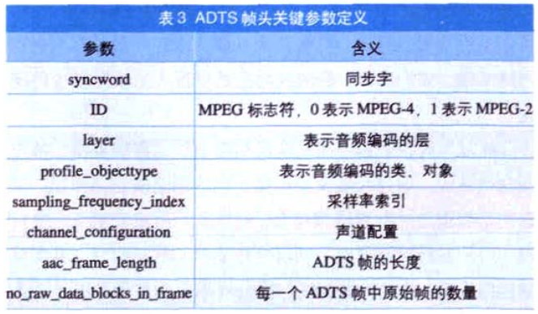
        - LATM封装形式
          - 由AudioSpecificConfig和音频负载组成,音频负载包含负载长度信息和负载净荷.
          - AudioSpecificConfig可以带内传,也可以带外传.带内传即每帧LATM都有该信息,带外传即共用相同该信息.
          - AudioSpecificConfig格式如下:
            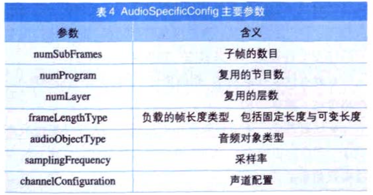
    - "AC3/EAC3": 包含DOLBY和DOLBY Plus.
      - 需要授权才能使用.
      - AC3/EAC3由一系列的同步帧组成,帧结构如下:
        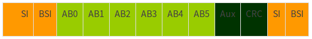
        - SI(同步信息): 包含同步字节0x0B77, 采样率,帧长等信息.
        - BSI(比特流信息): 包含比特流识别码,声道数等信息.
        - AB0~AB5(音频块): 每一音频块有256样点.
    - "DRA": 全称Digital Rise Audio.
        - 中国电子行业标准: SJ/T11368-2006.
        - 支持单声道或多声道.
    - "OPUS"
        - 有损压缩,开源免费.
        - IETF标准: RFC6716.
        - 特点:
          - 支持单声道和立体声,支持多达255个音轨.
          - 采样率从8kHz ~ 48kHz.
          - 支持语音(SILK层)和音乐(CELT层)编码.
    - "VORBIS"
      - 有损压缩,开源免费,使用OGG的容器,因此被称为OGG-Vorbis.
    - "FLAC"
      - 无损压缩,开源免费.
    - "SBC"
      - 有损压缩,开源免费,适用于蓝牙音频传输.
      - 特点:
        - 采样频率: 16KHz,32KHz,44.1KHz和48KHz.
        - 通道模式: 单声道,双声道,立体声和联合立体声.
    - "DTS"
      - 需要授权才能使用.
### 音频播放
  - 音频(播放)传输标准
    - I2S: 用于PCM数据传输.
      - 用于数字音频数据在系统内部器件之间传输,例如编解码器CODEC、DSP、数字输入/输出接口、ADC、DAC和数字滤波器等.
      - 提供时钟(SCK和LRCLK)的设备为主设备.
      - 包括两个声道(Left/Right)的数据,通过(LRCLK)控制左右声道数据切换.
        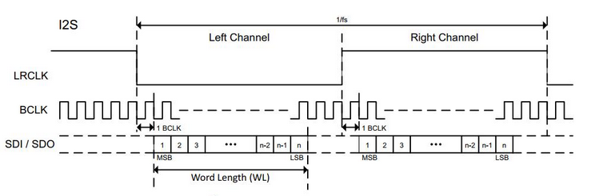
    - SPDIF: 既支持PCM数据传输,也支持压缩编码数据传输(DOLBY/DTS等).
      - 在传输数据时使用双相符号编码BMC,将时钟信号和数据信号混合在一起传输.
        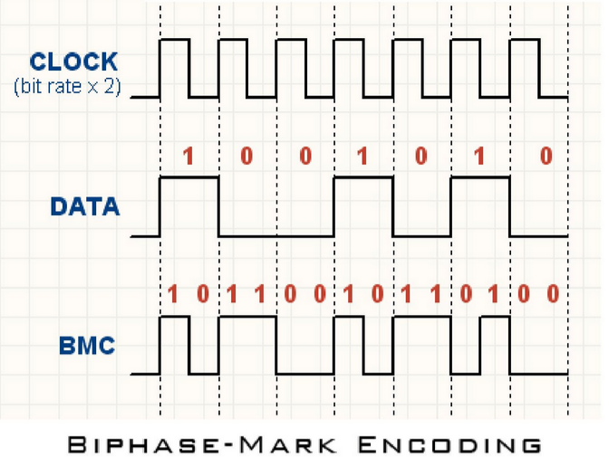
      - 标准IEC60985,报文格式如下:
        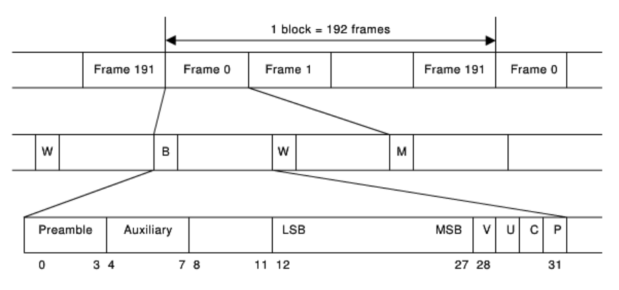
        - 一个Block为192(Frames)x8=1536Bytes.
        - 最多传输左右声道PCM数据.
      - 标准IEC61937,报文格式如下: 
        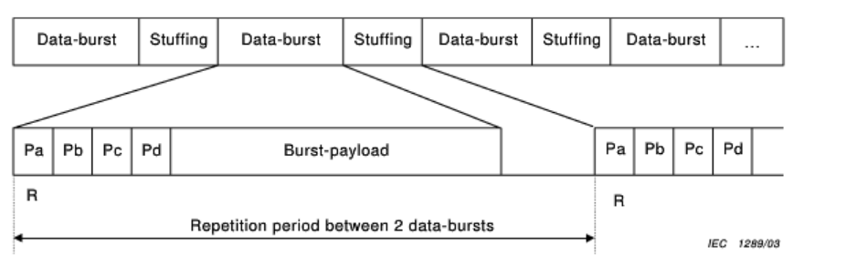
        - Preamble格式:
          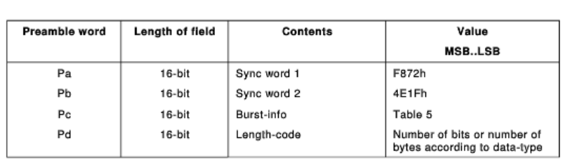
        - Pc格式:
          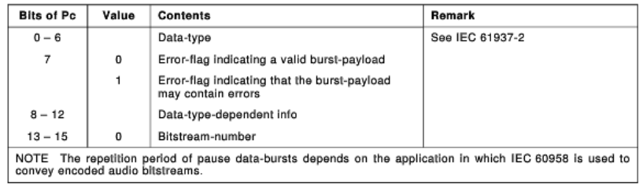
        - Data定义:
          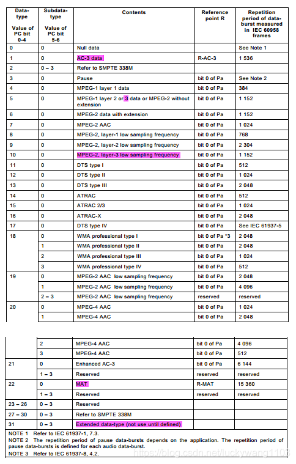
        - 支持复杂音频数据传输,例如AC3/DTS.
  - 音频接口:
    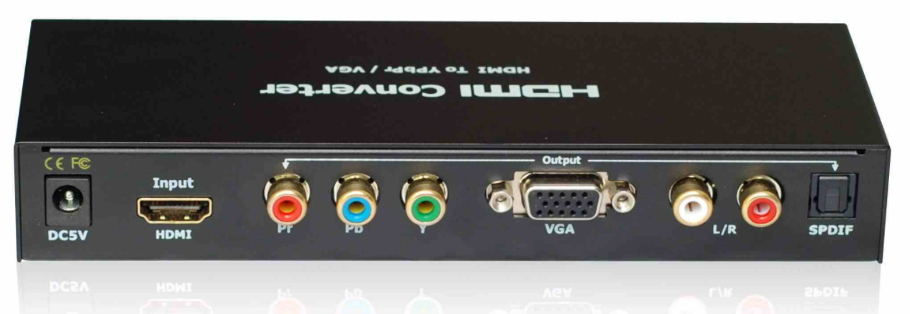
    - CVBS
      - 复合同步视频广播信号,包含1个视频通道和2个音频通道.
      - 只支持PCM数据传输.
    - S/PDIF
      - SONY、PHILIPS数字音频接口的简称,插口硬件使用的是光缆口或同轴口.
      - 支持双声道PCM或者DOLBY/DTS等音频编码数据输出.
    - HDMI
      - 是一种全数字化视频和声音发送接口,可以发送未压缩的音频及视频信号.
      - 支持多声道PCM或者DOLBY/DTS等音频编码数据输出.
    - SCART
      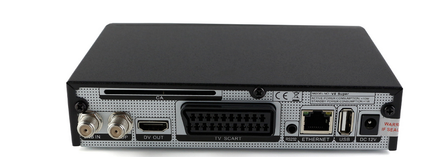
      - SCART传输线有三种信号传输方式:
        - CVBS与RGB三基色、声音信号.
        - 仅传输CVBS与声音信号.
        - 传输S-Video与声音信号.
