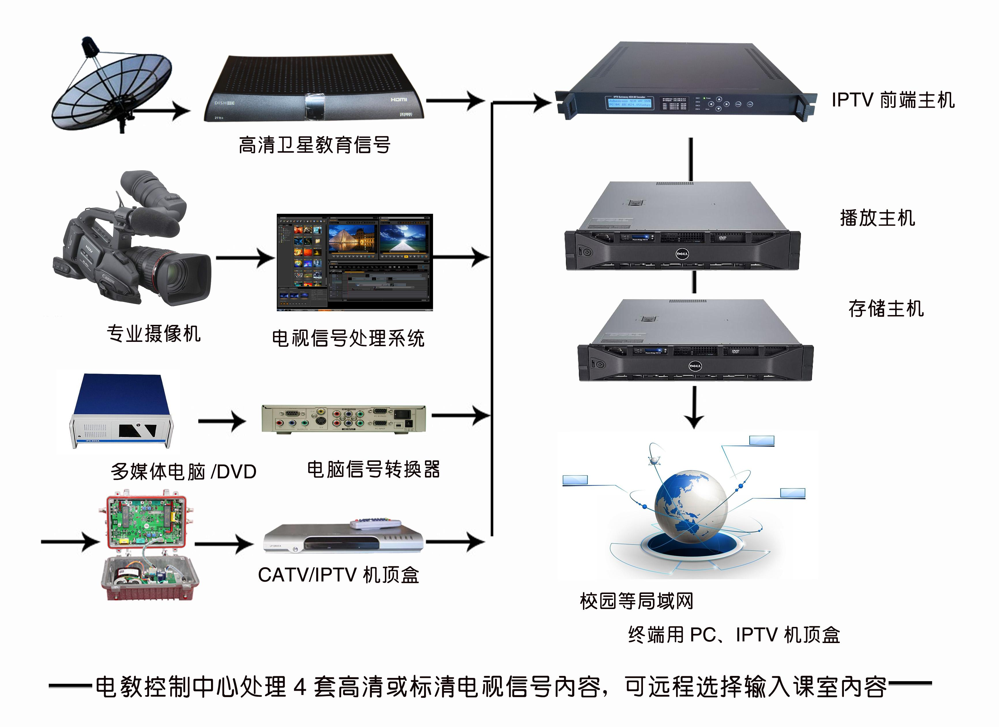
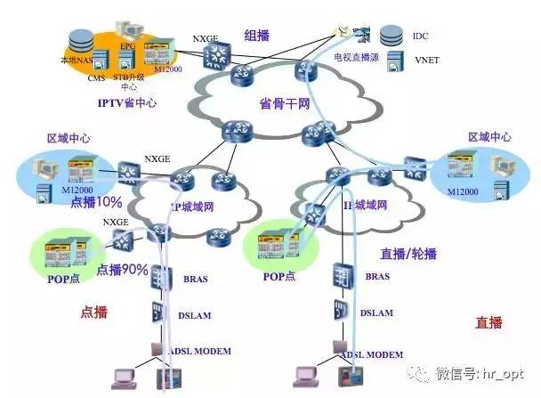
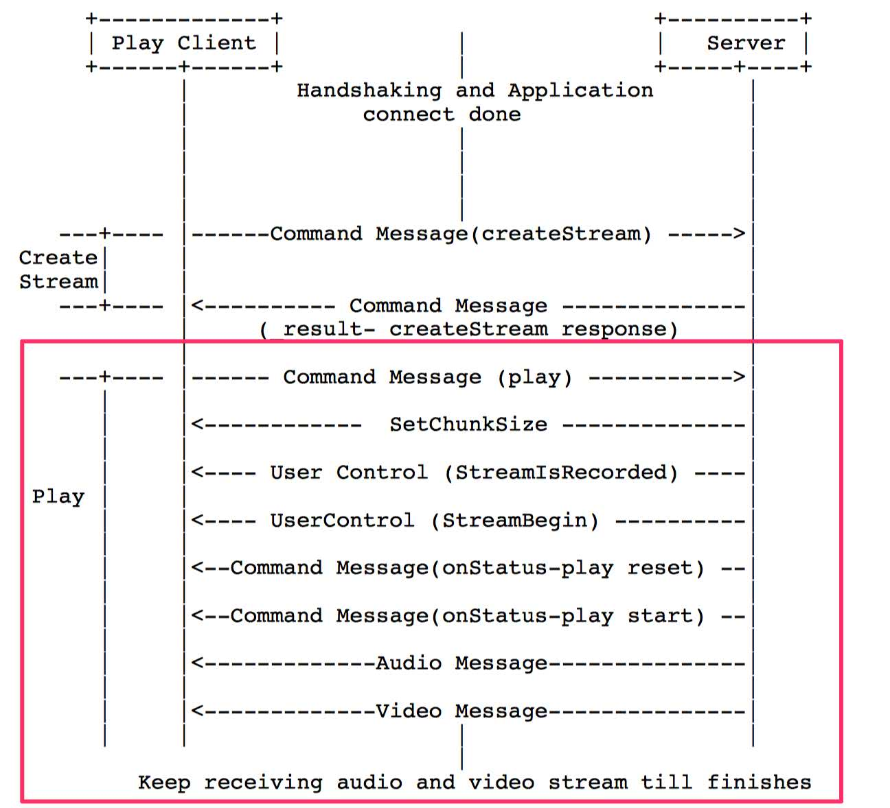

## IPTV基础

### IPTV/OTT 简介

- <span id = "iptv/ott定义">**什么是 IPTV/OTT**</span>

    >  &emsp;&emsp;[IPTV](https://wiki.mbalib.com/wiki/IPTV)集互联网、多媒体、通讯等多种技术于一体，向家庭用户提供包括数字电视在内的多种交互式服务的崭新技术;

    >  &emsp;&emsp;[OTT](https://wiki.mbalib.com/wiki/OTT)其显示终端可以是个人电脑，也可以是电视机或平板电脑等其他显示终端;

- **区别：**

    >  &emsp;&emsp; 传输：IPTV走的是[IP城域网(专网传输)](https://wiki.mbalib.com/wiki/%E5%9F%8E%E5%9F%9F%E7%BD%91)，OTT走的是互联网Internet(公网上，连接家庭WiFi即可);

    >  &emsp;&emsp; 内容：IPTV主要是牌照商的内容,常用于电视直播领域；OTT除了牌照商内容+视频网内容（有版权）+其他，常用于点播领域;

    >   &emsp;&emsp; 屏幕：IPTV还是只对电视屏;OTT多了Pad、Phone的屏幕(所谓的多屏互动);


- **IPTV/OTT 采集、重编码、推流流程**

    

- **CDN上拉流流程**

    


### 流媒体协议简介


流媒体协议主要有:

- 常用:  [http/https](#httphttps)、[hls/ll-hls](#hlsll-hls)、[rtmp](#rtmp)、[http-flv](#http-flv)、[mpegdash](#mpegdash)、[udp](#udp)、[rtsp/rtcp](#rtsprtcp) 、[rtp](#rtp) 、[mms](#mms) 、[hds](#hds) 、[concat](#concat)  、[composedash](#composedash)  、[composenormal](#composenormal)  、[rtpsdp](#rtpsdp) 等常用协议

- 私有:  [rudp](https://blog.csdn.net/icebergliu1234/article/details/107320295)、 other ...

流媒体协议鉴权：

- 常用:  [重定向301/302的方式](https://cloud.tencent.com/developer/article/1019648) 、 [token方式](https://www.cnblogs.com/xkyii/p/14179813.html)、 [Cookie方式](https://www.cnblogs.com/xkyii/p/14179813.html)、 [User-Agent方式](https://www.cnblogs.com/dengyg200891/p/4930752.html)、 [Referer方式](https://baike.baidu.com/item/HTTP_REFERER/5358396?fr=aladdin) 、 [Connection方式](https://blog.csdn.net/mangoyiy/article/details/80941816)

- 稀有:  [DRM](http://www.drmsoft.cn/drm/whatsdrm.html) 方式,主要有： [Widewine](https://blog.csdn.net/beautyfuel/article/details/56277988) 、 [PlayReady](https://baike.baidu.com/item/Microsoft%20PlayReady/3152509?fr=aladdin) 、 [marlin](https://www.expressplay.com/products/marlin/) 、 [FairPlay](https://developer.apple.com/streaming/fps/FairPlayStreamingOverview.pdf) 、 等其他DRM 、 私有加密方式;


#### HTTP/HTTPS

- **什么是http/https**

    >  &emsp;&emsp;[HTTP](https://blog.csdn.net/xiaoming100001/article/details/81109617)是互联网上应用最为广泛的一种网络协议，是一个客户端和服务器端请求和应答的标准(`TCP`)，用于从`WWW`服务器传输超文本到本地浏览器的传输协议。`HTTP`是采用明文形式进行数据传输，极易被不法份子窃取和篡改;

    >   &emsp;&emsp;[HTTPS](https://blog.csdn.net/xiaoming100001/article/details/81109617)是在`HTTP`上建立`SSL`加密层，并对传输数据进行加密，是HTTP协议的安全版;

    > &emsp;&emsp;在流媒体服务中，`http/https`是最为常见的方式,尤其是点播。当然,直播也是适用于`http/https`服务的，例如使用`http`传输`flv`直播流([http-flv](#http-flv)),使用`http`传输`ts`流,使用`http`传输`m3u8`([hls功能](#hls))等等;

- **HTTPS和HTTP的区别是什么**
    >     1、 HTTPS是加密传输协议，HTTP是名文传输协议;

    >     2、 HTTPS需要用到SSL证书，而HTTP不用;

    >     3、 HTTPS比HTTP更加安全，对搜索引擎更友好;

    >     4、 HTTPS标准端口443，HTTP标准端口80;

    >     5、 HTTPS在浏览器显示绿色安全锁，HTTP没有显示;


- <span id = "http_request_yf">**请求语法**</span>

    ```url
    http url: http://resource.meishesdk.com/video/edit/sdkedit_example.mp4

    https url: https://maiche.hynews.net/2019-05-28/e6b896e84fee4802a76396640804154f.high.mp4

    ```

- <span id = "http_jh">**[常见的交互方式](http://www.360doc.com/content/20/0907/15/38894361_934408506.shtml)**</span>

    ```
    > GET /video/edit/sdkedit_example.mp4 HTTP/1.1
    > User-Agent: Lavf/58.29.100
    > Accept: */*
    > Range: bytes=0-
    > Connection: close
    > Host: resource.meishesdk.com
    > Icy-MetaData: 1

    < HTTP/1.1 206 Partial Content'=0/0
    < http_code=206
    < Server: Tengine
    < Content-Type: video/mp4
    < Content-Length: 87004397
    < Connection: close
    < Date: Fri, 26 Mar 2021 05:33:09 GMT
    < Accept-Ranges: bytes
    < Access-Control-Allow-Origin: *
    < Access-Control-Expose-Headers: X-Log, X-Reqid
    < Access-Control-Max-Age: 2592000
    < Cache-Control: public, max-age=31536000
    ```

    ```
    > POST /video/edit/sdkedit_example.mp4 HTTP/1.1
    > Host: resource.meishesdk.com
    > User-Agent: curl/7.47.0
    > Accept: */*
    >

    < HTTP/1.1 200 OK
    < Server: JSP3/2.0.14
    < Date: Fri, 26 Mar 2021 05:57:05 GMT
    < Content-Type: video/mp4
    < Content-Length: 87004397
    < Connection: keep-alive

    ```

#### HLS/LL-HLS

- **什么是HLS**

    >   &emsp;&emsp;[HTTP Live Streaming(HLS)](https://blog.csdn.net/u011857683/article/details/84863250)是一个由苹果公司提出的基于`HTTP`的流媒体网络传输协议。是苹果公司`QuickTime X`和`iPhone`软件系统的一部分。它的工作原理是把整个流分成一个个小的基于`HTTP`的文件来下载，每次只下载一些。当媒体流正在播放时，客户端可以选择从许多不同的备用源中以不同的速率下载同样的资源，允许流媒体会话适应不同的数据速率。在开始一个流媒体会话时，客户端会下载一个包含元数据的`extended M3U (m3u8)playlist`文件，用于寻找可用的媒体流。
`HLS`只请求基本的`HTTP`报文，与实时传输协议`（RTP)`不同，`HLS`可以穿过任何允许`HTTP`数据通过的防火墙或者代理服务器。它也很容易使用内容分发网络来传输媒体流;

- **什么是LL_HLS**

    >   &emsp;&emsp;其实[`LL-HLS`](https://developer.apple.com/documentation/http_live_streaming/enabling_low-latency_hls)(低延迟`HLS`)就是`HLS`的升级版,在V7版本以上才支援，`LL-HLS`引入了部分分段（`“parts”`）的概念。每个部分都可以通过唯一的`URL`谨慎地寻址，也可以选择作为媒体段中引用的字节范围来寻址;

- <span id = "hls_request_yf">**请求语法**</span>

    ```
    http://ivi.bupt.edu.cn/hls/cctv1hd.m3u8

    https://hls.ted.com/talks/29159.m3u8

    ```

**<span id = "hls_list">hls 列表分类模式:</span>**

    ```
    .
    ├── index.m3u8
    ├── rrk_000.ts
    ├── rrk_001.ts
    ├── rrk_002.ts
    ├── rrk_003.ts

    ```

**<span id = "hls_ll_list">ll_hls 列表分类模式:</span>**

    ```

    .
    ├── init.mp4
    ├── playlist10.m4s
    ├── playlist11.m4s
    ├── playlist1.m4s
    ├── playlist2.m4s
    ├── playlist3.m4s
    └── playlist.m3u8


    ```

**<span id = "hls_mode">hls 普通模式:</span>**

    ```
    #EXTM3U
    #EXT-X-VERSION:3
    #EXT-X-MEDIA-SEQUENCE:0
    #EXT-X-ALLOW-CACHE:YES
    #EXT-X-TARGETDURATION:3
    #EXTINF:15.699711,
    rrk_000.ts
    #EXTINF:14.380578,
    rrk_001.ts
    #EXTINF:15.580400,
    rrk_002.ts
    #EXTINF:14.379600,
    #EXT-X-ENDLIST

    ```

**<span id = "llhls_mode">ll_hls 普通模式:</span>**

    ```
    #EXTM3U
    #EXT-X-VERSION:7
    #EXT-X-TARGETDURATION:4
    #EXT-X-MEDIA-SEQUENCE:2
    #EXT-X-MAP:URI="init.mp4"
    #EXTINF:4.000000,
    playlist2.m4s
    #EXTINF:4.000000,
    playlist3.m4s
    #EXTINF:4.000000,
    playlist4.m4s
    #EXTINF:4.000000,
    playlist5.m4s
    #EXT-X-ENDLIST

    ```

**<span id = "hls_bandwidth">hls 多带宽模式:</span>**

    ```
    #EXTM3U
    #EXT-X-STREAM-INF:PROGRAM-ID=1, BANDWIDTH=200000
    gear1/index.m3u8
    #EXT-X-STREAM-INF:PROGRAM-ID=1, BANDWIDTH=311111
    gear2/index.m3u8
    #EXT-X-STREAM-INF:PROGRAM-ID=1, BANDWIDTH=484444
    gear3/index.m3u8
    #EXT-X-STREAM-INF:PROGRAM-ID=1, BANDWIDTH=737777
    gear4/index.m3u8
    ```

**<span id = "hls_muli_audio">hls 多音轨模式:</span>**

    ```
    #EXTM3U
    #EXT-X-MEDIA:TYPE=AUDIO,GROUP-ID="aac",NAME="lit 2",DEFAULT=YES,AUTOSELECT=YES,LANGUAGE="lit"
    #EXT-X-MEDIA:TYPE=AUDIO,GROUP-ID="aac",NAME="eng 3",DEFAULT=NO,AUTOSELECT=YES,LANGUAGE="eng",URI="eng_audio/index.m3u8"
    #EXT-X-MEDIA:TYPE=AUDIO,GROUP-ID="aac",NAME="eng 3",DEFAULT=NO,AUTOSELECT=YES,LANGUAGE="cn",URI="cn_audio/index.m3u8"
    #EXT-X-MEDIA:TYPE=AUDIO,GROUP-ID="aac",NAME="rus 4",DEFAULT=NO,AUTOSELECT=YES,LANGUAGE="rus",URI="rus_audio/index.m3u8"
    #EXT-X-MEDIA:TYPE=AUDIO,GROUP-ID="aac",NAME="rus 4",DEFAULT=NO,AUTOSELECT=YES,LANGUAGE="uk",URI="uk_audio/index.m3u8"
    #EXT-X-STREAM-INF:AUDIO="aac",RESOLUTION=1256x720,CODECS="avc1.64001f,mp4a.40.2",BANDWIDTH=3052000
    lit_video/index.m3u8

    ```

**<span id = "hls_av">hls AV分离模式:</span>**

    ```
    #EXTM3U
    #EXT-X-VERSION:4
    ## Created with Unified Streaming Platform(version=1.7.16)

    # AUDIO groups
    #EXT-X-MEDIA:TYPE=AUDIO,GROUP-ID="aac-lc-192",LANGUAGE="en",NAME="English",DEFAULT=YES,AUTOSELECT=YES,URI="trailer-22113301_PRO34_audio-aaclc-192k/prog_index.m3u8"
    #EXT-X-MEDIA:TYPE=AUDIO,GROUP-ID="he-aac-64",LANGUAGE="en",NAME="English",DEFAULT=YES,AUTOSELECT=YES,URI="trailer-22113301_PRO34_audio-heaac-64k/prog_index.m3u8"

    # CLOSED-CAPTIONS groups
    #EXT-X-MEDIA:TYPE=CLOSED-CAPTIONS,GROUP-ID="cc1",LANGUAGE="en",NAME="English",DEFAULT=YES,AUTOSELECT=YES,INSTREAM-ID="CC1"

    # variants
    #EXT-X-STREAM-INF:BANDWIDTH=3491000,AVERAGE-BANDWIDTH=2462000,CODECS="avc1.4D401F,mp4a.40.2",RESOLUTION=1280x720,FRAME-RATE=29.97,AUDIO="aac-lc-192",CLOSED-CAPTIONS="cc1"
    trailer-22113301_PRO34_video-2200/prog_index.m3u8
    #EXT-X-STREAM-INF:BANDWIDTH=314000,AVERAGE-BANDWIDTH=302000,CODECS="avc1.4D400C,mp4a.40.2",RESOLUTION=416x234,FRAME-RATE=9.99,AUDIO="aac-lc-192",CLOSED-CAPTIONS="cc1"
    trailer-22113301_PRO34_video-0100/prog_index.m3u8

    # keyframes
    #EXT-X-I-FRAME-STREAM-INF:BANDWIDTH=321000,CODECS="avc1.4D401F",RESOLUTION=1280x720,URI="trailer-22113301_PRO34_video-2200/iframe_index.m3u8"
    #EXT-X-I-FRAME-STREAM-INF:BANDWIDTH=23000,CODECS="avc1.4D400C",RESOLUTION=416x234,URI="trailer-22113301_PRO34_video-0100/iframe_index.m3u8"


    ```

**<span id = "hls_aes128">hls AES-128 模式:</span>**

    ```
    #EXTM3U
    #EXT-X-VERSION:3
    #EXT-X-MEDIA-SEQUENCE:0
    #EXT-X-ALLOW-CACHE:YES
    #EXT-X-TARGETDURATION:11
    #EXT-X-KEY:METHOD=AES-128,URI="https://shida66.com/?c=VideoInfo&a=hlsKey&vid=ad17fIE9G6n3NuiINIA",IV=0x7c6eb6acf264ad1cf170ee91686263c5
    #EXTINF:10.080000,
    /hls_sd/2882/3D1C10C7-57DA-526B-665E-4D45EA7EA776-000000
    #EXT-X-KEY:METHOD=AES-128,URI="https://shida66.com/?c=VideoInfo&a=hlsKey&vid=ad17fIE9G6n3NuiINIA",IV=0x25354c26924a3d0f2347ca074af776d4
    #EXTINF:10.000000,
    /hls_sd/2882/3D1C10C7-57DA-526B-665E-4D45EA7EA776-000001
    #EXT-X-KEY:METHOD=AES-128,URI="https://shida66.com/?c=VideoInfo&a=hlsKey&vid=ad17fIE9G6n3NuiINIA",IV=0x8ddcdbafc3f3cecece471bac4222a432
    #EXTINF:10.000000,
    /hls_sd/2882/3D1C10C7-57DA-526B-665E-4D45EA7EA776-000002
    #EXT-X-KEY:METHOD=AES-128,URI="https://shida66.com/?c=VideoInfo&a=hlsKey&vid=ad17fIE9G6n3NuiINIA",IV=0x0c1ef4f73fe6a92a9f75e5555d4e1d37
    #EXTINF:10.000000,
    /hls_sd/2882/3D1C10C7-57DA-526B-665E-4D45EA7EA776-000003
    #EXT-X-KEY:METHOD=AES-128,URI="https://shida66.com/?c=VideoInfo&a=hlsKey&vid=ad17fIE9G6n3NuiINIA",IV=0xdc03d9503763956bdaf3b65059472c9b
    #EXTINF:10.000000,
    /hls_sd/2882/3D1C10C7-57DA-526B-665E-4D45EA7EA776-000004
    #EXT-X-ENDLIST

    ```

**<span id = "hls_sample_aes">hls SAMPLE-AES 模式(切mp4后再进行加密(即[ll_hls](#llhls_mode))):</span>**

    ```

	#EXTM3U
	#EXT-X-VERSION:6
	## Generated with https://github.com/google/shaka-packager version v2.4.2-c60e988-release
	#EXT-X-TARGETDURATION:14
	#EXT-X-PLAYLIST-TYPE:VOD
	#EXT-X-MAP:URI="https://valipl.cp31.ott.cibntv.net/67756D6080932713CFC02204E/05007C0000606ECB298BB78000000091FDC372-D48F-45F5-897C-E10EF73E4CE7_video_init.mp4"
	#EXTINF:10.000,
	#EXT-X-PRIVINF:FILESIZE=387587
	https://valipl.cp31.ott.cibntv.net/67756D6080932713CFC02204E/05007C0000606ECB298BB78000000091FDC372-D48F-45F5-897C-E10EF73E4CE7_video_00001.mp4
	...
	...
	https://valipl.cp31.ott.cibntv.net/67756D6080932713CFC02204E/05007C0000606ECB298BB78000000091FDC372-D48F-45F5-897C-E10EF73E4CE7_video_00009.mp4
	#EXTINF:10.000,
	#EXT-X-PRIVINF:FILESIZE=708807
	https://valipl.cp31.ott.cibntv.net/67756D6080932713CFC02204E/05007C0000606ECB298BB78000000091FDC372-D48F-45F5-897C-E10EF73E4CE7_video_00010.mp4
	#EXT-X-KEY:METHOD=SAMPLE-AES,URI="data:text/plain;base64,AAAASnBzc2gAAAAA7e+LqXnWSs6jyCfc1R0h7QAAACoSEFaFg3ZkprZKTkJLSyMu3I0SEFaFg3ZkprZKTkJLSyMu3I1I88aJmwY=",KEYID=0x5685837664A6B64A4E424B4B232EDC8D,IV=0x75561043753047856A668125D3A545B4,KEYFORMATVERSIONS="1",KEYFORMAT="urn:uuid:edef8ba9-79d6-4ace-a3c8-27dcd51d21ed"
	#EXT-X-KEY:METHOD=SAMPLE-AES,URI="skd://5685837664a6b64a4e424b4b232edc8d",KEYFORMATVERSIONS="1",KEYFORMAT="com.apple.streamingkeydelivery"
	#EXTINF:10.000,
	#EXT-X-PRIVINF:FILESIZE=523189
	https://valipl.cp31.ott.cibntv.net/67756D6080932713CFC02204E/05007C0000606ECB298BB78000000091FDC372-D48F-45F5-897C-E10EF73E4CE7_video_00011.mp4
	#EXTINF:10.000,
	#EXT-X-PRIVINF:FILESIZE=345609
	https://valipl.cp31.ott.cibntv.net/67756D6080932713CFC02204E/05007C0000606ECB298BB78000000091FDC372-D48F-45F5-897C-E10EF73E4CE7_video_00012.mp4
	#EXTINF:10.000,
	#EXT-X-PRIVINF:FILESIZE=289861
	https://valipl.cp31.ott.cibntv.net/67756D6080932713CFC02204E/05007C0000606ECB298BB78000000091FDC372-D48F-45F5-897C-E10EF73E4CE7_video_00013.mp4
	#EXTINF:10.000,
	#EXT-X-PRIVINF:FILESIZE=231226
	https://valipl.cp31.ott.cibntv.net/67756D6080932713CFC02204E/05007C0000606ECB298BB78000000091FDC372-D48F-45F5-897C-E10EF73E4CE7_video_00014.mp4
	...
	...
	#EXT-X-ENDLIST


    ```

**<span id = "hls_sample_aes">hls 插入不连续标签 模式:</span>**

    ```

	#EXTM3U
	#EXT-X-VERSION:3
	#EXT-X-MEDIA-SEQUENCE:0
	#EXT-X-ALLOW-CACHE:YES
	#EXT-X-TARGETDURATION:11
	#EXTINF:10.000000,
	#EXT-X-PRIVINF:FILESIZE=270720
	https://valipl.cp31.ott.cibntv.net/67756D6080932713CFC02204E/0300060000604E06316604FA8E5E6B3E0DF6B2-C114-4BBA-9D3B-8F8F313AB18B-00001.ts
	#EXTINF:10.000000,
	#EXT-X-PRIVINF:FILESIZE=677740
	https://valipl.cp31.ott.cibntv.net/67756D6080932713CFC02204E/0300060000604E06316604FA8E5E6B3E0DF6B2-C114-4BBA-9D3B-8F8F313AB18B-00002.ts
	#EXTINF:10.000000,
	#EXT-X-PRIVINF:FILESIZE=1192296
	https://valipl.cp31.ott.cibntv.net/67756D6080932713CFC02204E/0300060000604E06316604FA8E5E6B3E0DF6B2-C114-4BBA-9D3B-8F8F313AB18B-00003.ts
	#EXTINF:10.000000,
	#EXT-X-PRIVINF:FILESIZE=868184
	https://valipl.cp31.ott.cibntv.net/67756D6080932713CFC02204E/0300060000604E06316604FA8E5E6B3E0DF6B2-C114-4BBA-9D3B-8F8F313AB18B-00004.ts
	#EXT-X-DISCONTINUITY
	#EXTINF:10.000000,
	#EXT-X-PRIVINF:FILESIZE=748804
	https://valipl.cp31.ott.cibntv.net/67756D6080932713CFC02204E/ad/XNTEzMjE0MTg1Ng==/03000600006067D3BD8E28F498F463AFF7C86A-B444-40D1-A68D-5BDD28FBBC1C-00001.ts
	#EXT-X-DISCONTINUITY
	#EXTINF:5.040000,
	#EXT-X-PRIVINF:FILESIZE=226540
	https://valipl.cp31.ott.cibntv.net/67756D6080932713CFC02204E/ad/XNTA5NzExMjUwOA==/0300060000604216B8A30008D924E3BD613101-4761-4079-A959-F5A0B55BD419-00001.ts
	#EXT-X-DISCONTINUITY
	#EXTINF:10.000000,
	#EXT-X-PRIVINF:FILESIZE=1017644
	https://valipl.cp31.ott.cibntv.net/67756D6080932713CFC02204E/0300060000604E06316604FA8E5E6B3E0DF6B2-C114-4BBA-9D3B-8F8F313AB18B-00005.ts
	#EXTINF:10.000000,
	#EXT-X-PRIVINF:FILESIZE=1673388
	https://valipl.cp31.ott.cibntv.net/67756D6080932713CFC02204E/0300060000604E06316604FA8E5E6B3E0DF6B2-C114-4BBA-9D3B-8F8F313AB18B-00006.ts
	#EXTINF:10.000000,
	#EXT-X-PRIVINF:FILESIZE=927028
	https://valipl.cp31.ott.cibntv.net/67756D6080932713CFC02204E/0300060000604E06316604FA8E5E6B3E0DF6B2-C114-4BBA-9D3B-8F8F313AB18B-00007.ts
	#EXTINF:10.000000,
	#EXT-X-PRIVINF:FILESIZE=1046784
	https://valipl.cp31.ott.cibntv.net/67756D6080932713CFC02204E/0300060000604E06316604FA8E5E6B3E0DF6B2-C114-4BBA-9D3B-8F8F313AB18B-00008.ts
	#EXTINF:10.000000,
	#EXT-X-PRIVINF:FILESIZE=944324
	https://valipl.cp31.ott.cibntv.net/67756D6080932713CFC02204E/0300060000604E06316604FA8E5E6B3E0DF6B2-C114-4BBA-9D3B-8F8F313AB18B-00009.ts
	...

    ```

##### RTMP

- **什么是rtmp**

    >  &emsp;&emsp;[RTMP(Real Time Messaging Protocol)](https://mp.weixin.qq.com/s/HKgR4d-_fEhdx5roaFmiyw)协议基于TCP，是一个协议族，包括`RTMP`基本协议及`RTMPT`/`RTMPS`/`RTMPE`等多种变种。RTMP是一种设计用来进行实时数据通信的网络协议，主要用来在`Flash/AIR`平台和支持RTMP协议的流媒体/交互服务器之间进行音视频和数据通信。支持该协议的软件包括`Adobe Media Server/Ultrant Media Server/red5`等;

* **rtmp的优缺点**
    1.  `RTMP`与`HTTP`一样，都属于`TCP/IP`四层模型的应用层;
    2.  `RTMP`工作在`TCP`之上，默认使用端口`1935`;
    3.  `RTMPE`在`RTMP`的基础上增加了加密功能;
    4.  `RTMPT`封装在`HTTP`请求之上，可穿透防火墙;
    5.  RTMPS类似RTMPT，增加了`TLS/SSL`的安全功能;
    6.  目前rtmp草案不支持`h265`,早已不维护了，但很多公司拿它做直播，延时低;


- <span id = "rtmp_request_yf">**请求语法**</span>

    ```

    rtmp://[username:password@]server[:port][/app][/instance][/playpath]

    ```

* **rtmp 流程**

    


##### HTTP-FLV

- **什么是http-flv**

    > &emsp;&emsp;`HTTP-FLV`，即将音视频数据封装成 `FLV`，然后通过 `HTTP` 协议传输给客户端进行播放;与 [http/https](#http) 的功能类似，只是传输用的容器为:`flv`

##### MPEGDASH

- **什么是DASH协议**

    > &emsp;&emsp;[DASH(Dynamic Adaptive Streaming over HTTP)](https://blog.csdn.net/qq_27582179/article/details/51598208)是一种在互联网上传送动态码率的`Video Streaming`技术，类似于苹果的`HLS`;是一种集服务端、客户端的流媒体解决方案;

    > &emsp;&emsp;服务端：将视频内容分割为一个个分片，每个分片可以存在不同的编码形式（不同的`codec`、`profile`、分辨率、码率等）；

    > &emsp;&emsp;播放器端：就可以根据自由选择需要播放的媒体分片；可以实现`adaptive bitrate streaming`技术。不同画质内容无缝切换，提供更好的播放体验。

- **DASH相比HLS、HSS等协议的优势**

    1. DASH支持多种编码，支持`H.265`、`H.264`、`VP9`等等；
    2. DASH支持`ultiDRM`，支持`PlayReady`、`Widewine`，采用通用加密技术；
    3. DASH支持多种文件封装，支持`MPEG-4`、`MPEG-2 TS(Transport Stream)`；
    4. DASH支持多种`CDN`对接，采用相同的封装描述对接多厂家`CDN`；
    5. DASH支持直播、点播、录制、时移等等丰富的视频特性；
    6. DASH支持动态码率适配，支持多码率平滑切换；
    7. DASH支持紧缩型描述以支持快速启动；
    8. DASH支持客户端和服务端的广告插入;

- **DASH的厂家支持情况**

    1. `Android`原生`ExoPlayer`播放器；
    2. 主流`OTT`：`Youtube`、`Netflix`；
    3. 主流浏览器(采用MSE、EME);
    4. 主流智能电视厂商：三星、LG、飞利浦、SONY等;


- <span id = "dash_request_yf">**请求语法**</span>

    ```
    http://irtdashreference-i.akamaihd.net/dash/live/901161/bfs/manifestBR.mpd

    https://6ad095016bc323339af2932d4587e07b7855f4bc.streamvid.club/09_20/16/12/2Y3SB436/638339.mpd

    ```


**<span id = "dash_list">mpegdash 列表分类模式:</span>**

    ```
    .
    ├── chunk-stream0-00001.m4s
    ├── chunk-stream0-00002.m4s
    ├── chunk-stream0-00003.m4s
    ├── chunk-stream1-00001.m4s
    ├── chunk-stream1-00002.m4s
    ├── chunk-stream1-00003.m4s
    ├── index.mpd
    ├── init-stream0.m4s
    └── init-stream1.m4s

    ```

**<span id = "dash_pt">mpegdash 普通模式:</span>**

    ```
    <?xml version="1.0" encoding="utf-8"?>
    <MPD xmlns:xsi="http://www.w3.org/2001/XMLSchema-instance"
    	xmlns="urn:mpeg:dash:schema:mpd:2011"
    	xmlns:xlink="http://www.w3.org/1999/xlink"
    	xsi:schemaLocation="urn:mpeg:DASH:schema:MPD:2011 http://standards.iso.org/ittf/PubliclyAvailableStandards/MPEG-DASH_schema_files/DASH-MPD.xsd"
    	profiles="urn:mpeg:dash:profile:isoff-live:2011"
    	type="static"
    	mediaPresentationDuration="PT3M12.8S"
    	minBufferTime="PT10.0S">
    	<ProgramInformation>
    	</ProgramInformation>
    	<Period id="0" start="PT0.0S">
    		<AdaptationSet id="0" contentType="video" segmentAlignment="true" bitstreamSwitching="true" lang="eng">
    			<Representation id="0" mimeType="video/mp4" codecs="avc1.4d4029" bandwidth="20929634" width="1920" height="1080" frameRate="25/1">
    				<SegmentTemplate timescale="12800" initialization="init-stream$RepresentationID$.m4s" media="chunk-stream$RepresentationID$-$Number%05d$.m4s" startNumber="1">
    					<SegmentTimeline>
    						<S t="0" d="64512" />
    						<S d="64000" r="1" />
    						<S d="64000" r="1" />
    						<S d="68608" />
    						...
    						<S d="61440" />
    					</SegmentTimeline>
    				</SegmentTemplate>
    			</Representation>
    		</AdaptationSet>
    		<AdaptationSet id="1" contentType="audio" segmentAlignment="true" bitstreamSwitching="true" lang="eng">
    			<Representation id="1" mimeType="audio/mp4" codecs="mp4a.40.2" bandwidth="317375" audioSamplingRate="48000">
    				<AudioChannelConfiguration schemeIdUri="urn:mpeg:dash:23003:3:audio_channel_configuration:2011" value="2" />
    				<SegmentTemplate timescale="48000" initialization="init-stream$RepresentationID$.m4s" media="chunk-stream$RepresentationID$-$Number%05d$.m4s" startNumber="1">
    					<SegmentTimeline>
    						<S t="0" d="240640" />
    						<S d="239616" />
    						<S d="239616" r="1" />
    						<S d="242688" />
                            ...
    						<S d="239616" />
    						<S d="231936" />
    					</SegmentTimeline>
    				</SegmentTemplate>
    			</Representation>
    		</AdaptationSet>
    	</Period>
    </MPD>

    ```

**<span id = "dash_mul_audio_band">mpegdash 多音轨多带宽 模式:</span>**

    ```
    <?xml version="1.0" ?>
    <MPD mediaPresentationDuration="PT653.781333333S" minBufferTime="PT2S" profiles="http://dashif.org/guidelines/dash264,urn:mpeg:dash:profile:isoff-on-demand:2011" type="static" xmlns="urn:mpeg:dash:schema:mpd:2011" xmlns:xsi="http://www.w3.org/2001/XMLSchema-instance" xsi:schemaLocation="urn:mpeg:DASH:schema:MPD:2011 DASH-MPD.xsd">
     <BaseURL>./</BaseURL>
     <Period>
      <AdaptationSet codecs="mp4a.40.2" contentType="audio" lang="en" mimeType="audio/mp4" subsegmentAlignment="true" subsegmentStartsWithSAP="1">
       <AudioChannelConfiguration schemeIdUri="urn:mpeg:mpegB:cicp:ChannelConfiguration" value="2"/>
       <Representation audioSamplingRate="48000" bandwidth="260333" id="ED-CM-St-16bit_length_fixed-en-653s-2-lc-256000bps_seg">
        <BaseURL>ED-CM-St-16bit_length_fixed-en-653s-2-lc-256000bps_seg.mp4</BaseURL>
        <SegmentBase indexRange="606-2209">
         <Initialization range="0-605"/>
        </SegmentBase>
       </Representation>
       <Representation audioSamplingRate="48000" bandwidth="133287" id="ED-CM-St-16bit_length_fixed-en-653s-2-lc-128000bps_seg">
        <BaseURL>ED-CM-St-16bit_length_fixed-en-653s-2-lc-128000bps_seg.mp4</BaseURL>
        <SegmentBase indexRange="606-2209">
         <Initialization range="0-605"/>
        </SegmentBase>
       </Representation>
       <Representation audioSamplingRate="48000" bandwidth="69766" id="ED-CM-St-16bit_length_fixed-en-653s-2-lc-64000bps_seg">
        <BaseURL>ED-CM-St-16bit_length_fixed-en-653s-2-lc-64000bps_seg.mp4</BaseURL>
        <SegmentBase indexRange="606-2209">
         <Initialization range="0-605"/>
        </SegmentBase>
       </Representation>
       <Representation audioSamplingRate="48000" bandwidth="101526" id="ED-CM-St-16bit_length_fixed-en-653s-2-lc-96000bps_seg">
        <BaseURL>ED-CM-St-16bit_length_fixed-en-653s-2-lc-96000bps_seg.mp4</BaseURL>
        <SegmentBase indexRange="606-2209">
         <Initialization range="0-605"/>
        </SegmentBase>
       </Representation>
       <Representation audioSamplingRate="48000" bandwidth="196810" id="ED-CM-St-16bit_length_fixed-en-653s-2-lc-192000bps_seg">
        <BaseURL>ED-CM-St-16bit_length_fixed-en-653s-2-lc-192000bps_seg.mp4</BaseURL>
        <SegmentBase indexRange="606-2209">
         <Initialization range="0-605"/>
        </SegmentBase>
       </Representation>
      </AdaptationSet>
     </Period>
    </MPD>

    ```

**<span id = "dash_mul_sub">mpegdash 多字幕 模式:</span>**

    ```
    <?xml version="1.0" encoding="utf-8"?>
    <MPD xmlns:xsi="http://www.w3.org/2001/XMLSchema-instance" xmlns="urn:mpeg:dash:schema:mpd:2011" xsi:schemaLocation="urn:mpeg:dash:schema:mpd:2011 DASH-MPD.xsd" profiles="urn:mpeg:dash:profile:isoff-live:2011,http://dashif.org/guidelines/dash-if-simple" maxSegmentDuration="PT2S" minBufferTime="PT2S" type="static" mediaPresentationDuration="PT1H">
       <ProgramInformation>
          <Title>Media Presentation Description by DASH-IF Live Source Simulator.</Title>
       </ProgramInformation>
       <Period id="precambrian" start="PT0S">
          <AdaptationSet contentType="audio" mimeType="audio/mp4" lang="eng" segmentAlignment="true" startWithSAP="1">
             <Role schemeIdUri="urn:mpeg:dash:role:2011" value="main"/>
             <SegmentTemplate startNumber="1" initialization="$RepresentationID$/init.mp4" duration="2" media="$RepresentationID$/$Number$.m4s"/>
             <Representation id="A48" codecs="mp4a.40.2" bandwidth="48000" audioSamplingRate="48000">
                <AudioChannelConfiguration schemeIdUri="urn:mpeg:dash:23003:3:audio_channel_configuration:2011" value="2"/>
             </Representation>
          </AdaptationSet>
          <AdaptationSet contentType="video" mimeType="video/mp4" segmentAlignment="true" startWithSAP="1" par="16:9" minWidth="640" maxWidth="640" minHeight="360" maxHeight="360" maxFrameRate="60/2">
             <Role schemeIdUri="urn:mpeg:dash:role:2011" value="main"/>
             <SegmentTemplate startNumber="1" initialization="$RepresentationID$/init.mp4" duration="2" media="$RepresentationID$/$Number$.m4s"/>
             <Representation id="V300" codecs="avc1.64001e" bandwidth="300000" width="640" height="360" frameRate="30" sar="1:1"/>
          </AdaptationSet>
          <AdaptationSet contentType="text" mimeType="application/mp4" segmentAlignment="true" lang="eng">
             <Role schemeIdUri="urn:mpeg:dash:role:2011" value="subtitle"/>
             <SegmentTemplate startNumber="1" initialization="$RepresentationID$/init.mp4" duration="2" media="$RepresentationID$/$Number$.m4s"/>
             <Representation id="sub_eng" codecs="stpp" startWithSAP="1" bandwidth="5367"/>
          </AdaptationSet>
          <AdaptationSet contentType="text" mimeType="application/mp4" segmentAlignment="true" lang="eng">
             <Role schemeIdUri="urn:mpeg:dash:role:2011" value="caption"/>
             <SegmentTemplate startNumber="1" initialization="$RepresentationID$/init.mp4" duration="2" media="$RepresentationID$/$Number$.m4s"/>
             <Representation id="sub_eng_cap" codecs="stpp" startWithSAP="1" bandwidth="5367"/>
          </AdaptationSet>
          <AdaptationSet contentType="text" mimeType="application/mp4" segmentAlignment="true" lang="swe">
             <Role schemeIdUri="urn:mpeg:dash:role:2011" value="subtitle"/>
             <SegmentTemplate startNumber="1" initialization="$RepresentationID$/init.mp4" duration="2" media="$RepresentationID$/$Number$.m4s"/>
             <Representation id="sub_swe" codecs="stpp" startWithSAP="1" bandwidth="5367"/>
          </AdaptationSet>
          <AdaptationSet contentType="text" mimeType="application/mp4" segmentAlignment="true" lang="qbb">
             <Role schemeIdUri="urn:mpeg:dash:role:2011" value="subtitle"/>
             <SegmentTemplate startNumber="1" initialization="$RepresentationID$/init.mp4" duration="2" media="$RepresentationID$/$Number$.m4s"/>
             <Representation id="sub_ttml_qbb" codecs="stpp" startWithSAP="1" bandwidth="5367"/>
          </AdaptationSet>
          <AdaptationSet contentType="text" mimeType="application/mp4" segmentAlignment="true" lang="nor">
             <Role schemeIdUri="urn:mpeg:dash:role:2011" value="subtitle"/>
             <SegmentTemplate startNumber="1" initialization="$RepresentationID$/init.mp4" duration="2" media="$RepresentationID$/$Number$.m4s"/>
             <Representation id="sub_nor" codecs="stpp" startWithSAP="1" bandwidth="5367"/>
          </AdaptationSet>
       </Period>
    </MPD>

    ```


**<span id = "dash_widevine">mpegdash DRM 模式:</span>**

    ```
    <?xml version="1.0" encoding="utf-8"?>
    <!--
    Version information:
    Axinom.MediaProcessing v1.1.1 targeting General Purpose Media Formats specification v6
    ffmpeg version N-76456-g6df2c94 Copyright (c) 2000-2015 the FFmpeg developers
    x265 [info]: HEVC encoder version 1.8+56-4dba00243ea87531
    x264 0.148.2638 7599210
    MP4Box - GPAC version 0.5.2-DEV-rev971-g61bef99-master
    MediaInfoLib - v0.7.79
    AAC Package version:    1.5.4.0
    aacgain version 1.9.0, derived from mp3gain version 1.5.2
    -->
    <MPD xmlns="urn:mpeg:dash:schema:mpd:2011" minBufferTime="PT1.500S" type="static" mediaPresentationDuration="PT0H12M14.000S" maxSegmentDuration="PT0H0M4.000S" profiles="urn:mpeg:dash:profile:isoff-live:2011,http://dashif.org/guidelines/dash264" xmlns:cenc="urn:mpeg:cenc:2013">
    	<Period duration="PT0H12M14.000S">
    		<AdaptationSet segmentAlignment="true" maxWidth="1920" maxHeight="1080" maxFrameRate="24" par="16:9" lang="und">
    			<SegmentTemplate timescale="24" media="$RepresentationID$/$Number%04d$.m4s" startNumber="1" duration="96" initialization="$RepresentationID$/init.mp4" />
    			<ContentProtection schemeIdUri="urn:mpeg:dash:mp4protection:2011" value="cenc" cenc:default_KID="6e5a1d26-2757-47d7-8046-eaa5d1d34b5a" />
    			<ContentProtection value="MSPR 2.0" schemeIdUri="urn:uuid:9a04f079-9840-4286-ab92-e65be0885f95">
    				<cenc:pssh>AAAB5HBzc2gAAAAAmgTweZhAQoarkuZb4IhflQAAAcTEAQAAAQABALoBPABXAFIATQBIAEUAQQBEAEUAUgAgAHgAbQBsAG4AcwA9ACIAaAB0AHQAcAA6AC8ALwBzAGMAaABlAG0AYQBzAC4AbQBpAGMAcgBvAHMAbwBmAHQALgBjAG8AbQAvAEQAUgBNAC8AMgAwADAANwAvADAAMwAvAFAAbABhAHkAUgBlAGEAZAB5AEgAZQBhAGQAZQByACIAIAB2AGUAcgBzAGkAbwBuAD0AIgA0AC4AMAAuADAALgAwACIAPgA8AEQAQQBUAEEAPgA8AFAAUgBPAFQARQBDAFQASQBOAEYATwA+ADwASwBFAFkATABFAE4APgAxADYAPAAvAEsARQBZAEwARQBOAD4APABBAEwARwBJAEQAPgBBAEUAUwBDAFQAUgA8AC8AQQBMAEcASQBEAD4APAAvAFAAUgBPAFQARQBDAFQASQBOAEYATwA+ADwASwBJAEQAPgBKAGgAMQBhAGIAbABjAG4AMQAwAGUAQQBSAHUAcQBsADAAZABOAEwAVwBnAD0APQA8AC8ASwBJAEQAPgA8AC8ARABBAFQAQQA+ADwALwBXAFIATQBIAEUAQQBEAEUAUgA+AA==</cenc:pssh>
    				<pro xmlns="urn:microsoft:playready">xAEAAAEAAQC6ATwAVwBSAE0ASABFAEEARABFAFIAIAB4AG0AbABuAHMAPQAiAGgAdAB0AHAAOgAvAC8AcwBjAGgAZQBtAGEAcwAuAG0AaQBjAHIAbwBzAG8AZgB0AC4AYwBvAG0ALwBEAFIATQAvADIAMAAwADcALwAwADMALwBQAGwAYQB5AFIAZQBhAGQAeQBIAGUAYQBkAGUAcgAiACAAdgBlAHIAcwBpAG8AbgA9ACIANAAuADAALgAwAC4AMAAiAD4APABEAEEAVABBAD4APABQAFIATwBUAEUAQwBUAEkATgBGAE8APgA8AEsARQBZAEwARQBOAD4AMQA2ADwALwBLAEUAWQBMAEUATgA+ADwAQQBMAEcASQBEAD4AQQBFAFMAQwBUAFIAPAAvAEEATABHAEkARAA+ADwALwBQAFIATwBUAEUAQwBUAEkATgBGAE8APgA8AEsASQBEAD4ASgBoADEAYQBiAGwAYwBuADEAMABlAEEAUgB1AHEAbAAwAGQATgBMAFcAZwA9AD0APAAvAEsASQBEAD4APAAvAEQAQQBUAEEAPgA8AC8AVwBSAE0ASABFAEEARABFAFIAPgA=</pro>
    			</ContentProtection>
    			<ContentProtection value="Widevine" schemeIdUri="urn:uuid:edef8ba9-79d6-4ace-a3c8-27dcd51d21ed">
    				<cenc:pssh>AAAANHBzc2gAAAAA7e+LqXnWSs6jyCfc1R0h7QAAABQIARIQblodJidXR9eARuql0dNLWg==</cenc:pssh>
    			</ContentProtection>
    			<Representation id="1" mimeType="video/mp4" codecs="avc1.640015" width="512" height="288" frameRate="24" sar="1:1" startWithSAP="1" bandwidth="391598">
    				<ContentProtection schemeIdUri="urn:mpeg:dash:mp4protection:2011" value="cenc" cenc:default_KID="6e5a1d26-2757-47d7-8046-eaa5d1d34b5a" />
    			</Representation>
    			<Representation id="2" mimeType="video/mp4" codecs="avc1.64001e" width="640" height="360" frameRate="24" sar="1:1" startWithSAP="1" bandwidth="773994">
    				<ContentProtection schemeIdUri="urn:mpeg:dash:mp4protection:2011" value="cenc" cenc:default_KID="6e5a1d26-2757-47d7-8046-eaa5d1d34b5a" />
    			</Representation>
    			<Representation id="3" mimeType="video/mp4" codecs="avc1.64001e" width="852" height="480" frameRate="24" sar="640:639" startWithSAP="1" bandwidth="1152137">
    				<ContentProtection schemeIdUri="urn:mpeg:dash:mp4protection:2011" value="cenc" cenc:default_KID="6e5a1d26-2757-47d7-8046-eaa5d1d34b5a" />
    			</Representation>
    			<Representation id="4" mimeType="video/mp4" codecs="avc1.64001f" width="1280" height="720" frameRate="24" sar="1:1" startWithSAP="1" bandwidth="1999944">
    				<ContentProtection schemeIdUri="urn:mpeg:dash:mp4protection:2011" value="cenc" cenc:default_KID="6e5a1d26-2757-47d7-8046-eaa5d1d34b5a" />
    			</Representation>
    			<Representation id="5" mimeType="video/mp4" codecs="avc1.640028" width="1920" height="1080" frameRate="24" sar="1:1" startWithSAP="1" bandwidth="2826848">
    				<ContentProtection schemeIdUri="urn:mpeg:dash:mp4protection:2011" value="cenc" cenc:default_KID="6e5a1d26-2757-47d7-8046-eaa5d1d34b5a" />
    			</Representation>
    		</AdaptationSet>
    		<AdaptationSet segmentAlignment="true" group="1" par="1:1" lang="en">
    			<SegmentTemplate timescale="44100" media="$RepresentationID$/$Number%04d$.m4s" startNumber="1" duration="176128" initialization="$RepresentationID$/init.mp4" />
    			<ContentProtection schemeIdUri="urn:mpeg:dash:mp4protection:2011" value="cenc" cenc:default_KID="6e5a1d26-2757-47d7-8046-eaa5d1d34b5a" />
    			<ContentProtection value="MSPR 2.0" schemeIdUri="urn:uuid:9a04f079-9840-4286-ab92-e65be0885f95">
    				<cenc:pssh>AAAB5HBzc2gAAAAAmgTweZhAQoarkuZb4IhflQAAAcTEAQAAAQABALoBPABXAFIATQBIAEUAQQBEAEUAUgAgAHgAbQBsAG4AcwA9ACIAaAB0AHQAcAA6AC8ALwBzAGMAaABlAG0AYQBzAC4AbQBpAGMAcgBvAHMAbwBmAHQALgBjAG8AbQAvAEQAUgBNAC8AMgAwADAANwAvADAAMwAvAFAAbABhAHkAUgBlAGEAZAB5AEgAZQBhAGQAZQByACIAIAB2AGUAcgBzAGkAbwBuAD0AIgA0AC4AMAAuADAALgAwACIAPgA8AEQAQQBUAEEAPgA8AFAAUgBPAFQARQBDAFQASQBOAEYATwA+ADwASwBFAFkATABFAE4APgAxADYAPAAvAEsARQBZAEwARQBOAD4APABBAEwARwBJAEQAPgBBAEUAUwBDAFQAUgA8AC8AQQBMAEcASQBEAD4APAAvAFAAUgBPAFQARQBDAFQASQBOAEYATwA+ADwASwBJAEQAPgBKAGgAMQBhAGIAbABjAG4AMQAwAGUAQQBSAHUAcQBsADAAZABOAEwAVwBnAD0APQA8AC8ASwBJAEQAPgA8AC8ARABBAFQAQQA+ADwALwBXAFIATQBIAEUAQQBEAEUAUgA+AA==</cenc:pssh>
    				<pro xmlns="urn:microsoft:playready">xAEAAAEAAQC6ATwAVwBSAE0ASABFAEEARABFAFIAIAB4AG0AbABuAHMAPQAiAGgAdAB0AHAAOgAvAC8AcwBjAGgAZQBtAGEAcwAuAG0AaQBjAHIAbwBzAG8AZgB0AC4AYwBvAG0ALwBEAFIATQAvADIAMAAwADcALwAwADMALwBQAGwAYQB5AFIAZQBhAGQAeQBIAGUAYQBkAGUAcgAiACAAdgBlAHIAcwBpAG8AbgA9ACIANAAuADAALgAwAC4AMAAiAD4APABEAEEAVABBAD4APABQAFIATwBUAEUAQwBUAEkATgBGAE8APgA8AEsARQBZAEwARQBOAD4AMQA2ADwALwBLAEUAWQBMAEUATgA+ADwAQQBMAEcASQBEAD4AQQBFAFMAQwBUAFIAPAAvAEEATABHAEkARAA+ADwALwBQAFIATwBUAEUAQwBUAEkATgBGAE8APgA8AEsASQBEAD4ASgBoADEAYQBiAGwAYwBuADEAMABlAEEAUgB1AHEAbAAwAGQATgBMAFcAZwA9AD0APAAvAEsASQBEAD4APAAvAEQAQQBUAEEAPgA8AC8AVwBSAE0ASABFAEEARABFAFIAPgA=</pro>
    			</ContentProtection>
    			<ContentProtection value="Widevine" schemeIdUri="urn:uuid:edef8ba9-79d6-4ace-a3c8-27dcd51d21ed">
    				<cenc:pssh>AAAANHBzc2gAAAAA7e+LqXnWSs6jyCfc1R0h7QAAABQIARIQblodJidXR9eARuql0dNLWg==</cenc:pssh>
    			</ContentProtection>
    			<Representation id="8" mimeType="audio/mp4" codecs="mp4a.40.2" audioSamplingRate="44100" startWithSAP="1" bandwidth="132448">
    				<AudioChannelConfiguration schemeIdUri="urn:mpeg:dash:23003:3:audio_channel_configuration:2011" value="2" />
    				<ContentProtection schemeIdUri="urn:mpeg:dash:mp4protection:2011" value="cenc" cenc:default_KID="6e5a1d26-2757-47d7-8046-eaa5d1d34b5a" />
    			</Representation>
    		</AdaptationSet>
    		<AdaptationSet segmentAlignment="true" group="1" par="1:1" lang="en-AU">
    			<SegmentTemplate timescale="44100" media="$RepresentationID$/$Number%04d$.m4s" startNumber="1" duration="176128" initialization="$RepresentationID$/init.mp4" />
    			<ContentProtection schemeIdUri="urn:mpeg:dash:mp4protection:2011" value="cenc" cenc:default_KID="6e5a1d26-2757-47d7-8046-eaa5d1d34b5a" />
    			<ContentProtection value="MSPR 2.0" schemeIdUri="urn:uuid:9a04f079-9840-4286-ab92-e65be0885f95">
    				<cenc:pssh>AAAB5HBzc2gAAAAAmgTweZhAQoarkuZb4IhflQAAAcTEAQAAAQABALoBPABXAFIATQBIAEUAQQBEAEUAUgAgAHgAbQBsAG4AcwA9ACIAaAB0AHQAcAA6AC8ALwBzAGMAaABlAG0AYQBzAC4AbQBpAGMAcgBvAHMAbwBmAHQALgBjAG8AbQAvAEQAUgBNAC8AMgAwADAANwAvADAAMwAvAFAAbABhAHkAUgBlAGEAZAB5AEgAZQBhAGQAZQByACIAIAB2AGUAcgBzAGkAbwBuAD0AIgA0AC4AMAAuADAALgAwACIAPgA8AEQAQQBUAEEAPgA8AFAAUgBPAFQARQBDAFQASQBOAEYATwA+ADwASwBFAFkATABFAE4APgAxADYAPAAvAEsARQBZAEwARQBOAD4APABBAEwARwBJAEQAPgBBAEUAUwBDAFQAUgA8AC8AQQBMAEcASQBEAD4APAAvAFAAUgBPAFQARQBDAFQASQBOAEYATwA+ADwASwBJAEQAPgBKAGgAMQBhAGIAbABjAG4AMQAwAGUAQQBSAHUAcQBsADAAZABOAEwAVwBnAD0APQA8AC8ASwBJAEQAPgA8AC8ARABBAFQAQQA+ADwALwBXAFIATQBIAEUAQQBEAEUAUgA+AA==</cenc:pssh>
    				<pro xmlns="urn:microsoft:playready">xAEAAAEAAQC6ATwAVwBSAE0ASABFAEEARABFAFIAIAB4AG0AbABuAHMAPQAiAGgAdAB0AHAAOgAvAC8AcwBjAGgAZQBtAGEAcwAuAG0AaQBjAHIAbwBzAG8AZgB0AC4AYwBvAG0ALwBEAFIATQAvADIAMAAwADcALwAwADMALwBQAGwAYQB5AFIAZQBhAGQAeQBIAGUAYQBkAGUAcgAiACAAdgBlAHIAcwBpAG8AbgA9ACIANAAuADAALgAwAC4AMAAiAD4APABEAEEAVABBAD4APABQAFIATwBUAEUAQwBUAEkATgBGAE8APgA8AEsARQBZAEwARQBOAD4AMQA2ADwALwBLAEUAWQBMAEUATgA+ADwAQQBMAEcASQBEAD4AQQBFAFMAQwBUAFIAPAAvAEEATABHAEkARAA+ADwALwBQAFIATwBUAEUAQwBUAEkATgBGAE8APgA8AEsASQBEAD4ASgBoADEAYQBiAGwAYwBuADEAMABlAEEAUgB1AHEAbAAwAGQATgBMAFcAZwA9AD0APAAvAEsASQBEAD4APAAvAEQAQQBUAEEAPgA8AC8AVwBSAE0ASABFAEEARABFAFIAPgA=</pro>
    			</ContentProtection>
    			<ContentProtection value="Widevine" schemeIdUri="urn:uuid:edef8ba9-79d6-4ace-a3c8-27dcd51d21ed">
    				<cenc:pssh>AAAANHBzc2gAAAAA7e+LqXnWSs6jyCfc1R0h7QAAABQIARIQblodJidXR9eARuql0dNLWg==</cenc:pssh>
    			</ContentProtection>
    			<Representation id="9" mimeType="audio/mp4" codecs="mp4a.40.2" audioSamplingRate="44100" startWithSAP="1" bandwidth="133374">
    				<AudioChannelConfiguration schemeIdUri="urn:mpeg:dash:23003:3:audio_channel_configuration:2011" value="2" />
    				<ContentProtection schemeIdUri="urn:mpeg:dash:mp4protection:2011" value="cenc" cenc:default_KID="6e5a1d26-2757-47d7-8046-eaa5d1d34b5a" />
    			</Representation>
    		</AdaptationSet>
    		<AdaptationSet segmentAlignment="true" group="1" par="1:1" lang="en-ET">
    			<SegmentTemplate timescale="44100" media="$RepresentationID$/$Number%04d$.m4s" startNumber="1" duration="176128" initialization="$RepresentationID$/init.mp4" />
    			<ContentProtection schemeIdUri="urn:mpeg:dash:mp4protection:2011" value="cenc" cenc:default_KID="6e5a1d26-2757-47d7-8046-eaa5d1d34b5a" />
    			<ContentProtection value="MSPR 2.0" schemeIdUri="urn:uuid:9a04f079-9840-4286-ab92-e65be0885f95">
    				<cenc:pssh>AAAB5HBzc2gAAAAAmgTweZhAQoarkuZb4IhflQAAAcTEAQAAAQABALoBPABXAFIATQBIAEUAQQBEAEUAUgAgAHgAbQBsAG4AcwA9ACIAaAB0AHQAcAA6AC8ALwBzAGMAaABlAG0AYQBzAC4AbQBpAGMAcgBvAHMAbwBmAHQALgBjAG8AbQAvAEQAUgBNAC8AMgAwADAANwAvADAAMwAvAFAAbABhAHkAUgBlAGEAZAB5AEgAZQBhAGQAZQByACIAIAB2AGUAcgBzAGkAbwBuAD0AIgA0AC4AMAAuADAALgAwACIAPgA8AEQAQQBUAEEAPgA8AFAAUgBPAFQARQBDAFQASQBOAEYATwA+ADwASwBFAFkATABFAE4APgAxADYAPAAvAEsARQBZAEwARQBOAD4APABBAEwARwBJAEQAPgBBAEUAUwBDAFQAUgA8AC8AQQBMAEcASQBEAD4APAAvAFAAUgBPAFQARQBDAFQASQBOAEYATwA+ADwASwBJAEQAPgBKAGgAMQBhAGIAbABjAG4AMQAwAGUAQQBSAHUAcQBsADAAZABOAEwAVwBnAD0APQA8AC8ASwBJAEQAPgA8AC8ARABBAFQAQQA+ADwALwBXAFIATQBIAEUAQQBEAEUAUgA+AA==</cenc:pssh>
    				<pro xmlns="urn:microsoft:playready">xAEAAAEAAQC6ATwAVwBSAE0ASABFAEEARABFAFIAIAB4AG0AbABuAHMAPQAiAGgAdAB0AHAAOgAvAC8AcwBjAGgAZQBtAGEAcwAuAG0AaQBjAHIAbwBzAG8AZgB0AC4AYwBvAG0ALwBEAFIATQAvADIAMAAwADcALwAwADMALwBQAGwAYQB5AFIAZQBhAGQAeQBIAGUAYQBkAGUAcgAiACAAdgBlAHIAcwBpAG8AbgA9ACIANAAuADAALgAwAC4AMAAiAD4APABEAEEAVABBAD4APABQAFIATwBUAEUAQwBUAEkATgBGAE8APgA8AEsARQBZAEwARQBOAD4AMQA2ADwALwBLAEUAWQBMAEUATgA+ADwAQQBMAEcASQBEAD4AQQBFAFMAQwBUAFIAPAAvAEEATABHAEkARAA+ADwALwBQAFIATwBUAEUAQwBUAEkATgBGAE8APgA8AEsASQBEAD4ASgBoADEAYQBiAGwAYwBuADEAMABlAEEAUgB1AHEAbAAwAGQATgBMAFcAZwA9AD0APAAvAEsASQBEAD4APAAvAEQAQQBUAEEAPgA8AC8AVwBSAE0ASABFAEEARABFAFIAPgA=</pro>
    			</ContentProtection>
    			<ContentProtection value="Widevine" schemeIdUri="urn:uuid:edef8ba9-79d6-4ace-a3c8-27dcd51d21ed">
    				<cenc:pssh>AAAANHBzc2gAAAAA7e+LqXnWSs6jyCfc1R0h7QAAABQIARIQblodJidXR9eARuql0dNLWg==</cenc:pssh>
    			</ContentProtection>
    			<Representation id="10" mimeType="audio/mp4" codecs="mp4a.40.2" audioSamplingRate="44100" startWithSAP="1" bandwidth="133460">
    				<AudioChannelConfiguration schemeIdUri="urn:mpeg:dash:23003:3:audio_channel_configuration:2011" value="2" />
    				<ContentProtection schemeIdUri="urn:mpeg:dash:mp4protection:2011" value="cenc" cenc:default_KID="6e5a1d26-2757-47d7-8046-eaa5d1d34b5a" />
    			</Representation>
    		</AdaptationSet>
    		<AdaptationSet segmentAlignment="true" group="2" par="1:1" lang="zh-Hant-CN">
    			<SegmentTemplate timescale="1000" media="$RepresentationID$/$Number%04d$.m4s" startNumber="1" duration="4000" initialization="$RepresentationID$/init.mp4" />
    			<Representation id="11" mimeType="application/mp4" codecs="wvtt" startWithSAP="1" bandwidth="391"></Representation>
    		</AdaptationSet>
    		<AdaptationSet segmentAlignment="true" group="2" par="1:1" lang="en">
    			<SegmentTemplate timescale="1000" media="$RepresentationID$/$Number%04d$.m4s" startNumber="1" duration="4000" initialization="$RepresentationID$/init.mp4" />
    			<Representation id="12" mimeType="application/mp4" codecs="wvtt" startWithSAP="1" bandwidth="446"></Representation>
    		</AdaptationSet>
    		<AdaptationSet segmentAlignment="true" group="2" par="1:1" lang="es">
    			<SegmentTemplate timescale="1000" media="$RepresentationID$/$Number%04d$.m4s" startNumber="1" duration="4000" initialization="$RepresentationID$/init.mp4" />
    			<Representation id="13" mimeType="application/mp4" codecs="wvtt" startWithSAP="1" bandwidth="449"></Representation>
    		</AdaptationSet>
    		<AdaptationSet segmentAlignment="true" group="2" par="1:1" lang="nl">
    			<SegmentTemplate timescale="1000" media="$RepresentationID$/$Number%04d$.m4s" startNumber="1" duration="4000" initialization="$RepresentationID$/init.mp4" />
    			<Representation id="14" mimeType="application/mp4" codecs="wvtt" startWithSAP="1" bandwidth="448"></Representation>
    		</AdaptationSet>
    		<AdaptationSet segmentAlignment="true" group="2" par="1:1" lang="ru">
    			<SegmentTemplate timescale="1000" media="$RepresentationID$/$Number%04d$.m4s" startNumber="1" duration="4000" initialization="$RepresentationID$/init.mp4" />
    			<Representation id="15" mimeType="application/mp4" codecs="wvtt" startWithSAP="1" bandwidth="469"></Representation>
    		</AdaptationSet>
    	</Period>
    </MPD>

    ```

#### UDP

- **什么是udp**

    >   &emsp;&emsp;[UDP](https://baike.baidu.com/item/UDP/571511?fromtitle=UDP%E5%8D%8F%E8%AE%AE&fromid=421768&fr=aladdin)是一个无连接协议，传输数据之前源端和终端不建立连接，当它想传送时就简单地去抓取来自应用程序的数据，并尽可能快地把它扔到网络上;


- <span id = "udp_request_yf">**请求语法**</span>

    ```
    udp://239.255.1.184:1234

    ```

#### RTSP/RTCP

- **什么是RTSP/RTCP**

    >   &emsp;&emsp;[RTSP（Real Time Streaming Protocol）](https://wiki.mbalib.com/wiki/RTSP)，[RFC2326](https://www.rfc-editor.org/rfc/rfc2326.txt)，实时流传输协议，是`TCP/IP`协议体系中的一个应用层协议，由哥伦比亚大学、网景和`RealNetworks`公司提交的`IETF RFC`标准。该协议定义了一对多应用程序如何有效地通过IP网络传送多媒体数据。RTSP在体系结构上位于(RTP)[#rtp]和`RTCP`之上，它使用`TCP`或`UDP`完成数据传输;`rtsp`通常与`rtp rtcp`协议共同使用，其中`rtsp`是服务器与客户端间的双向协议，它不负责输出音视频数据，而是用来控制多个音视频流。`rtsp`是一个基于`iso10646`字符集的文本协议，基于`tcp`创建会话，与`http1.1`很类似;

    > &emsp;&emsp;[RTCP(Real-time Transport Control Protocol)](https://baike.baidu.com/item/RTCP-%E5%AE%9E%E6%97%B6%E4%BC%A0%E8%BE%93%E5%8D%8F%E8%AE%AE/2174166?fr=aladdin)是实时传输协议[rtp](#rtp) 的一个姐妹协议,其主要功能是就 [rtp](#rtp) 正在提供的服务质量做出反馈;


- <span id = "rtsp_request_yf">**请求语法**</span>

    ```
    rtsp://ip:port/live
    rtsp://ip/live
    ```


- <span id = "rtsp_jh">**RTSP的交互过程**</span>

    ```
    //询问S有哪些方法可用
    OPTIONS rtsp://192.168.1.136:554/ch1/main/video RTSP/1.0
    CSeq: 1

    //S回应信息的public头字段中包括提供的所有可用方法
    RTSP/1.0 200 OK
    CSeq: 1
    Public: OPTIONS, DESCRIBE, PLAY, PAUSE, SETUP, TEARDOWN, SET_PARAMETER, GET_PARAMETER
    Date:  Fri, Jan 02 1970 16:26:27 GMT

    //要求得到S提供的媒体描述信息
    DESCRIBE rtsp://192.168.1.136:554/ch1/main/video RTSP/1.0
    Accept: application/sdp
    CSeq: 2

    //S响应401，并获悉加密并且加密方式是digest模式
    RTSP/1.0 401 Unauthorized
    CSeq: 2
    WWW-Authenticate: Digest realm="IP Camera(D1508)", nonce="5dbf8c080746789f383edb26919fc444", stale="FALSE"
    Date:  Fri, Jan 02 1970 16:26:27 GMT

    //把密钥处理后,重新要求得到S提供的媒体描述信息
    DESCRIBE rtsp://192.168.1.136:554/ch1/main/video RTSP/1.0
    Accept: application/sdp
    CSeq: 3
    Authorization: Digest username="admin", realm="IP Camera(D1508)", nonce="5dbf8c080746789f383edb26919fc444", uri="rtsp://192.168.1.136:554/ch1/main/video", response="e62775812fe6fea97bf4cb44c3574689"

    //S回应媒体描述信息，一般是sdp信息（一会抓包会详细讲解一下sdp的相关信息）
    RTSP/1.0 200 OK
    CSeq: 3
    Content-Type: application/sdp
    Content-Base: rtsp://192.168.1.136:554/ch1/main/video/
    Content-Length: 573

    //以下是sdp的信息
    v=0 //version
    o=- 145587958907 145587958907 IN IP4 192.168.1.64  //id、网络类型、IP等信息
    s=Media Presentation //会话名称
    e=NONE
    b=AS:5050
    t=0 0 //会话的开始时间，停止时间，如果都为0表示永不停止
    a=control:rtsp://192.168.1.136:554/ch1/main/video/ //属性信息
    m=video 0 RTP/AVP 96 //媒体信息描述
    c=IN IP4 0.0.0.0
    b=AS:5000
    a=recvonly
    a=x-dimensions:1920,1080
    a=control:rtsp://192.168.1.136:554/ch1/main/video/trackID=1
    a=rtpmap:96 H264/90000
    a=fmtp:96 profile-level-id=420029; packetization-mode=1; sprop-parameter-sets=Z00AKY2NcDwBE/LCAAAXcAACvyAI,aOpTiA==
    a=Media_header:MEDIAINFO=494D4B48010200000400000100000000000000000000000081000000000000000000000000000000;
    a=appversion:1.0

    //通过Transport头字段列出可接受的传输选项，请求S建立会话
    SETUP rtsp://192.168.1.136:554/ch1/main/video/trackID=1 RTSP/1.0
    Transport: RTP/AVP/TCP;unicast;interleaved=0-1
    CSeq: 4
    Authorization: Digest username="admin", realm="IP Camera(D1508)", nonce="5dbf8c080746789f383edb26919fc444", uri="rtsp://192.168.1.136:554/ch1/main/video/trackID=1", response="ec1c0d2cfe102f417d32cd2229d2e632"

    S建立会话，通过Transport头字段返回选择的具体转输选项，并返回建立的Session ID;
    RTSP/1.0 200 OK
    CSeq: 4
    Session:       1046375400;timeout=60
    Transport: RTP/AVP/TCP;unicast;interleaved=0-1;ssrc=35346ecf;mode="play"
    Date:  Fri, Jan 02 1970 16:26:27 GMT

    //C请求S开始发送数据
    PLAY rtsp://192.168.1.136:554/ch1/main/video/ RTSP/1.0
    Range: npt=0.000-
    CSeq: 5
    Session: 1046375400
    Authorization: Digest username="admin", realm="IP Camera(D1508)", nonce="5dbf8c080746789f383edb26919fc444", uri="rtsp://192.168.1.136:554/ch1/main/video/", response="0c480e19e96b82275607a217a70c34de"

    //S回应该请求的信息
    RTSP/1.0 200 OK
    CSeq: 5
    Session:       1046375400
    RTP-Info: url=rtsp://192.168.1.136:554/ch1/main/video/trackID=1;seq=42084;rtptime=218317092
    Date:  Fri, Jan 02 1970 16:26:28 GMT
    ```


- <span id = "rtsp_auth">**RTSP 认证**</span>

 **基本认证（basic authentication)**

    ```注释
    1、 客户端发送DESCRIBE请求到服务端，
    DESCRIBE  rtsp://192.168.1.55:554/11
    RTSP/1.0\r\n
    CSeq: 1\r\n
    Accept: application/sdp\r\n
    User-agent: Realplayer\r\n\r\n

    2、 RTSP服务端认为没有通过认证，发出WWW-Authenticate认证响应
    RTSP/1.0 401 Unauthorized\r\n
    CSeq: 1\r\n
    WWW-Authenticate: Basic realm="RTSPD"\r\n\r\n

    3、 客户端携带Authorization串再次发出DESCRIBE请求
    DESCRIBE rtsp://192.168.1.55:554/live/1/video.sdp?token=A00453FR805a54C8RTSP/1.0\r\n
    CSeq: 2\r\n
    Accept: application/sdp\r\n
    User-Agent: RealMedia Player HelixDNAClient/12.0.1.647 (win32)\r\n
    Authorization: Basic YWRtaW46YWRtaW4=\r\n\r\n

    其中：
    YWRtaW46YWRtaW4= 对应的就是：username:password 进行base64编码所得
    ffmpeg code: ff_http_auth_create_response 函数HTTP_AUTH_BASIC 分支下的(httpauth.c)

    ```

- **摘要认证（digest authentication)**

    ```
    RTSP客户端应该使用username + password并计算response如下:
    (1)当password为MD5编码,则
    response = md5(password:nonce:md5(public_method:url));

    (2)当password为ANSI字符串,则response= md5(md5(username:realm:password):nonce:md5(public_method:url));

    ffmpeg code: ff_http_auth_create_response / make_digest_auth 函数
    ```

#### SDP

- **什么是SDP**

    > &emsp;&emsp;[SDP（Session Description Protocol）](https://baike.baidu.com/item/%E4%BC%9A%E8%AF%9D%E6%8F%8F%E8%BF%B0%E5%8D%8F%E8%AE%AE/5682894?fromtitle=Session%20Description%20Protocol&fromid=11305398&fr=aladdin)是一种会话描述协议[(RFC4566)](https://www.ietf.org/archive/id/draft-nandakumar-rtcweb-sdp-08.txt);大白话解释就是：由于Web端、IOS、Android、PC、MAC端的差异性导致它们对音视频的支持能力不同，为了进行一些音视频会话之前，需要交互下彼此的音视频编解码能力、网络带宽和传输协议等信息，这些需要协商的信息需要用SDP来描述;注意的是SDP虽然具备这些能力参数信息的描述功能，但是SDP并不是传输协议，需要用[RTSP](#rtsp/rtcp)、[SIP](https://baike.baidu.com/item/SIP/33921?fr=aladdin)、[HTTP](http)等协议进行承载传输、交换，如果大家协调好了之后，就可以建立会话，完成真实的音视频码流传输，再完成解码和播放;

- **应用场景**

    > &emsp;&emsp;SDP一般用在媒体会话建立之前，可以适用于实时流媒体、点播、直播等领域，特别在音视频通话、视频会议、VoIP、视频监控等领域应用较多。媒体码流一般基于RTP传输，服务质量用RTCP协议保障;但是SDP的交互不是所有音视频会话建立时都是必须的，假如双方提前约定好这些音视频会话创建需要的信息就不用这个步骤来交互彼此的SDP信息，比如HTTP-FLV、RTMP-FLV直播和点播方案，因为一旦采用了这套方案，这些音视频会话建立需要的信息都是确定的，但是这样会降低或者说没有充分发挥端到端的音视频能力，协商显得更加灵活点;

- **SDP格式**

    ```
    v=0 //SDP的版本号,一般就是v=0;
    o=- 145587958907 145587958907 IN IP4 192.168.1.64  //id、网络类型、IP等信息
    s=Media Presentation //session name,在整个SDP里面只有一个会话名称，有且仅有一个这样的字段
    e=NONE //
    b=AS:5050
    t=0 0 //time the session is active，必选字段，表示的是该会话的开始到结束时间
    a=control:rtsp://192.168.1.136:554/ch1/main/video/ //属性信息
    m=video 0 RTP/AVP 96 //媒体信息描述
    c=IN IP4 0.0.0.0
    b=AS:5000
    a=recvonly //attribute，可选字段，表示的媒体的属性，进一步的描述媒体信息
    a=x-dimensions:1920,1080 //attribute，可选字段，表示的媒体的属性，进一步的描述媒体信息
    a=control:rtsp: //192.168.1.136:554/ch1/main/video/trackID=1
    a=rtpmap:96 H264/90000 //attribute，可选字段，表示的媒体的属性，进一步的描述媒体信息
    a=fmtp:96 profile-level-id=420029; packetization-mode=1; sprop-parameter-sets=Z00AKY2NcDwBE/LCAAAXcAACvyAI,aOpTiA==
    a=Media_header:MEDIAINFO=494D4B48010200000400000100000000000000000000000081000000000000000000000000000000;//包含一些RTP封包模式，视频质量等级，视频的SPS、PPS等信息
    a=appversion:1.0

    ```

#### RTP

- **什么是RTP**

    > &emsp;&emsp;[RTP（Real-time Transport Protocol）](https://baike.baidu.com/item/%E5%AE%9E%E6%97%B6%E4%BC%A0%E8%BE%93%E5%8D%8F%E8%AE%AE/9365206?fromtitle=RTP&fromid=8974125&fr=aladdin)是一个网络传输协议,它一开始被设计为一个多播协议，但后来被用在很多单播应用中,[RTP](#rtp)控制协议`[RTCP](#rtsp/rtcp)一起使用，而且它是创建在UDP协议上的;

- **rtp推流方式**

    - 推mpegts的方式:

    ```
    推mpegts方式：
    推流命令：ffmpeg -stream_loop -1 -re -i input_file -c copy -f rtp_mpegts rtp://238.123.46.66:8001
    播放地址：rtp://238.123.46.66:8001
    ```

    - 推单流的方式:

    ```
    推流命令： ffmpeg -re -i chengpeng.mp4 -an -c:v copy -f rtp rtp://238.123.234.23:1234
    new test.sdp file,write sdp info
    播放：ffplay -protocol_whitelist "file,http,https,rtp,udp,tcp,tls" test.sdp

    ```

#### MMS

- **什么是mms**

    > &emsp;&emsp;[MMS(Microsoft Media Server Protocol)](https://baike.baidu.com/item/MMS%E5%8D%8F%E8%AE%AE/3361719?fr=aladdin)，用来访问并流式接收 Windows Media 服务器中 .asf 文件的一种协议。MMS 协议用于访问 Windows Media 发布点上的单播内容;其中分为:mmst,mmsh二种;

>> mmst基于TCP的MMS (Microsoft Media Server)协议.

>> mmsh基于HTTP的MMS (Microsoft Media Server)协议


- <span id = "mms_request_yf">**请求语法**</span>

    ```
    mmsh://server[:port][/app][/playpath]
    mmst://server[:port][/app][/playpath]

    ```

#### HDS

- **什么是hds**

    > &emsp;&emsp;HDS（HTTP dynamic streaming）Adobe推出的流媒体协议，这种方式本质和HLS的策略是类似的，就是通过索引文件+视频片段的方式。但是显然采用的索引格式和视频片段格式都不一样的。文件存储格式为flv/f4v/mp4 + f4m（类似m3u8）

    > 在服务器端降一个视频文件分割成segment节，segment节表示的是这个视频的几种不同的分辨率模式，针对某种分辨率的segment节，可以再划分成fragmen片段，每个片段都是视频的一小段时间，分段后每个片段会有segment+fragment的索引，客户端会根据索引请求视频片段。索引文件可以是.f4m的manifest文件，也可以是.bootstrap文件，视频文件是使用附加的基于标准的MP4片段格式（ISO / IEC 14496-12：2008）扩展F4V格式，扩展名为.f4f


- <span id = "hds_request_yf">**请求语法**</span>

    ```
    hds://server[:port][/app][/playpath]/index.f4m

    ```


- **<span id = "hds_list">hds 列表分类模式:</span>**

    ```
    .
    ├── index.f4m
    ├── stream0.abst
    ├── stream0Seg1-Frag1
    └── stream0Seg1-Frag2

    ```

- **<span id = "hds_pt">hds 普通模式:</span>**

    ```
    <?xml version="1.0" encoding="utf-8"?>
    <manifest xmlns="http://ns.adobe.com/f4m/1.0">
    	<id>output</id>
    	<streamType>recorded</streamType>
    	<deliveryType>streaming</deliveryType>
    	<duration>14.997000</duration>
    	<bootstrapInfo profile="named" url="stream0.abst" id="bootstrap0" />
    	<media bitrate="7781" url="stream0" bootstrapInfoId="bootstrap0">
    		<metadata>AgAKb25NZXRhRGF0YQgAAAAMAAhkdXJhdGlvbgAAAAAAAAAAAAAFd2lkdGgAQJQAAAAAAAAABmhlaWdodABAhoAAAAAAAAANdmlkZW9kYXRhcmF0ZQBAvPOgwAAAAAAMdmlkZW9jb2RlY2lkAEAcAAAAAAAAAA1hdWRpb2RhdGFyYXRlAEBnfUgAAAAAAA9hdWRpb3NhbXBsZXJhdGUAQOdwAAAAAAAAD2F1ZGlvc2FtcGxlc2l6ZQBAMAAAAAAAAAAGc3RlcmVvAQEADGF1ZGlvY29kZWNpZABAJAAAAAAAAAAHZW5jb2RlcgIADUxhdmY1OC4yOS4xMDAACGZpbGVzaXplAAAAAAAAAAAAAAAJ</metadata>
    	</media>
    </manifest>

    ```


#### COMPOSEDASH

- **什么是composedash**

    > &emsp;&emsp;`composedash` 是GX私有定义的一种协议，主要是用于`YouTube`上音视频分离 `url `(比如:url1:仅有音频流的URL， url2:仅有视频流的URL);因旧版本时只支持一路播放，我们为了实现播放时有音视频输出，我们就需要对分离的 `url` 进行组合拼接，整成 [mpegdash](#mpegdash) 的 `sdp` 方式，传递给dash进行解析播放;


- **composedash组合方式**

    ```
	composedash:url1|url2

	composedash:url1|url2 -H User-Agent:"***"

	composedash:url1|url2 -H User-Agent:"***" Set-Cookie:"***"

	其中 url1:仅音频url

	其中 url2:仅视频url

    ```

- **composedash优缺点**

    > &emsp;&emsp;`composedash`  仅用于两路AV分离的源，其主要针对YouTube的处理(YouTube高清URL);

    > &emsp;&emsp;`composedash`  需要依赖于dash模块，并且dash需要依赖libxml(gx裁剪出来) 或者 libxml2(开源代码);

#### COMPOSEDASH

- **什么是composenormal**

    > &emsp;&emsp;`composenormal` 是GX私有定义的一种协议，主要是用于两路链接拼接处理的操作;它与 [composedash](#composedash) 的区别在于：composedash需要依赖于libxml+dash模块，而该模块并不需要;


- **composenormal组合方式**

    ```
    composenormal:url1|url2

	其中 url1: 仅有视频的url

    其中 url2: 仅有音频的url

	avcomposenarnal:url1|url2 -H vn_streams:1 an_streams:2

	avcomposenarnal:url1|url2 -H vn_streams:2 an_streams:1

    其中 url1: 可有音视频的url

    其中 url2: 可有音视频的url

	其中 vn_streams: 关掉url1中的视频

	其中 an_streams: 关掉url2中的音频

    ```

- **composenormal优缺点**

    > &emsp;&emsp;`composenormal`  支持两路AV分离的源;支持两路AV的链接源;

	> &emsp;&emsp;`composenormal`  不需要依赖于dash模块，不依赖libxml or libxml2;


#### CONCAT

- **什么是concat**

    > &emsp;&emsp;`concat` 是私自定义的一种协议，其实就是源的拼接(类似于播完一个接着播下一个url的功能);

- **concat 组合方式**

```
concat:url1|url2|url3

```


#### RTPSDP

- **什么是rtpsdp**

    > &emsp;&emsp;`rtpsdp`是私自定义的一种协议，因`rtp`除`mpegts`外，只能传输一路视频或者音频,为了支援上一路视频或者一路音频的方式，我们需要使用到 `rtpsdp` 的功能（其实就是[rtp](#rtp)推流下来`sdp`信息进行封装到`url`上(因让上层提供`sdp` 信息传递下来比较麻烦，需要改接口，为了保持上层以及`old version code`的兼容性,统一到`sdp`的信息放到`-H options`上进行处理));


- **<span id = "ff_ffmpeg_rtpsdp"> ffmpeg 推流生成sdp信息:</span>**

    ```
    ffmpeg -stream_loop -1 -re -i chenpeng.mp4  -an -c:v copy -f rtp rtp://238.123.234.23:1234
    ffmpeg version 4.2.2 Copyright (c) 2000-2019 the FFmpeg developers
    ...
    Output #0, rtp, to 'rtp://238.123.234.23:1234':
      Metadata:
        major_brand     : isom
        minor_version   : 512
        compatible_brands: isomiso2avc1mp41
        location        : +22.5415+113.9449/
        location-eng    : +22.5415+113.9449/
        encoder         : Lavf58.29.100
        Stream #0:0(eng): Video: h264 (Constrained Baseline) (avc1 / 0x31637661), yuv420p, 1280x720 [SAR 1:1 DAR 16:9], q=2-31, 7589 kb/s, 29.51 fps, 29.83 tbr, 90k tbn, 90k tbc (default)
        Metadata:
          handler_name    : VideoHandle
    SDP:
    v=0
    o=- 0 0 IN IP4 127.0.0.1
    s=No Name
    c=IN IP4 238.123.234.23
    t=0 0
    a=tool:libavformat 58.29.100
    m=video 1234 RTP/AVP 96
    b=AS:7589
    a=rtpmap:96 H264/90000
    a=fmtp:96 packetization-mode=1; sprop-parameter-sets=Z0LAH9oBQBbIB4QCFQ==,aM48gA==; profile-level-id=42C01F

    Stream mapping:
      Stream #0:0 -> #0:0 (copy)
    Press [q] to stop, [?] for help

    ```

- **<span id = "ff_gstreamer_rtpsdp"> gstreamer 推流生成sdp信息:</span>**

    ```
    #!/bin/sh

    DEST_IP=192.168.3.12
    #DEST_IP=127.0.0.1
    BITRATE_KBITS=8000

    # get video file if we don't already have

    FILE=video.mov
    SRC=http://trailers.apple.com/movies/independent/the-stand-in/the-standin-trailer-1_h1080p.mov

    if [ ! -f "$FILE" ]; then
        echo "$FILE does not exist"
        echo "downloading..."
        wget -O $FILE $SRC
    fi

    # encode and send to rtp

    gst-launch-1.0 -v filesrc location=$FILE ! decodebin ! x264enc tune=zerolatency bitrate=$BITRATE_KBITS speed-preset=superfast vbv-buf-capacity=100 ! rtph264pay ! udpsink host=$DEST_IP port=5003

    ```

- **<span id = "ff_sdp_information"> sdp信息:</span>**

    ```

    SDP:
    v=0
    o=- 0 0 IN IP4 127.0.0.1
    s=No Name
    c=IN IP4 238.123.234.23
    t=0 0
    a=tool:libavformat 58.29.100
    m=video 1234 RTP/AVP 96
    b=AS:7589
    a=rtpmap:96 H264/90000
    a=fmtp:96 packetization-mode=1; sprop-parameter-sets=Z0LAH9oBQBbIB4QCFQ==,aM48gA==; profile-level-id=42C01F

    ```

- 而我们上层需要把sdp的信息组合到url上,并添加成rtpsdp://协议传输(方便识别判断),组装的方式是(每行后加&)：

    ```

    url -H sdp_media_info:""

    把上面生成sdp信息进行组合成sdp_media_info的信息下来:
    url -H sdp_media_info:"v=0&o=- 0 0 IN IP4 127.0.0.1&s=No Name&c=IN IP4 238.123.234.23&t=0 0&a=tool:libavformat 58.29.100&m=video 1234 RTP/AVP 96&b=AS:7589&a=rtpmap:96 H264/90000&a=fmtp:96 packetization-mode=1; sprop-parameter-sets=Z0LAH9oBQBbIB4QCFQ==,aM48gA==; profile-level-id=42C01F"

    然后传递给播放器进行播放

    ```
