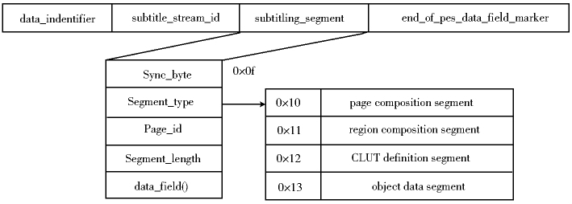
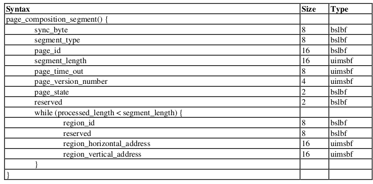
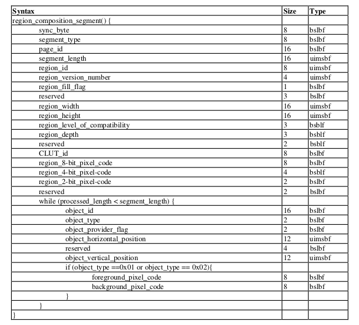
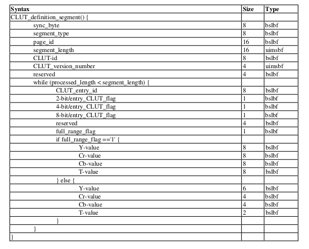
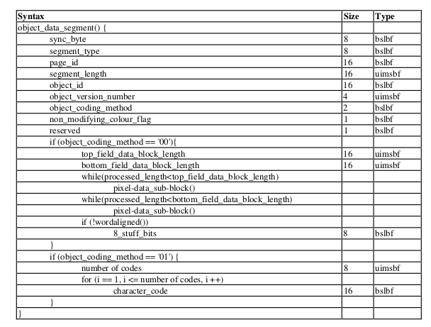
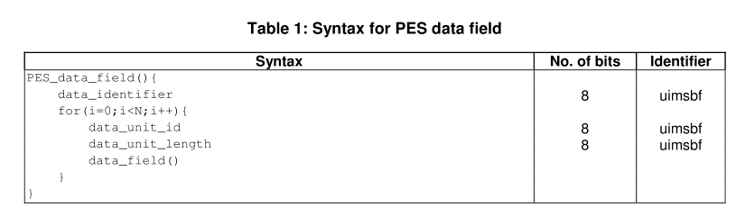
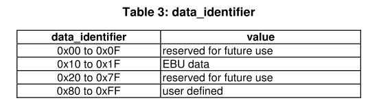
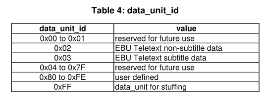
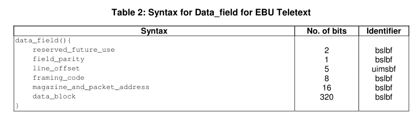

## 字幕基础

  - 字幕的基础:
    - **外挂字幕**: 将字幕单独做成一个文件, 字幕文件有多种格式.
    - <span id="硬字幕">**硬字幕**</span>: 将字幕履盖叠加在视频画面上, 不可编辑, 兼容性最佳, 只要能够播放视频, 就能显示字幕.
    - <span id="软字幕">**软字幕**</span>: 是指通过某种方式将外挂字幕与视频打包在一起, 下载、复制时只需要复制一个文件即可.

  - 字幕的分类:
    - 按字幕的应用方式分类, 可分为: [外挂字幕](##外挂字幕), [内置字幕](#内置字幕), [DVB 字幕](#dvb-字幕), [CC 字幕](#cc-字幕)等.
      - 字幕一般可分为外挂字幕和内置字幕([硬字幕](##硬字幕), [软字幕](#软字幕)), 与 gxplayer 应用相关, 把内置字幕细分成内置字幕, DVB 字幕, CC 字幕.
    - 按字幕的数据格式分类, 可分为: 文本格式字幕, 图形格式字幕.
      - 文本格式字幕需要字符库支持才能显示, 其生成编码文件大小较小, 应用较为灵活等.
      - 图形格式字幕可以直接显示, 其生产编码文件大小较大, 一般10M.
    - 按字幕的编码类型分类, 可分为: SSA / ASS , SRT, XSUB, PGS, WEBVTT, DVD, DVB, CC.
      - DVB 字幕包含: DVB-SUBTITLE, DVB-TELETEXT, DVB-MAGAZINE.
      - CC 字幕包含: SCTE-CC, ARIB-CC, ATSC-CC.

### 外挂字幕:

  - 外挂字幕独立于多媒体文件, 由单个或多个文件描述, 根据文件后缀识别:

    - <span id="lrc">".lrc"</span>: 全称 [lyric](https://baike.baidu.com/item/lrc/46935?fr=aladdin), 属于文本格式字幕.
      ```
      例子:
      [00:00.50]蔡健雅 - 依赖
      [00:11.60]关了灯把房间整理好
      ...
      [01:07.84][01:58.23][02:25.11][02:33.15]你对爱　已不再　想依赖
      ```
    - <span id="ass">".ass", ".ssa"</span>:
      - ".ssa": 全称 SubStationAlpha, 即 [v4 style], 属于文本格式字幕.
      - ".ass": 全称 [Advanced SubStation Alpha](https://www.jianshu.com/p/df1f42ba59aa), 即 [v4+ style], 属于文本格式字幕.
      ````
      例子:
      Dialogue: Marked=0,0:00:02.20,0:00:02.50,mine,,0000,0000,0000,,{\pos(290,220)}{\fs60}{\t(0,300,\fs20)}{\c&HFF80FF&}{\fe130\fnComic Sans MS}欢迎光临
      ````
    - <span id="srt">".srt"</span>: 全称 [SubRip Text](https://www.douban.com/note/499434767/), 属于文本格式字幕.
      ````
      例子:
      1.
      00:00:06,756 --> 00:00:08,087
      which liberated a yellow,
      ````
    - <span id="vtt">".vtt"</span>: 全称 [Web Video Text Tracks](https://blog.lyz810.com/article/2017/01/webvtt-introduction/), 属于文本格式字幕.
      ````
      例子:
      1.
      00:01.000 --> 00:04.000
      Never drink liquid nitrogen.

      2.
      00:05.000 --> 00:09.000
      - It will perforate your stomach.
      - You could die.
      ````
    - ".txt": (略)
    - <span id="idx">".idx" + ".sub" + ".ifo"</span>: VOBSub 格式字幕, 属于图形格式字幕．
      - ".idx": 索引文件, 描述了字幕出现的时间以及字幕的属性.
      - ".ifo": 调色板信息, 可有可无.
      - ".sub": 存放字幕数据, 图片格式.
      ````
      例子:
      timestamp: 01:09:28:080, filepos: 0023af000
      ````

### 内置字幕:

  - 内置字幕存在于流媒体文件中, 可以包含多个字幕轨道的描述, 字幕编码描述于多媒体文件中:语法

    - "ASS", "SSA": 详细信息见: [".ass", ".ssa"](##ass).
    - "SRT": 详细信息见: [".srt"](##srt).
    - "WEBVTT": 详细信息见: [".vtt"](##vtt)
    - <span id="xsub">"XSUB"</span>:  DivX Media Subtitle, 属于图形格式字幕.
    - <span id="pgs">"PGS"</span>: 全称 [Presentation graphic stream](https://blog.csdn.net/weixin_30865427/article/details/95064500), 属于图形格式字幕.
    - <span id="dvd">"DVD"</span>: VOBSub, 属于图形格式字幕.

### DVB 字幕:

  - DVB 字幕存在于多媒体 MPEG-TS 流文件中.
  - DVB 字幕有两种传输的方式，一种是图形方式, 即 DVB-SUBTITLE; 另一种是文本方式, 即 DVB-TELETEXT, DVB-MAGAZINE.
    - <span id="dvb-subtitle">DVB-SUBTITLE</span>:
      - 信息描述:
        - 字幕信息描述于 PMT 表下的 descriptor_tag 为 0x59.
        - 一个 descriptor_tag 下包含多个字幕, 由合成页 composition page 以及辅助页 ancillary page 描述.
      - 编码规范: 标准文档 - [[ETSI 300 743](https://www.doc88.com/p-3562525379736.html)]
        - 字幕数据封装在PES报文中, PES 包结构携带字幕数据的时间戳 PTS, PTS 用于字幕的同步.
          - 语法
            
        - Page Composition Segment(PCS): 页面组成段包含一个由零或多个区域组成段的列表.
          - 语法
            
        - Region Composition Segment(RCS): 区域组成段, 定义储存区域大小, 数据储存在对象数据段中.
          - 语法
            
        - CLUT definition segment: 调色板定义段, 包含 2 bit / 4 bit / 8 bit 的调色板.
          - 语法
            
        - Object data segment: 对象数据段.
          - 语法
            
    - <span id="dvb-teletext">DVB-TELETEXT, DVB-MAGAZINE</span>:
      - 信息描述:
        - 字幕信息描述于 PMT 表下的 descriptor_tag 为 0x56.
        - 一个 descriptor_tag 下包含多个字幕, 由合成页 composition page 以及辅助页 ancillary page 描述.
        - 每个由合成页和辅助页描述的字幕, 都有类型标识字段用于区分 DVB-TELETEXT 以及 DVB-MAGAZINE.
      - 编码规范: 标准文档 - [[ETSI EN 300 472](https://www.doc88.com/p-1176369341107.html) | [ETSI EN 300 706](https://www.doc88.com/p-0651775729154.html)]
        - 字幕数据封装在 PES 报文中, PES 包结构携带字幕数据的时间戳 PTS, DVB-TELETEXT 需要 PTS 同步, DVB-MAGAZINE 不需要 PTS 同步.
        - PES 包由多个 EUB Teletext 组成.
          - 语法
            
          - data_identifier 定义
            
          - data_unit_id 定义
            
        - EBU Teletext:
          - 语法
            
        - 利用 VBI 库对 EBU TELETEXT 数据进行解码显示.

### CC 字幕:

  - CC(Closed Caption):
    - [相关知识:](https://www.doc88.com/p-101556386179.html)
      - 最初设计的目的是为了帮助有听力障碍的人理解电视节目的内容，即将节目中的Audio (背景音乐显示音乐符号) 通过文字在屏幕上显示出来.
      - 目前, Closed Caption 的标准主要有 ATSC 定义的 CEA/EIA-608 和 CEA/EIA-708，日本 ARIB STD-B24 等.
    - 实现方法:
      - 解码 Closed Caption 协议规范定义, 在 SPP 层上显示字幕.
  - <span id="atsc-cc">ATSC-CC 字幕</span>:
    - ATSC-CC 数据是通过 MPEG-2 Video 中的 User Data 部分进行传输.
  - <span id="arib-cc">ARIB-CC 字幕</span>:
    - ARIB-CC 数据是通过 MPEG-TS 流中以独立的 ES 进行传输.
    - [语法解析](http://www.360doc.com/content/12/0412/17/1016783_203079292.shtml)
  - <span id="scte-cc">SCTE-CC 字幕</span>: [标准文档](http://www.doc88.com/p-8136420645646.html)

