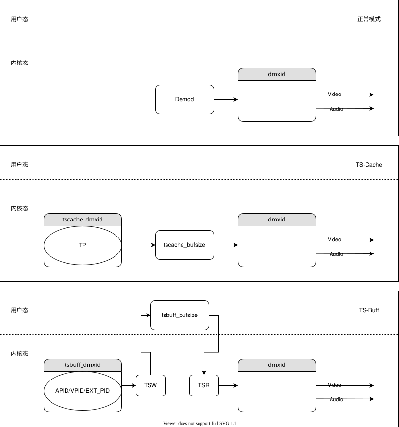

# 播放功能

- 音视频播放的基本原理请参考：[音视频播放背景知识](../../background/background.md#播放基础)
- 播放器是指能播放以数字信号形式存储的视频或音频资源的软件。
- 播放器按数据源分为 **DVB 播放器、多媒体播放器、网络播放器** 三种。
- 初始化阶段, 有很多与播放功能相关的配置项可用配置, 详见:[播放配置](init.md#模块配置)

## 播放 DVB

### 概述

- 支持的协议有："dvbc", "dvbt","dvbs", "dtmb", "dvbt2", "dvbnet"。
- 更多信息参考：[DVB 协议支持范围](support/support.md#DVB协议支持范围)

### 配置

- 打开 播放器 【**可选**】
  - 配置方法:
    - 使用 \ref GxPlayer_Open

- 生成 URL 【**必选**】
  - URL 示例参考：[URL 介绍](../../background/background.md#url-示例)

- 配置 DemuxID【**可选**】
  - 默认值: 0
  - 取值范围:
    - 因芯片而异，一般用 0 或者 1， 更多信息请参考: \ref DemuxID
  - 配置方法:
    - 在基础 URL 中增加字段 "&dmxid:value"。可以使用 GxUrl_XXX 相关接口或字符串相关接口配置。

- 配置 音视频同步时钟源【**可选**】
  - 默认值:  AVPTS_RECOVER
  - 取值范围:
    - 见： \ref GxSTCProperty_Config
  - 配置方法:
    - 在基础 URL 中增加字段 "&sync:value"。可以使用 GxUrl_XXX 相关接口或字符串相关接口配置。

- 配置 音视频同步效果【**可选**】
  - 默认值: VIDEO_SYNCMODE_NORMAL
  - 取值范围:
    - 见： \ref VideoSyncMode
  - 配置方法:
    - 使用 \ref GxPlayer_SetVideoSyncMode

- 配置 音量大小【**可选**】
  - 默认值: 50
  - 取值范围: 0 ~ 100
  - 配置方法:
    - 使用 \ref GxPlayer_SetAudioVolume

- 配置 黑屏/静帧【**可选**】
  - 默认值: 1
  - 取值范围: [0|1]
  - 配置方法:
    - 使用 \ref GxPlayer_SetFreezeFrameSwitch

### 启动

- 为了满足不同应用场景的需求，DVB 播放器在常规模式的基础上，又增加了 TSCache、TSBuff 两种模式。

- 这几种模式只有启动前置条件有区别，其他 (配置、停止、切换) 都一样。

- 其中，dvbnet 只支持常规模式，其他协议支持所有模式。

- 简要数据流图如下：

  

  ### 常规模式

- 如何启动
    - 调用接口 \ref GxPlayer_MediaPlay

  ### TSCache (快速切台)

  - 模式介绍
    - 目的：加速相同频点下 DVB 节目之间的切换速度。
    - 缺陷：
      - 额外的内存消耗；
      - 多占用一个 Demux 硬件；
      - 同步效果不支持 VIDEO_SYNCMODE_NORMAL;
      - 仅支持同一个频点内快速切台；
      - 用户如果快速连续按键进行切台，那么无法达到快速切台的效果;

  - 如何启动
    - 启动播放前，增加以下配置：
      - 调用 \ref GxPlayer_SetVideoSyncMode
      - 调用 \ref GxPlayer_ModuleRegisterDVBSourceTSCache
    - 启动播放前，对原 URL 进行扩展，增加以下字段：
      - tscache_ms . 表示需要缓冲多少时间的数据，单位 ms。 (**必须配置**，推荐500~600) 。
      - tscache_dmxid . 表示要用哪个 Demux 进行录制原始数据. 这个 id 不能与原 URL 中的 dmxid 相同。 (**可选**，默认: 1) 。
      - tscache_bufsize . 缓存Buffer的大小, 单位: Byte. 至少能够缓冲 1.5 倍 tscache_ms 时间单 TP 的数据。(**可选**，默认: 10M) 。
    - 调用接口 \ref GxPlayer_MediaPlay

  - 注意事项
    - tscache_dmxid 指定的 DemuxID 被播放器独占，其他功能不能再用了。
    - ESA/ESV 大小必须能缓冲1s数据，推荐ESV=4M ESA=256k+， 修改的方法参考：
      ```c
       GxBus_ConfigSetInt(PLAYER_CONFIG_VIDEO_ESV_SIZE, 0x400000);
       GxBus_ConfigSetInt(PLAYER_CONFIG_AUDIO_ESA_SIZE, 0x40000);
       GxBus_ConfigSetInt(PLAYER_CONFIG_AUDIO_PCM_SIZE, 0x80000);
    ```
  ### TSBuff (延迟播放)

  - 模式介绍
    - 目的：缓存原始的 TS 流，实现延迟播放。
    - 缺陷：
    - 额外的内存消耗；
    - 多占用一个 Demux 硬件;
    - CPU 负载上升。
  - 如何启动
    - 启动播放前，增加以下配置：
      - 调用 \ref GxPlayer_MediaDelayConfig
    - 启动播放前，对原 URL 进行扩展，增加以下字段：
      - tsbuff . 表示需要延迟多少时间的数据，单位 ms。 (**必须配置**) 。
      - tsbuff_dmxid . 表示要用哪个 Demux 进行录制原始数据. 这个 id 不能与原 URL 中的 DemuxID 相同。 (**可选**, 默认: 1) 。
      - tsbuff_memhole_size . 表示当系统缓存缓存不足时，可以使用的洞内存的大小, 单位: Byte。 (**可选**, 默认: 0) 。
    - 调用接口 \ref GxPlayer_MediaPlay
  - 注意事项
    - tsbuff_dmxid 指定的 DemuxID 被播放器独占，其他功能不能再用了。
    -  \ref GxPlayer_MediaDelayConfig
    - TSBuff 默认只缓存 URL 中指定的音视频数据，如果要使用 URL 中的 DemuxID 来过滤一些表数据或者多音轨、多字幕数据，需要在播放启动后，调用 \ref GxPlayer_MediaTrackAdd

### 停止

- 调用接口 \ref GxPlayer_MediaStop
  - 如果不曾调用过 \ref GxPlayer_Open
  - 如果曾经调用过 \ref GxPlayer_Open

### 控制

#### 切换节目
  - 不需要调用 \ref GxPlayer_MediaStop
#### 暂停 / 恢复
  - \ref GxPlayer_MediaPause
  - \ref GxPlayer_MediaSave
#### 缩放 / 裁剪
  - \ref GxPlayer_MediaWindow
  - \ref GxPlayer_MediaClip
#### 显示 / 隐藏
  - \ref GxPlayer_MediaVideoShow
#### 音轨切换
  - \ref GxPlayer_MediaAudioSwitch
#### 其他功能
  - 详见：[字幕功能](./subtitle.md)，[AD 功能](./ad.md)，[信息获取](./info.md) 。

## 播放文件

### 概述

- 用于播放本地存储的多媒体文件 (含 PVR 的录制文件)。
- 更多信息参考：[多媒体容器格式支持范围](support/support.md#容器格式支持范围)

### 配置

- 打开 播放器 【**可选**】
  - 配置方法:
    - 使用 \ref GxPlayer_Open

- 获取 URL 【**必选**】
  - URL 示例参考：[URL 介绍](../../background/background.md#url-示例)
  - 获取方法：
    - 从 HOTPLUG 模块获取磁盘路径，调用 GxCoreAPI 中 FS 相关接口，获取文件路径。

- 配置 音视频同步时钟源【**可选**】
  - 默认值:  PURE_APTS_RECOVER
  - 取值范围:
    - \ref PURE_APTS_RECOVER 兼容性更好。
    - \ref FIXD_VPTS_RECOVER 起播及跳转速度更快(视频出来更快), 音频出来稍慢。
    - 更多信息参考: [同步方式介绍](../../background/background.md#同步方式介绍)
  - 配置方法:
     ```ｃ
      GxBus_ConfigSetInt(PLAYER_CONFIG_PVR_PLAYBACK_HWTS_SYNCMODE, FIXD_VPTS_RECOVER);
     ```
  - **注意事项**：
    - 仅当目标文件是 PVR 录制的 ".dvr 文件" 且强制采用硬件 Demux 播放时生效。
      - 强制采用硬件 Demux 播放的方法：
        ```c
        GxBus_ConfigGetInt(PLAYER_CONFIG_PVR_PLAYBACK_FORCE_HWTS, 1);
        ```
      - NNE 芯片会自动强制采用硬件 Demux 播放 ".dvr" 文件。
      - 强制采用硬件 Demux 播放的优势：节省内存、减轻 CPU 负担。
    - 必须占用一个硬件 Demux，默认使用 Demux:1, 可用 \ref PLAYER_CONFIG_PVR_PLAY_DEMUX_ID 配置 。

- 配置 音量大小【**可选**】
    - 默认值: 50
    - 取值范围: 0 ~ 100
    - 配置方法:
      - 使用 \ref GxPlayer_SetAudioVolume

### 启动

- 调用接口 \ref GxPlayer_MediaPlay

### 停止

- 调用接口 \ref GxPlayer_MediaStop
  - 如果不曾调用过 \ref GxPlayer_Open
  - 如果曾经调用过 \ref GxPlayer_Open

### 控制

#### 切换节目
  - 不需要调用 \ref GxPlayer_MediaStop
#### 暂停 / 恢复
  - \ref GxPlayer_MediaPause
  - \ref GxPlayer_MediaSave
#### 缩放 / 裁剪
  - \ref GxPlayer_MediaWindow
  - \ref GxPlayer_MediaClip
#### 显示 / 隐藏
  - \ref GxPlayer_MediaVideoShow
#### 音轨切换
  - \ref GxPlayer_MediaAudioSwitch
#### 跳转 (Seek)
  - \ref GxPlayer_MediaSeek
#### 快进 / 快退
  - \ref GxPlayer_MediaSpeed
#### 其他功能
  - 详见：[字幕功能](./subtitle.md)，[AD 功能](./ad.md)，[信息获取](./info.md) 。

## 播放 IPTV

### 概述

- 用于网络上的直播、点播节目。
- 支持的协议有："http/https", "hls","dash", "rtmp", "rtsp", "udp", "rtp"。
- 支持存在于磁盘上的 “.m3u8”，".mpd" 文件。
- 更多信息参考：[网络协议支持范围](support/support.md#网络协议支持范围)

### 配置

- 打开 播放器 【**可选**】
  - 配置方法:
    - 使用 \ref GxPlayer_Open

- 获取 URL 【**必选**】
  - URL 示例参考：[URL 介绍](../../background/background.md#url-示例)
  - 获取方法：
    - 从服务提供商处获取。

- 配置 URL 【**可选**】
  - 配置方法：
    - 根据各个服务器的特性按需在 URL 后增加 -H 配置。
    - 详细信息参考：[IPTV-H 选项](support/support.md##IPTV配置项)

- 配置 音量大小【**可选**】
  - 默认值: 50
  - 取值范围: 0 ~ 100
  - 配置方法:
    - 使用 \ref GxPlayer_SetAudioVolume

### 启动

- 调用接口 \ref GxPlayer_MediaPlay

### 停止

- 调用接口 \ref GxPlayer_MediaStop
  - 如果不曾调用过 \ref GxPlayer_Open
  - 如果曾经调用过 \ref GxPlayer_Open

### 控制

#### 切换节目
  - 不需要调用 \ref GxPlayer_MediaStop
#### 暂停 / 恢复
  - \ref GxPlayer_MediaPause
  - \ref GxPlayer_MediaSave
#### 缩放 / 裁剪
  - \ref GxPlayer_MediaWindow
  - \ref GxPlayer_MediaClip
#### 显示 / 隐藏
  - \ref GxPlayer_MediaVideoShow
#### 音轨切换
  - \ref GxPlayer_MediaAudioSwitch
#### 跳转 (Seek)
  - \ref GxPlayer_MediaSeek
  - 直播节目不支持 Seek。
  - 当前节目是否支持 Seek，可以用 \ref GxPlayer_MediaGetProgInfoByName
#### 快进 / 快退
  - \ref GxPlayer_MediaSpeed
#### 带宽切换
  - \ref GxPlayer_MediaBandwidthSwitch
  - \ref GxPlayer_MediaSeamlessBandwidthSwitch
#### 其他功能
  - 详见：[字幕功能](./subtitle.md)，[AD 功能](./ad.md)，[信息获取](./info.md) 。

## 播放 FM

### 概述

- 用于播放广播电台。
- 支持的协议有："fm"。

### 配置

- 打开 播放器 【**可选**】
  - 配置方法:
    - 使用 \ref GxPlayer_Open

- 获取 URL 【**必选**】
  - URL 示例参考：[URL 介绍](../../background/background.md#url-示例)

- 配置 音量大小【**可选**】
  - 默认值: 50
  - 取值范围: 0 ~ 100
  - 配置方法:
    - 使用 \ref GxPlayer_SetAudioVolume

### 启动

- 调用接口 \ref GxPlayer_MediaPlay

### 停止

- 调用接口 \ref GxPlayer_MediaStop
  - 如果不曾调用过 \ref GxPlayer_Open
  - 如果曾经调用过 \ref GxPlayer_Open

### 控制

#### 切换节目
  - 不需要调用 \ref GxPlayer_MediaStop
#### 暂停 / 恢复
  - \ref GxPlayer_MediaPause
  - \ref GxPlayer_MediaResume
