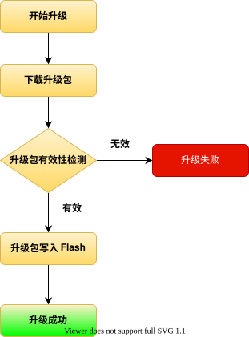
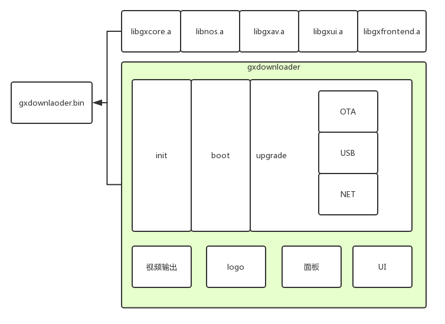
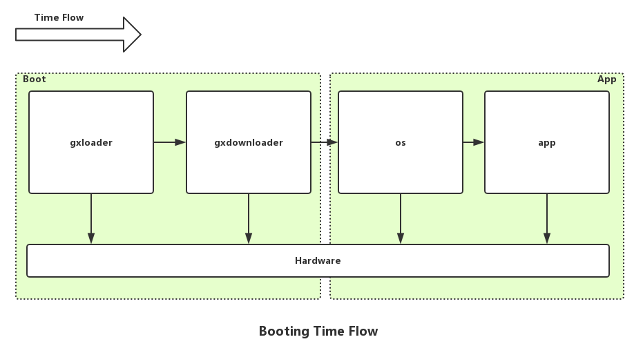
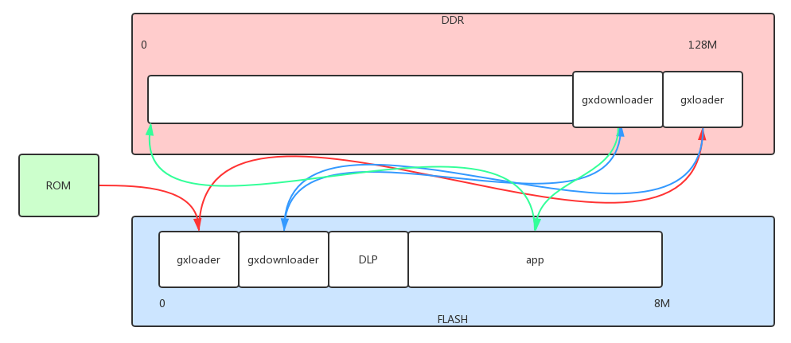
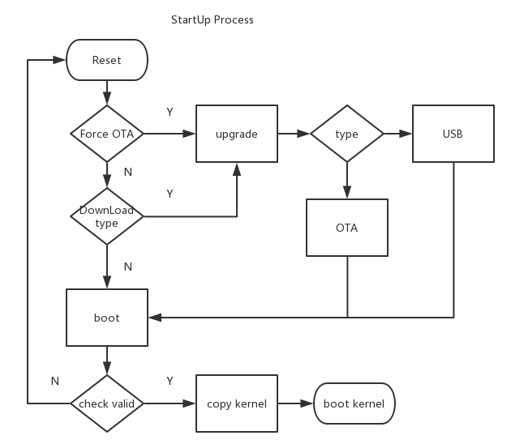
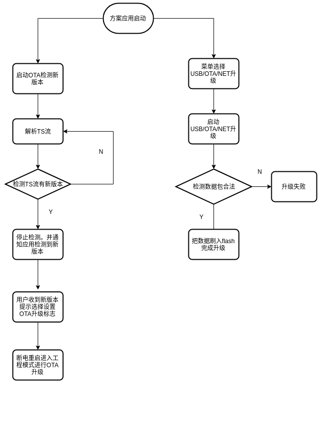
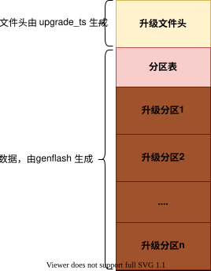

# 功能特性

GxDownloader 主要提供了升级和引导功能，还包括了其他一些特色功能。功能包括：

- 升级方式 
  - 有线模式(USB)
  - 无线模式(OTA/HTTP)
- 支持的 Flash 类型
  - SPI Nor Flash
  - Nand Flash
- 引导功能
  - 支持校验启动
  - 支持解密启动
  - 支持签名启动
- 特色功能
  - 支持静态、动态调整分辨率和制式logo 显示不黑屏。
  - 支持 CVBS、HDMI 视频输出,支持完整版本 HDMI 驱动。
  - 支持面板显示/遥控器的交互模式。
  - 支持多语言。
  - 支持 minigui/gdi 图形系统。
  - 支持点阵字库、矢量字库。
  - 支持 minifs 文件系统，可以单独升级数据区域的某个文件。

## 升级方式

GxDownloader 目前支持 3 种升级方式，不同的升级方式区别是接收升级数据来源的方式不同，支持有线模式和无线模式，根据接收到的文件解析升级信息，校验之后把升级数据写入 Flash。

- OTA 升级，是通过 DSM-CC 协议接收升级文件。工程模式和方案模式都支持。
- USB 升级，是读取U盘的升级文件进行升级，只支持 FAT 格式 U 盘，根目录放置升级文件。目前只有工程模式支持。
- NET-HTTP 升级，是通过 HTTP 协议接收服务器的升级文件。工程模式和方案模式都支持。

## 升级策略

GxDownloader 中一次完整的升级流程如下：



### 升级文件有效性检测

流程中的升级文件有效性检测包括升级文件版本号匹配检测、升级文件完整性校验、升级文件签名验证、升级数据合理性检测。

**升级文件版本号匹配检测**

版本号由厂商 ID、硬件版本号、软件版本号组成。升级文件的厂商 ID 和硬件版本号必须与机顶盒 DLP 信息中存储的厂商 ID 和硬件版本号一致，否则认为升级文件非法，升级失败；当厂商 ID 和硬件版本号一致后需要比较软件版本号，软件版本号比较的策略有四种。

1. ota_type=0 ，默认策略，升级文件的软件版本号必须大于当前升级文件的软件版本号
2. ota_type=1，SN 号范围判断升级，在 ota_type=0 的基础上再增加 SN 号范围判断，只有在 SN 号范围的机顶盒才能被升级，此功能只有一个用户使用，公版目前未使用 (v1.9.8-8 版本开始支持)
3. ota_type=2，强制升级，忽略软件版本号的比较，只要厂商 ID 和硬件版本号一致 (v1.9.8-8 版本开始支持)
4. ota_type=3，软件版本号不相等升级 (v1.9.8-8 版本开始支持)

ota_type 是升级文件的包含在升级文件的头信息中，在制作升级文件的时候指定，具体可以看[升级码流制作工具](./tools.md)

**升级文件完整性校验**

升级文件使用循环冗余校验（Cyclic Redundancy Check， CRC）对数据进行完整性校验，检测数据在传输的过程中是否出现错误。升级文件由头信息和有效数据组成，头信息包含了本身的 CRC 和 有效数据的 CRC，当机顶盒接收到数据后，进行 CRC 校验。

**升级文件签名验证**

升级文件签名验证指的是使用非对称加密算法验证升级文件来源的合法性。目前 GxDownloader 未有相应框架，由客户自己实现，后续会加入。

**升级数据合理性检测**

升级数据合理性检测包括以下几点

1. 当前机顶盒必须包含升级文件中指定要升级的分区，否则认为该升级文件制作有问题，升级失败。
2. 升级文件中指定要升级的分区的有效数据必须小于等于当前机顶盒该分区的最大空间，否则认为该升级文件制作有问题，升级失败。
3. 当不包含任何升级数据时，认为该升级文件制作有问题，升级失败。

只有升级文件通过有效性检测，升级文件才能被写入 Flash，否则不会更新任何一个分区。

## 升级触发

当需要升级的时候，首先需要制作升级 image 文件，image 文件可以通过有线模式或者无线模式升级。升级有多种触发方式：

- 在方案中，当检测到升级触发，可以进入工程模式也可以进入方案模式进行升级。
  - OTA 在应用程序监控新版本，检测到新版本，调用 DLP 接口设置升级标志位，解析升级参数，重启进入 OTA 升级模式。
- 在方案中，主动进入 OTA 升级模式。
  - 界面选择 OTA 升级。
- 在启动的时候，如果检测到升级触发，进入升级模式。
  - 发现升级标志位，进入升级模式。
- 在启动的时候，交互模式，通过检测面板按键，进入升级模式，不同的面板按键值，对应不同的升级模式。
  - OTA 升级模式，可以在界面中输入前端类型，频点等参数设置，根据参数设置进行 OTA 升级。
  - USB 升级模式，可以在界面中输入升级文件文件名参数设置，根据参数设置进行 USB 升级。
  - HTTP 升级模式，可以在界面中输入设备和服务器的 IP 地址，网络端口号等参数设置，根据参数设置进行HTTP 升级。
  



## 集成模式

GxDownloader 是基于 GxAPI 开发的应用程序，主要提供了多模式（有线模式、无线模式）升级镜像功能。它有两种软件集成模式：

- 工程模式，GxDownloader 编译结果是单独可执行的程序，生成压缩的 LZMA 格式的 bin 文件，独立存储在 Flash 的 OTA 分区中，提供升级和引导功能。 工程升级模式进入的方法是在方案应用中利用 API 提供的设置升级类型接口写 DLP 分区，然后重启进入工程升级模式。工程模式可以被认为是 GxLoader 的延续，提供了升级功能。
- 方案模式，GxDownloader 编译结果是 libdownloader.a 和相关的头文件，提供给 ecos、linux 方案集成升级功能。

### 工程模式



工程模式执行流程上电或者复位重启后分为两个部分；第一部分找到 APP 并且引导；第二个部分升级系统。下图是启动的时间流程图。



系统上电或者复位之后，ROM 代码拷贝 GxLoader 到 RAM 最后的位置（红线部分），GxLoader 初始化 CPU 和RAM，从 Flash 指定的位置拷贝压缩的 GxDownloader 镜像到 RAM 的 GxLoader 之前的位置（蓝线部分），解压跳转执行 GxDownloader。GxDownloader 初始化堆栈，格式化 cmdline，根据功能初始化 AV、DEMOD、FRONTEND、USB、网路等模块的驱动，GxDownloader 拷贝 App 到 RAM 的 0 地址位置启动引导（绿线部分）。



GxDownloader 初始化完成之后进入引导检测流程，首先检测前面板，判断是否强制进入 OTA 升级，如果需要升级就进入 update；如果前面板不需要强制进入升级，则根据 DLP 分区的标志位 “Download type”，判断是否需要进入升级状态，如果需要升级就进入 update，其他情况进入 boot 程序。 启动引导流程图：



### 方案模式

方案模式指的是在 App 应用中调用 libdownloader.a 库提供的接口执行升级，检测新版本和设置升级标记等功能。公版方案的升级流程如下:



- 以上流程图描述的是公版应用方案集成了 GxDownloader 功能实现的执行流程。
- 方案模式通过 OTA 检测到新版本，设下 OTA 升级标记位，断电重启进入 GxDownloader 会根据 OTA 升级标记进行 OTA 升级。
- 可以选择直接在方案中升级，目前集成了 OTA 升级，流程图中的 USB 和 NET 升级还未支持。

## 接口说明

* DLP 操作接口

  以 GxDLP 前缀的函数用来操作 DLP 数据。头文件 gxdlp_api.h

* OTA 升级接口

  GxOTA 开头的函数用以 OTA 升级时操作。头文件 gxota_api.h 和 gxota_msg.h

* GxUpdate 接口

  新的 api 接口，后续将完全代替 GxOTA 接口，目前只支持网络升级。头文件 gxupdate_api.h 和 gxupdate_msg.h

各个接口函数的详细说明请看[函数列表](./functions.md)


## 配置和构建

### 配置

GxDownloader 通过 "make menuconfig" 进⾏配置。配置包括芯⽚类型、⽀持的升级⽅式、⽀持的 tuner 和 demod 类型、⽀持的 WIFI 类型、DLP 路径等。

在执⾏ "make menuconfig" 之前必须先在 GxDownloader 执⾏ ./build 编译（./build 编译指的是选择⼀种芯⽚和操作系统编译，如选择 csky ecos ，即 ./build csky ecos），build 脚本会查找 GxDownloader 的根⽬录有有没有 .config ⽂件，如果没有 .config ⽂件就会从 configs ⽂件夹根据操作系统选择对应的 defconfig，defconfig ⼀般只打开了最⼩功能，只⽀持 OTA-DSMCC 升级。执⾏完 ./build 编译后，再执⾏ make menuconfig，在默认功能的基础上减少或增加配置。./build 编译切换操作系统时，build 脚本会判断操作系统的切换，重新从 configs 选择对应操作系统的 defconfig。

### 构建

GxDownloader 是基于 GxAPI 开发的应⽤程序，所以依赖 GoXceed 提供的库。

在集成模式中提到过 GxDownloader ⽀持两种软件集成模式，其编译⽅式也会有不同。

#### ⼯程模式

⼯程模式⽀持 nos 和 ecos，ecos 是从 v1.9.8-8 平台版本开始⽀持的。

##### nos ⼯程模式

- 编译 libnos.a 和 target.ld

  ⽣成 libnos.a 和 target.ld，但在编译⽣成之前，需要修改 "gxloader/conf/chipxxx/boardxxx/lib.config”, "script/ota.config" ⽂件。下⾯对两个⽂件的修改⼀⼀说明。
  **lib.config**

  如果需要 GxDownloader 升级时 CVBS 能正常显⽰ logo 和 GUI，需要在 CMDLINE_VALUE 增加 svpumem 字段， 如 CMDLINE_VALUE = "mem=66M videomem=60M svpumem=2M mem_end console=ttyS0,115200 init=/init"。如果不需要 CVBS 显⽰，保持默认配置即可。lib.config 和 release.config 的 CMDLINE_VALUE 必须保持⼀致。
  **ota.config**

  根据需要修改 SPP_BUF_SIZE 和 OSD_BUF_SIZE，⼀般不需要修改，保持默认值即可。SPP_BUF_SIZE是显⽰ logo 的 buffer 空间，OSD_BUF_SIZE 是显⽰ GUI 界⾯。计算⽅法都是分辨率*3。如576i分辨率等于720 * 576 * 3 = 1244160 = 0x12fc00 Bytes, 默认值 0x130000>0x12fc00。

  gxloader 下编译执⾏, 以下 taurus 6605H1 只是⼀个例⼦，实际根据具体的芯⽚修改

  ```
  cd gxloader
  ./build taurus 6605H1 lib
  ```

- 编译 gxosal

  ```
  cd gxosal
  ./build csky|arm nos
  ```

- 编译⽆系统的 AV 驱动

  ```
  cd gxavdev
  ./build csky|arm nos
  ```

- 编译⽆系统的前端驱动

  ```
  cd  gxfrontend
  ./build csky|arm nos
  ```

- 编译⽆系统的 secure 驱动

  ```
  cd gxsecure
  ./build csky|arm nos
  ```

- 编译⽆系统的 GxCore API

  ```
  cd gxapi
  ./build csky|arm nos
  ```

- 编译⽆系统的第三⽅库

  ```
  cd thirdparty
  ./build csky|arm nos
  ```

- 编译⽆系统的 bus 库

  ```
  cd gxbus
  ./build csky|arm nos
  ```

- 编译⽣成 ota.img

  ```
  cd gxdownloader
  ./build csky|arm nos
  ```

  执⾏结束后 gxdownloader ⽬录下会⽣成⼀个 ota.img ⽂件。
  ⽣成 ota.img 之前⼀定要根据当前芯⽚类型和所需功能进⾏配置，特别是芯⽚类型，芯⽚类型如
  果选错，会导致程序死机或者驱动不正常⼯作

最后为了 GxLoader 能正常引导 GxDownloader 编译⽣成的 ota.img，需要
gxloader/conf/chipxxx/boardxxx/release.config 和 script/ota.config 修改以下这⼏个选项：
**release.config:**

1. 关闭 ENABLE_LOGO，取消 GxLoader 阶段 logo 的显⽰，logo 会在 GxDownloader 中显⽰。
2. 打开 ENABLE_OTA 和 ENABLE_OTA_FORCE_DRAM_ADDR
3. CMDLINE_VALUE 的值应该和 lib.config 保持⼀致。

**ota.config:**

1. 修改 OTA_FORCE_FLASH_ADDR，这个值要和实际存储 ota.img 的 Flash 地址⼀致。⽐如 ota.img 在 Flash 地址 0x10000 的位置，则 OTA_FORCE_FLASH_ADDR = 0x10000
2. 修改 OTA_FORCE_FLASH_SIZE，这个值要⼤于等于 ota.img 的⼤⼩，并规定在 NOR Flash 中该值
   是64 KBytes 的整数倍，NAND Flash 是128 KBytes 的整数倍。⽐如当 ota.img 是 443 KBytes 时，则当 Flash 是 NOR Flash 时 OTA_FORCE_FLASH_SIZE = 0x70000，Flash 是 Nand Flash 时
     OTA_FORCE_FLASH_SIZE = 0x80000
3. SPP_BUF_SIZE 和 OSD_BUF_SIZE 必须和在编译 libnos.a 时设置的⼀致。

**注意:** 经常遇到的问题是 gxloader 已经把 ota.img 解压并拷⻉到内存，并跳转到 gxdownloader。但是gxdownloader 并没有运⾏，原因是 gxloader 拷⻉的内存地址和 gxdownloader 的实际运⾏地址不匹 配，可以查看编译 libnos.a 库时⽣成的target.ld的运⾏地址和编译 gxloader ⽣成的 include/version_autogenerated.h 中的OTA_DRAM_START_ADDR 是否⼀致。如果不⼀致，请按上⾯教程重新检查 lib.config 和 release.config 中CMDLINE_VALUE 值是否⼀样， 以及在编译 libnos.a 和 gxloader 时 ota.config 的 SPP_BUF_SIZE，OSD_BUF_SIZE 有没有改动。

##### ecos ⼯程模式

- 编译 ecos 3.0 库

  ```
  cd ecos3.0
  ./build csky ecos
  
  ```

- 编译 gxosal

  ```
  cd gxosal
  ./build csky|arm ecos
  ```
  
- 编译 ecos 的 AV 驱动

  ```
  cd gxavdev
  ./build csky ecos ota
  ```
  
- 编译 ecos 的前端驱动

  ```
  cd gxfrontend
  ./build csky ecos
  
  ```

- 编译 ecos secure 驱动

  ```
  cd gxsecure
  ./build csky ecos
  
  ```

- 编译 ecos 的 GxCore API

  ```
  cd gxapi
  ./build csky ecos
  
  ```

- 编译 ecos 的第三⽅库

  ```
  cd thirdparty
  ./build csky ecos
  
  ```

- 编译 ecos 的 bus 库

  ```
  cd gxbus
  ./build csky ecos ota
  
  ```

- 编译 libboot.a 和 version_autogenerated.h

  ecos 的⼯程模式需要 GxLoader ⽣成两个⽂件 libboot.a 和 version_autogenerated.h 供其使⽤。

  - libboot.a

    ⼯程模式下 GxDownloader 需要引导内核，但是 ecos 本⾝不带引导功能，需要增加引导功
    能；为了只维护⼀份引导代码，直接使⽤ GxLoader 的引导代码 libboot.a

  - version_autogenerated.h
    提供了 ecos ⼯程模式的加载和运⾏地址 OTA_DRAM_START_ADDR

  GxLoader 下编译执⾏, 以下 taurus 6605H1 只是⼀个例⼦，实际根据具体的芯⽚修改，注意编译命令的最后⼀个参数 "ecos" 

  ```
  cd gxloader
  ./build taurus 6605H1 lib ecos
  
  ```

- 编译⽣成 ota.img，执⾏结束后当前⽬录下会⽣成⼀个 ota.img ⽂件。注意编译命令最后⼀个参数 image，没有这个参数不会⽣成 ota.img。

  ```
  cd gxdownloader
  ./build csky ecos image
  
  ```

最后为了 GxLoader 能正常引导 GxDownloader 编译⽣成的 ota.img，需要 gxloader/conf/chipxxx/boardxxx/release.config 和 script/ota.config 修改以下这⼏个选项

**release.config:**

1. 关闭 ENABLE_LOGO，取消 GxLoader 阶段 logo 的显⽰，logo 会在 GxDownloader 中显⽰。
2. 打开 ENABLE_OTA 和 ENABLE_OTA_FORCE_DRAM_ADDR，打开这两个
3. CMDLINE_VALUE 的值应该和 lib.config 保持⼀致。

**ota.config:**

1. 修改 OTA_FORCE_FLASH_ADDR，这个值要和实际存储 ota.img 的 Flash 地址⼀致。⽐如 ota.img 在 Flash 地址 0x10000 的位置，则 OTA_FORCE_FLASH_ADDR = 0x10000
2. 修改 OTA_FORCE_FLASH_SIZE，这个值要⼤于等于 ota.img 的⼤⼩，并规定在 NOR Flash 中该值是64 KBytes 的整数倍，NAND Flash 是128 KBytes 的整数倍。⽐如当 ota.img 是 443 KBytes 时，则当 Flash 是 NOR Flash 时 OTA_FORCE_FLASH_SIZE = 0x70000，Flash 是 Nand Flash 时 OTA_FORCE_FLASH_SIZE = 0x80000
3. SPP_BUF_SIZE 和 OSD_BUF_SIZE 必须和在编译 libnos.a 时设置的⼀致。

#### ⽅案模式

⽅案模式时 GxDownloader ⽣成 libdownloader.a 和相应的头⽂件，libdownloader.a 本⾝也依赖 GoXceed ⼀系列库，和应⽤所依赖的库⼀样，所以这⾥对依赖的库的编译⽅式不做介绍。

- 编译⽣成 libdownloader.a

  ```
  cd gxdownloader
  ./build csky|arm ecos|linux
  ```

## 升级文件格式

GxDownloader 的升级文件是有升级文件头、升级数据组成，升级数据又由分区表和 n 个升级分区组成。升级文件头固定为 4096 字节，分区表和升级分区的数据大小不固定。

升级文件格式如下图：



**升级文件头**

升级文件头主要描述了升级文件的版本信息、升级类型、序列号、升级数据的 CRC 校验值，它是由 upgrade_ts 工具在制作升级码流的时候生成。GxDownloader 通过解析升级文件头进行[升级文件有效性检测](#升级文件有效性检测)。

| name                | bytes | Note                                                |
| ------------------- | ----- | --------------------------------------------------- |
| magic num1          | 4     | 固定值 0xEBD88320                                   |
| magic num2          | 4     | 固定值 0x12477CDF                                   |
| head_version        | 1     | 第一个版本为0x01                                    |
| image_data_size     | 4     | 升级镜像数据大小                                    |
| image_data_crc32    | 4     | 升级镜像CRC32校验                                   |
| image_compress_type | 1     | 0: 表示不压缩，后面数字未定，当前不支持压缩         |
| reserved1           | 4     | 预留                                                |
| reserved2           | 4     | 预留                                                |
| mid                 | 4     | 厂商ID                                              |
| hwversion           | 4     | 硬件版本号                                          |
| swversion           | 4     | 软件版本号                                          |
| ota_type            | 1     | 0: 常规升级 1: SN号升级 2: 强制升级(忽略软件版本号) |
| sn_start            | 4     | 起始序列号                                          |
| sn_end              | 4     | 终止序列号                                          |
| ....                |       | 未使用                                              |
| head_crc32          | 4     | 计算头部 CRC32                                      |

**升级数据**

升级数据又由分区表和n个升级分区组成，由 genflash 工具制作生成。分区表描述了升级分区的信息，包括升级分区的名字，大小，CRC校验值等，具体请看[分区表]()文档，升级分区则是包含了对应新的分区数据。支持的最大升级分区个树由分区表的类型决定，也请看[分区表]()文档。

## DSMCC 私有表

DSM-CC 协议由 MPEG-2 定义，协议中本来定义了三张表，DSI、DII、DDB，GxDownloader 新增了一个私有的 PSI 表 DPT(DSMCC private table)表，tableid = 0x40。DPT 表能够方便的插入升级文件信息，目前包含的升级文件信息包括版本号、升级类型、SN 号，而且升级文件信息可定制。DPT 表加速了 OTA-DSMCC 检测版本的速度，不用等到 DDB 数据下载完成后才能确认升级文件的版本号（DDB 表包含了升级文件的有效数据，所以会很大，当检测版本的时候就会很慢，而 DPT 表只有 1024 bytes）。DPT 表由[升级码流制作工具]()在制作升级码流中默认生成，并自动插入到升级码流里面。

**DPT 表**

表的格式描述参照 MPEG-TS 的描述

|          Synatx          | N of bits | Mnemonic |                        Note                         |
| :----------------------: | :-------: | :------: | :-------------------------------------------------: |
|      DPT_section {       |           |          |                                                     |
|         table_id         |     8     |  uimsbf  |                 DPT Table id = 0x40                 |
| section_syntax_indicator |     1     |  bslbf   |                                                     |
|    private_indicator     |     1     |  bslbf   |                                                     |
|         reserved         |     2     |  bslbf   |                                                     |
|      section_length      |    12     |  uimsbf  |                     最大值1021                      |
|   transport_stream_id    |    16     |  uimsbf  |                      固定值 0                       |
|         Reserved         |     2     |  bslbf   |                                                     |
|      Version_number      |     5     |  uimsbf  |                       固定值1                       |
|  Current_next_indicator  |     1     |  bslbf   |                                                     |
|      Section_number      |     8     |  uimsbf  |                       固定值0                       |
|   last_section_number    |     8     |  uimsbf  |                       固定值0                       |
|        payload {         |           |          |                                                     |
|        magic_num         |    32     |  uimsbf  |                     0x44505400                      |
|           mid            |    32     |  uimsbf  |                      厂商编号                       |
|        hwversion         |    32     |  uimsbf  |                     硬件版本号                      |
|        swversion         |    32     |  uimsbf  |                     软件版本号                      |
|         ota_type         |     8     |  uimsbf  | 0: 常规升级 1: SN号升级 2: 强制升级(忽略软件版本号) |
|         sn_start         |    32     |  uimsbf  |                serial_number范围起始                |
|          sn_end          |    32     |  uimsbf  |                serial_number范围结束                |
|            }             |           |          |                                                     |
|          CRC32           |    32     |  rpchof  |                                                     |
|            }             |           |          |                                                     |

