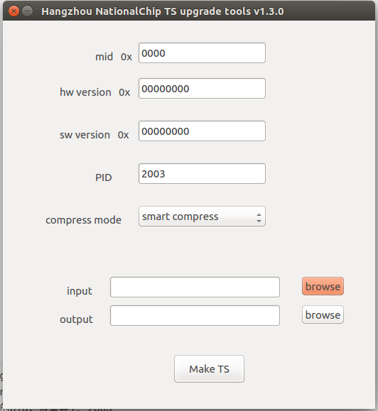

# 升级码流制作工具


## 功能特性
升级码流制作工具是国芯微机顶盒升级方案中制作升级码流的工具。

## 版本发布

### 最新版本

* **V1.6.0**
  * **功能**
    * 增加 stuff 选项对 section 的最后一个 ts 包填充的方式
  * **bug 修复**
    * 无
  * **下载地址**
    * [企业空间/国芯开发平台/国芯工具发布/upgrade_ts](http://yun.nationalchip.com/v/list/ent/1402098059243950172)

### 历史版本

* **V1.4.0**
  - **功能**
    - 增加 upgradeTS-cli 以支持命令行生成升级码流
    - 命令行增加 noheader 参数以兼容老版本，v1.9.8.3 ~ v1.9.8.7 平台版本在使用该版本时必须加上该参数， v1.9.8.8 及之后的版本不需要管 noheader 参数
  - **下载地址**
    - [企业空间/国芯开发平台/国芯工具发布/upgrade_ts](http://yun.nationalchip.com/v/list/ent/1402098059243950172)
* **V1.3.0**
  - **功能**
    - 适用于平台版本 v1.9.8.8 及后续版本
    - 在用 genflash 做的升级镜像头前增加了 header
    - 支持生成用于网络升级的升级文件和升级检测文件
    - 增加软件版本号不等升级和忽略软件版本号升级
  - **下载地址**
    - [企业空间/国芯开发平台/国芯工具发布/upgrade_ts](http://yun.nationalchip.com/v/list/ent/1402098059243950172)
* **V1.2.0**
  - **功能**
    - 适用于平台版本 v1.9.8.3 ~ v1.9.8.7
    - 增加了 DPT 私有表的生成
  - **下载地址**
    - [企业空间/国芯开发平台/国芯工具发布/upgrade_ts](http://yun.nationalchip.com/v/list/ent/1402098059243950172)
* **V1.1.0**
  * **功能**
    - 适用于平台版本 v1.9.8.3 ~ v1.9.8.7
    - 相比 V1.0.0 更新了界面，增加易用性。建议平台版本 v1.9.8.3 ~ v1.9.8.7 使用 V1,1,0
  * **下载地址**
    - [企业空间/国芯开发平台/国芯工具发布/upgrade_ts](http://yun.nationalchip.com/v/list/ent/1402098059243950172)
* **V1.0.0**
  * **功能**
    * 适用于平台版本 v1.9.8.3 ~ v1.9.8.7
  * **下载地址**
    * [企业空间/国芯开发平台/国芯工具发布/upgrade_ts](http://yun.nationalchip.com/v/list/ent/1402098059243950172)


## 软件安装

无需安装，双击即可使用。

## 使用方法




### 准备升级镜像

升级镜像是根据 flash.conf，运行 genflash 制作(与做普通的整bin的方式一样)。区别在 flash.conf 的编写上，制作升级包的 flash.conf 的第一个分区必须是 TABLE 分区，并且 TABLE 分区必须在 0 地址，其他分区的顺序和地址可以任意，因为程序在解析升级镜像时会根据分区名把升级镜像分区的数据更新到设备当前对应的分区，如果设备 Flash 中的分区没有对应的分区名，升级镜像中该分区的数据会被丢掉。

**注意项：**

- 生成升级 bin 的文件名必须和 OEM 分区中 upgrade_patch_file_name 定义的值一致！
- 单分区或者多分区升级时，每个要升级的分区的有效数据(即 USED_SIZE )必须小于设备 Flash 中的分区大小(即 TOTAL_SIZE )，否则升级时该升级镜像的分区数据会被丢掉，设备 Flash 对应的分区不会被升级。
- 制作 DATA 分区的升级 bin 文件时，由于 DATA 分区不能单独制作，需要用到 dd 工具，对于方案就是把 download.bin (整bin)的 DATA 分区裁剪出来
- 最好不要把不升级的分区写到 flash.conf，造成 bin 过大，浪费升级时的数据带宽和时间。

每个分区都有个 UPDATE 标志表示该分区是否升级。 

>    UPDATE标志：
>
>    - "1": 当分区表中的第一个分区 TABLE 的 UPDATE 标志为 1，表示升级整 bin，升级的时候会 先擦掉机顶盒整块 Flash, 然后取升级包中 TABLE 分区之后的全部数据刷入 Flash。
>    - "2": 除了第一个分区 TABLE，其他分区的 UPDATE 标志为 2，表示该分区的数据需要被升级 到机顶盒当前对应的分区(如果没有对应分区，数据不会被刷入机顶盒)，注意：如果升级包 的对应分区 used_size 大于机顶盒当前分区的 total_size，该分区不会被升级。
>    - 其他数字表示不升级
>    - 如果第一个分区 TABLE 的 UPDATE 标志为1会忽略后面的分区 UPDATE 标志，表示升级整 bin，所以如果不准备升级整 bin，第一个分区 TABLE 的 UPDATE 标志 不能为 1。

升级单分区的 flash.conf 例子

```
Flash_SIZE    0x900000
block_size    0x010000
#write_protect true
crc32         true
#zlibmode      true
table_version 1   

# NAME▸ FILE  CRC     FS    MODE UPDATE VERSION ADDRESS  TOTAL_SIZE  RES_SIZE
#---------------------------------------------------------------------------------------------------
TABLE   NULL                    true▸   RAW    ro    0     0     0x000000
KERNEL  kernel.bin              true▸   RAW    ro    2     0     0x010000   
```

解析：升级单分区 KERNEL，KERNEL 分区的 UPDATE 标记为 2，由于不升级整分区，TABLE 分区的标记必须是 0


升级多分区的 flash.conf  例子

```
Flash_SIZE    0x900000
block_size    0x010000
#write_protect true
crc32         true
#zlibmode      true
table_version 1  


# NAME▸ FILE             CRC     FS    MODE UPDATE VERSION ADDRESS  TOTAL_SIZE  RES_SIZE
#---------------------------------------------------------------------------------------------------
TABLE   NULL                    true▸   RAW    ro    0     0     0x000000  0x010000
KERNEL  kernel.bin              true▸   RAW    ro    2     0     0x010000  0x300000
ROOT    rootfs_cramfs.img       false   CRAMFS ro    2     0     0x310000  0x200000

```

解析：升级多分区，各个分区对应的 UPDATE 标志为 2，由于不升级整分区，TABLE 分区的标记必须是 0


升级整分区的 flash.conf  例子

```
Flash_SIZE    0x900000
block_size    0x010000
#write_protect true
crc32         true
#zlibmode      true
table_version 1  

# NAME▸ FILE       CRC     FS    MODE UPDATE VERSION ADDRESS  TOTAL_SIZE  RES_SIZE
#---------------------------------------------------------------------------------------------------
TABLE   NULL                    true▸   RAW    ro    1     0     0x000000
ALL     download_ecos.bin       true▸   RAW    ro    0     0     0x010000

```

解析：升级整分区，所以 TABLE 分区的 UPDATE 标记为 1, ALL 分区的 UPDATE 标记保持为 0 即可。


### 制作码流

#### 基本使用

然后使用升级码流制作工具制作，支持linux和windows。工具路径在 gxdownloader/tools目录


根据系统选择对应目录下的upgradeTS 双击打开，界面如下：


工具基本配置会显示在界面上，配置解析如下

* mid: 厂商ID
*  hw version: 硬件版本号
* sw version: 软件版本号
* pid: 升级码流的 pid
* compress mode: 压缩模式，目前支持 no compress、compress all、smart compress 三种模式。compress all 和 smart compress 都使用 zlib 压缩，两者模式没有区别。
* input: 选择升级镜像文件. 如 /home/nationalchip/update.bin，必须和 OEM 分区中 upgrade_patch_file_name 定义的值一样，如 upgrade_patch_file_name=update.bin, 则 input 的文件名必须是 update.bin
* output: 输出的升级码流文件.如 /home/nationalchip/update.ts

配置好参数，点击 ”Make TS“ 按钮即可生成。假设输入文件的文件名是 update.bin，输出文件的文件名 update.ts。生成的文件包括 update.ts、update.bin.extend、upgrade_desc.ini  (没有写错，这个文件固定就是 upgrade_desc.ini)。

* update.bin.extend: 在输入文件 update.bin 的基础上增加 header，header 信息包括软件版本号，硬件版本号，厂商 ID吗，用于网络、USB 升级。
* upgrade_desc.ini: 升级描述文件，用于网络升级时检测版本使用
* update.ts: 用于 OTA  即 TS 流方式升级用的升级码流。

#### 扩展配置

扩展配置需要更改 config.json 和 dpt.json。config.json 是在工具第一次打开后自动生成，dpt.json 是在点击 Make TS 后生成。

```
├── config
│   ├── config.json
│   └── dpt.json
└── upgradeTS
```

* config.json

  upgradeTs 系统配置信息，参数比较多，只有以下列出的参数可以更改

  * **mount_freq**
    * 参数在 config.json 中，数字越大，生成的升级码流包含的版本描述信息越多，会加速 OTA 升级时过滤的速度。

* dpt.json

  upgradeTs 工具会根据 dpt.json 的配置生成 DPT 表。

  * **ota_type**

    参数在 dpt.json，值范围目前是 0~3

    * 0: 常规升级，即 mid、hw version 必须与设备相等，sw version 大于设备才会升级， 
    * 1:  Reserved
    * 2: 忽略 sw version 升级，即相比 0 模式，不比较 sw version
    * 3: sw version 不相等升级，即相比 0 模式，sw version 与当前 设备不相等才会升级

## 常见问题

**Q**: OTA 下载升级文件或者检测新版本比较慢？

**A**:  增大[扩展配置](#扩展配置)中 mount_freq 的值
