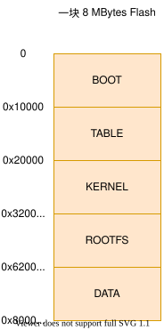

# 分区表

## 定义

嵌入式系统中一般只有一块 Flash，但一块 Flash 需要存储很多不同的数据，如 GxLoader,  Linux 内核镜像，根文件系统等，每块数据存储在 Flash 的不同地方，为了更好的组织它们，GoXceed 平台提出分区和分区表的概念，每块数据占一个独立的分区，把所有分区进行存放和排列形成分区表，分区表就是分区信息的集合。




引导功能，根据分区表可以得到不同数据存放的位置，GxLoader 在引导 OS 的时候，可以找到准确的位置加载内核镜像，并把根文件系统的位置通过 cmdline 传给内核，内核根据 cmdline 挂载找到根文件系统分区并挂载，完成 OS 的引导。

GxLoader 启动后会根据 magic num 查找分区表，如下为某个板子打印存储在 Flash 中的分区表：
```
NOR Flash, model: w25q128, size: 16 MB
Partition Version :  102
Partition Count   :  9
Write Protect     :  TRUE
CRC32 Enable      :  TRUE
Table CRC32       :  8DD3E85F
==============================================================================================
ID NAME    FS      CRC32     START    TOTAL_SIZE   MAIN_SIZE  USED_SIZE      Use%  RES_SIZE
==============================================================================================
0  BOOT    raw     2F257D7C  00000000      64 KB      64 KB   45856  B      69%       0 MB
1  OTA     raw     C3D3CD9C  00010000     448 KB     448 KB     385 KB      85%       0 MB
2  TABLE   raw               00080000      64 KB      64 KB     512  B       0%       0 MB
3  LOGO    raw     4CEDB02C  00090000      64 KB      64 KB   29801  B      45%       0 MB
4  KERNEL  raw     C1FDB335  000a0000    3776 KB    3776 KB    2533 KB      67%       0 MB
5  ROOT    cramfs  D72945F8  00450000     960 KB     960 KB      12 KB       1%       0 MB
6  OEM     raw     A04CED3C  00540000      64 KB      64 KB     571  B       0%       0 MB
7  BACKOEM raw               00550000      64 KB      64 KB       0 MB       0%       0 MB
8  DATA    minifs  FF000000  00560000    2688 KB    2688 KB       1  B       0%       0 MB
----------------------------------------------------------------------------------------------
```

:::{important}
TABLE 分区所在的位置就是存放分区表数据结构的位置。
:::

## 格式

分区表目前有四个版本，V1、V2、V4和V5。

:::{important}
V4 和 V5 分区表最大支持 84 个分区，限制于 cmdline 的大小，默认内核是无法解析到这么多分区的，每个分区需要占用 15 个字节左右的 cmdline 大小，大概最大只能解析到 40 个分区，需要更改内核的代码增大 cmdline 的长度。


Linux 内核


更改 arch/arm/include/uapi/asmsetup.h (arm 芯片的 cmdline 长度) 或者 include/uapi/asm-generic/setup.h (csky 芯片的 cmdline 长度)

```
define COMMAND_LINE_SIZE 1024
```

更改为

```
define COMMAND_LINE_SIZE 4096
```

ecos 3.0


更改 ecos3.0/packages/hal/nc/arm/sirius/gx6633/v3_0/include/cmdline.h (arm 芯片的 cmdline 长度) 或者 ecos3.0/packages/hal/gx/ckmmu/ck610m/gx3201/v3_0/include/cmdline.h (csky 芯片的 cmdline 长度)

```
define COMMAND_LINE_SIZE 1024
```

更改为

```
define COMMAND_LINE_SIZE 4096
```

:::

- 分区结表构定义
```
struct partition {
    unsigned int magic;                                      // 0-3
    unsigned char count;                                     // 4
    struct partition_info tables[FLASH_PARTITION_MAX_NUM];   // 5-364
    unsigned char write_protect;                             // 505
    unsigned char crc32_enable;                              // 506
    char version;                                            // 507
    unsigned int crc_verify;                                 // 508-512
    unsigned int table_version;                              // table version
    struct partition_io_ops *ops;                            //为了兼容
    int fd;                                                  //为了兼容
} __attribute__ ((packed));
```

- 分区结构定义
```
struct partition_info {
    char     name[FLASH_PARTITION_NAME_SIZE + 1];
    uint32_t total_size;
    uint32_t used_size;
    uint32_t reserved_size;
    uint32_t start_addr;
    char     file_system_type;
    char     mode;
    uint8_t  id;
    uint8_t  update_tags;
    uint32_t partition_size;
    uint32_t crc_verify;
    uint32_t crc32;
    uint16_t version;
    char     crc32_enable;
    char     write_protect;
    uint8_t  mtd_id;
} __attribute__ ((packed));
```


### V1

V1 分区表总共 512 个字节，支持最多 12 个分区，其总体结构如下:

:::{important}
V1 版本分区表不支持 nand flash (包括串行和并行 nand)。
:::


| 偏移 | 字节  | 意义                  | 说明                                                         |
| ---- | ----- | --------------------- | ------------------------------------------------------------ |
| 0    | 4     | 分区表 magic num      | 识别 V1 版本分区表的起始，固定值等于 0xAABCDEFA              |
| 4    | 1     | 分区个数              | 记录分区表包含的分区个数                                     |
| 5    | 12*24 | **分区信息**          | 总共包含 12 个分区信息，每个分区信息24 个字节，具体请看分区信息结构 |
| 293  | 12*2  | 分区版本号            | 总共包含 12 个分区的版本号，每个分区版本号占 2 个字节        |
| 317  | 96    | 未使用                |                                                              |
| 413  | 12*4  | 分区CRC 校验值        | 总共包含 12 个分区的有效数据的 CRC 校验值，每个 CRC 校验值占 4 个字节，但是只有分区的 CRC 使能后，才会有 CRC 校验值 |
| 461  | 44    | 未使用                |                                                              |
| 505  | 1     | 写保护使能            | 当系统启动时会根据该标志和每个分区的                         |
| 506  | 1     | 分区数据 CRC 校验使能 | 当使能分区CRC校验，genflash 制作的时候会根据分区包含的有效数据生成 CRC 值 |
| 507  | 1     | 分区表版本号          | 固定值等于 102，该标识可以忽略                               |
| 508  | 4     | 分区表 CRC 校验值     | 校验值等于计算分区表前 508 个字节的 CRC                      |

V1 分区表中的每个分区的**分区信息**占 24 字节，其结构如下：

| 偏移 | 字节 | 意义                         | 说明                                                         |
| ---- | ---- | ---------------------------- | ------------------------------------------------------------ |
| 0    | 8    | 分区名                       | 分区名字，必须是 '\0' 结尾，所以实际分区名为 7 个字节        |
| 8    | 4    | 分区大小                     | 分区大小                                                     |
| 12   | 4    | 分区已使用大小               | 分区包含的有效数据                                           |
| 16   | 4    | 分区起始地址                 | 分区相对于 Flash 0 地址的偏移，以字节为单位                  |
| 20   | 1    | 文件系统类型                 | 0: RAW 1: ROMFS 2: CRAMFS 3: JFFS2 4: YAFFS2 5: RAMFS 6: SQUASHFS 127: MINIFS |
| 21   | 1    | 分区读写权限 和 CRC 使能标记 | 低 7 bit 用来表示分区读写权限，0 表示只读，1 表示可读写；最高位表示分区 CRC 校验使能标记，0  表示不生成该分区的 CRC 校验值，1 表示生成该分区的 CRC 校验值 |
| 22   | 1    | 分区的 ID 号                 | 按分区排列 0 ~ 11                                            |
| 23   | 1    | 分区更新标志                 | 目前仅用于 GxDownloader 做升级包时使用                       |

### V2

V2 分区表总共 1024 个字节，相比 V2 支持的分区更多了，支持到 24 个分区，并且分区信息增加 Reserved Size。其总体结构如下:

| 偏移 | 字节  | 意义                  | 说明                                                         |
| ---- | ----- | --------------------- | ------------------------------------------------------------ |
| 0    | 4     | 分区表 magic num      | 识别 V2 版本分区表的起始，固定值等于 0xDD1C2BFA              |
| 4    | 1     | 分区个数              | 记录分区表包含的分区个数                                     |
| 5    | 24*28 | **分区信息**          | 总共包含 24 个分区信息，每个分区信息 28 个字节，具体请看分区信息结构 |
| 677  | 24*2  | 分区版本号            | 总共包含 24 个分区的版本号，每个分区版本号占 2 个字节，这里只有了 24 * 2 个字节，剩下 92 个字节未使用 |
| 725  | 92    | 未使用                |                                                              |
| 817  | 24*4  | 分区CRC 校验值        | 总共包含 24 个分区的有效数据的 CRC 校验值，每个 CRC 校验值占 4 个字节，但是只有分区的 CRC 使能后，才会有 CRC 校验值 |
| 913  | 104   | 未使用                |                                                              |
| 1017 | 1     | 写保护使能            | 当系统启动时会根据该标志和每个分区的                         |
| 1018 | 1     | 分区数据 CRC 校验使能 | 当使能分区CRC校验，genflash 制作的时候会根据分区包含的有效数据生成 CRC 值 |
| 1019 | 1     | 分区表版本号          | 固定值等于 102，该标识可以忽略                               |
| 1020 | 4     | 分区表 CRC 校验值     | 校验值等于计算分区表前 1020 个字节的 CRC                     |

V2 分区表中的每个分区的**分区信息**占 28 字节，其结构如下：

| 偏移 | 字节 | 意义                         | 说明                                                         |
| ---- | ---- | ---------------------------- | ------------------------------------------------------------ |
| 0    | 8    | 分区名                       | 分区名字，必须是 '\0' 结尾，所以实际分区名为 7 个字节        |
| 8    | 4    | 分区大小                     | 分区大小                                                     |
| 12   | 4    | 分区已使用大小               | 分区包含的有效数据                                           |
| 16   | 4    | 分区预留大小                 | Nor Flash 这里设为 0，NAND Flash 必须预留几个 block 用于跳坏块处理 |
| 20   | 4    | 分区起始地址                 | 分区相对于 Flash 0 地址的偏移，以字节为单位                  |
| 24   | 1    | 文件系统类型                 | 0: RAW 1: ROMFS 2: CRAMFS 3: JFFS2 4: YAFFS2 5: RAMFS 6: SQUASHFS 127: MINIFS |
| 25   | 1    | 分区读写权限 和 CRC 使能标记 | 低 7 bit 用来表示分区读写权限，0 表示只读，1 表示可读写；最高位表示分区 CRC 校验使能标记，0  表示不生成该分区的 CRC 校验值，1 表示生成该分区的 CRC 校验值 |
| 26   | 1    | 分区的 ID 号                 | 按分区排列 0 ~ 11                                            |
| 27   | 1    | 分区更新标志                 | 目前仅用于 GxDownloader 做升级包时使用                       |

### V4

V4 分区表总共 3072 个字节，相比 V2 支持的分区更多了，支持到 84 个分区。其总体结构如下:

| 偏移 | 字节  | 意义                  | 说明                                                         |
| ---- | ----- | --------------------- | ------------------------------------------------------------ |
| 0    | 4     | 分区表 magic num      | 识别 V4 版本分区表的起始，固定值等于 0xFF3E4D1C              |
| 4    | 1     | 分区个数              | 记录分区表包含的分区个数                                     |
| 5    | 84*28 | **分区信息**          | 总共包含 84 个分区信息，每个分区信息 28 个字节，具体请看分区信息结构 |
| 2357 | 84*2  | 分区版本号            | 总共包含 84 个分区的版本号，每个分区版本号占 2 个字节        |
| 2525 | 84*4  | 分区CRC 校验值        | 总共包含 84 个分区的有效数据的 CRC 校验值，每个 CRC 校验值占 4 个字节，但是只有分区的 CRC 使能后，才会有 CRC 校验值 |
| 2861 | 204   | 未使用                |                                                              |
| 3065 | 1     | 写保护使能            | 当系统启动时会根据该标志和每个分区的                         |
| 3066 | 1     | 分区数据 CRC 校验使能 | 当使能分区CRC校验，genflash 制作的时候会根据分区包含的有效数据生成 CRC 值 |
| 3067 | 1     | 分区表历史版本号      | 固定值等于 102，该标识可以忽略                               |
| 3068 | 4     | 分区表 CRC 校验值     | 计算分区表前 3068 个字节的 CRC                               |

V4 分区表中的每个分区的**分区信息**占 28 字节，其结构如下：

| 偏移 | 字节 | 意义                         | 说明                                                         |
| ---- | ---- | ---------------------------- | ------------------------------------------------------------ |
| 0    | 8    | 分区名                       | 分区名字，必须是 '\0' 结尾，所以实际分区名为 7 个字节        |
| 8    | 4    | 分区大小                     | 分区大小                                                     |
| 12   | 4    | 分区已使用大小               | 分区包含的有效数据                                           |
| 16   | 4    | 分区预留大小                 | Nor Flash 这里设为 0，NAND Flash 必须预留几个 block 用于跳坏块处理 |
| 20   | 4    | 分区起始地址                 | 分区相对于 Flash 0 地址的偏移，以字节为单位                  |
| 24   | 1    | 文件系统类型                 | 0: RAW 1: ROMFS 2: CRAMFS 3: JFFS2 4: YAFFS2 5: RAMFS 6: SQUASHFS 127: MINIFS |
| 25   | 1    | 分区读写权限 和 CRC 使能标记 | 低 7 bit 用来表示分区读写权限，0 表示只读，1 表示可读写；最高位表示分区 CRC 校验使能标记，0  表示不生成该分区的 CRC 校验值，1 表示生成该分区的 CRC 校验值 |
| 26   | 1    | 分区的 ID 号                 | 按分区排列 0 ~ 11                                            |
| 27   | 1    | 分区更新标志                 | 目前仅用于 GxDownloader 做升级包时使用                       |

### V5

V５ 分区表总共 8192 个字节，相比 V4 分区名长度增加到 63 个字节。其总体结构如下:

| 偏移 | 字节  | 意义                  | 说明                                                         |
| ---- | ----- | --------------------- | ------------------------------------------------------------ |
| 0    | 4     | 分区表 magic num      | 识别 V5 版本分区表的起始，固定值等于 0xCCABEF12              |
| 4    | 1     | 分区个数              | 记录分区表包含的分区个数                                     |
| 5    | 84*84 | **分区信息**          | 总共包含 84 个分区信息，每个分区信息 28 个字节，具体请看分区信息结构 |
| 7061 | 84*2  | 分区版本号            | 总共包含 84 个分区的版本号，每个分区版本号占 2 个字节        |
| 7229 | 84*4  | 分区CRC 校验值        | 总共包含 84 个分区的有效数据的 CRC 校验值，每个 CRC 校验值占 4 个字节，但是只有分区的 CRC 使能后，才会有 CRC 校验值 |
| 7565 | 620   | 未使用                |                                                              |
| 8185 | 1     | 写保护使能            | 当系统启动时会根据该标志和每个分区的                         |
| 8186 | 1     | 分区数据 CRC 校验使能 | 当使能分区CRC校验，genflash 制作的时候会根据分区包含的有效数据生成 CRC 值 |
| 8187 | 1     | 分区表历史版本号      | 固定值等于 102，该标识可以忽略                               |
| 8188 | 4     | 分区表 CRC 校验值     | 计算分区表前 8188 个字节的 CRC                               |

V５ 分区表中的每个分区的**分区信息**占 84 字节，其结构如下：

| 偏移 | 字节 | 意义                         | 说明                                                         |
| ---- | ---- | ---------------------------- | ------------------------------------------------------------ |
| 0    | 64   | 分区名                       | 分区名字，必须是 '\0' 结尾，所以实际分区名为 63 个字节       |
| 64   | 4    | 分区大小                     | 分区大小                                                     |
| 68   | 4    | 分区已使用大小               | 分区包含的有效数据                                           |
| 72   | 4    | 分区预留大小                 | Nor Flash 这里设为 0，NAND Flash 必须预留几个 block 用于跳坏块处理 |
| 76   | 4    | 分区起始地址                 | 分区相对于 Flash 0 地址的偏移，以字节为单位                  |
| 80   | 1    | 文件系统类型                 | 0: RAW 1: ROMFS 2: CRAMFS 3: JFFS2 4: YAFFS2 5: RAMFS 6: SQUASHFS 127: MINIFS |
| 81   | 1    | 分区读写权限 和 CRC 使能标记 | 低 7 bit 用来表示分区读写权限，0 表示只读，1 表示可读写；最高位表示分区 CRC 校验使能标记，0  表示不生成该分区的 CRC 校验值，1 表示生成该分区的 CRC 校验值 |
| 82   | 1    | 分区的 ID 号                 | 按分区排列 0 ~ 11                                            |
| 83   | 1    | 分区更新标志                 | 目前仅用于 GxDownloader 做升级包时使用                       |

:::{important}
需要在 .config 中打开 CONFIG_PARTITION_V5，才能使用 V5 分区表，
:::


## 制作

分区生成参考[镜像制作工具](../../gxtools/doc/genflash/index.md#使用方法)


