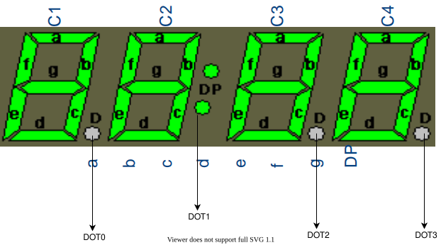
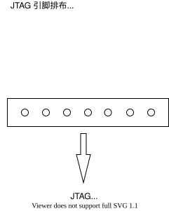

# 功能特性

GxLowpower 主要功能就是待机，在待机过程中接收外部信号或者根据设置的待机定时唤醒。额外的功能有面板显示。

* 唤醒方式支持红外按键遥控、面板按键和待机超时。
* 面板可以显示时间和特殊字符。

GxLowpower 支持两种芯片内核，一个是 CK610，一个是 51。一般新的芯片都是 51。

使用 CK610 芯片做待机的有 gx3201、gx3113c、g3211、gx6605s。

使用独立的 51 芯片做待机的有 sirius、taurus、gemini、cygnus、canopus、vega 、scorpio。

由于这两种芯片的架构和资源不同，导致其二次开发、功能配置会有区别，后面的章节中会在有区别的地方通过 CK610 和 51 的别名来对两种待机进行说明。

## 参数设置

应用程序通过 GxCore_Halt 接口进入待机，并传递参数给待机运行的 GxLowpower 程序，在下面会介绍各个参数的作用。

GxCore_Halt 函数和 struct lowpower_info_s 结构体

```
struct lowpower_info_s {
    unsigned int WakeTime;
    unsigned int GpioMask;
    unsigned int GpioData;
    unsigned int key;
    unsigned char *cmdline;
};
int GxCore_Halt(struct lowpower_info_s *info);
```

- WakeTime

  设置定时唤醒，以秒为单位，如果 == 0，即取消待机定时；如果 > 0，则在进入待机后，在超过设置的定时时间，自动唤醒。如 WakeTime = 30，则进入待机后 30 秒后，自动唤醒。

- GpioMask 和 GpioData

  GpioMask 和 GpioData 的每个 bit 是一一对应的，用于控制 GPIO 00 ~ GPIO 31的高低电平。

  GpioMask 的每个 bit 的值表示对应的 gpio 是否应该由 GpioData 控制。
    * 1：相应的 gpio 不受 GpioData 的控制，gpio 会将输出设置为低电平或者输入高阻态以节省功耗。
    * 0：应根据 GpioData 中的相应位将相应的 gpio 设置为低电平或高电平。

  GpioData的每一位的值指示应将对应 gpio 设置为低或高电平。
    * 1：输出高电平
    * 0：输出低电平

  有些 IO 口因为有特殊功能了，不会受 GpioMask 和 GpioData 的控制，比如红外 IO、面板控制 IO。

- key

  设置红外遥控键值，如果在待机中接收到红外遥控键值与 key 的值一样，就会唤醒芯片。不过这里只能设置一个键值唤醒，要设置多个红外遥控键值唤醒，请设置 key=0，然后设置 cmdline 。

- cmdline

  cmdline 包括更多的参数设置。参数格式”xxx=xxx“。不同参数通过空格分隔"xxx1=aaa xxx2=bbb"，相同参数的多个值用逗号分隔"xxx=a,b"。

  ```
  cmdline = "keys=0x7F8007F8,0x7F80E718,0x7F80A758 powercut=201,0 lowpower_clock_speed=27000000 panelio=13,14 timeshowflag=1 timezone=8 timesummer=1"
  ```

  - keys

    设置最多 19 个红外遥控键值和一个面板键值用来唤醒，GxLowpower 程序默认会把 "keys=" 的最后一个值当做面板键值。

    格式 "keys=\[红外遥控键值1\],\[红外遥控键值2\], .... \[红外遥控键值19\],\[面板键值\]"

    如 "keys=0x7F8007F8,0x7F80E718,0x7F80A758,0x47"，设了三个红外遥控键值，一个面板键值 0x47。

  - powercut
  
    设置使 CPU 断电的管脚和相应的电平。
  
    格式 
    
    ```
    powercut=<gpio>, <level>，如 "powercut=1,0"。
    ```
    
    gpio 的值 CK610 和 51 不同。
    
    CK610 填的是虚拟 gpio ，虚拟 gpio 与 物理 gpio 的对应关系由 GxLoader 中对应板级的 board_init.c 中 g_gpio_table 指定，这个和芯片正常工作时操作普通 GPIO 的方式一样，如果没在GxLoader 中对应板级的 board_init.c 中 g_gpio_table 指定，在进入低功耗前会通过打印提示用户。
    
    51 填的是 51 管理的逻辑 gpio，gpio 号可以在对应板级的 board_init.c 中搜索 PMUPORT 的注释，可以找到 PMUPORT 与 主芯片 gpio 对应的关系。如 PMUPORT03，gpio 的值就是 3 。
    
  - lowpower_clock_speed
  
    设置待机工作的时钟频率，该时钟频率和外部晶振一样，不传该参数，GxLowpower 程序默认以 27ＭHz 工作。如果外部晶振是 24MHz 或者 30MHz 则必须配置，否则会导致无法进行红外遥控唤醒功能和定时唤醒功能时间不准确。
  
    格式 
    
    ```
    lowpower_clock_speed=<speed>，如 "lowpower_clock_speed=24000000"
    ```
    
  - panelio
  
    设置待机时操控面板工作的两个 io 口。面板是 i2c 接口的，需要用两个 gpio 模拟进行模拟 i2c。
  
    格式
    
    ```
    panelio=<scl gpio>,<sda gpio>，如 "panelio=13,14"
    ```
    
    CK610 填的是主芯片的物理 gpio。
    
    51 填的是 51 管理的逻辑 gpio，gpio 号可以在对应板级的 board_init.c 中搜索 PMUPORT 的注释，可以找到 PMUPORT 与 主芯片 gpio 对应的关系。如 PMUPORT03，gpio 的值就是 3 。
    
  - timeshowflag
  
    设置待机时面板是否显示时间。0: 面板显示 "OFF" 1: 面板显示时分形式的时间，如"13:41"。如果不传 timeshowflag 默认为 0。
  
    格式
    
    ```
    timeshowflag=<flag>，如 "timeshowflag=1"
    ```
    
  - timezone
  
    设置时区，支持整时区，半时区，3/4 时区（如尼泊尔），单位是小时。
  
    格式
    
    ```
    timezone=<区时>，西 2 区"timezone=-2"，印度所在的时区"timezone=5.5"，尼泊尔时区 "timezone=5.75"，注意在传递半时区和 3/4 时区设置时小数点后面多余的 0 必须去掉，比如 "timezone=5.50" 或者 "timezone=5.750" 都是不对的。
    ```
    
  - timesummer
  
    设置夏令时，世界有很多国家支持夏令时。
  
    ```
    格式 "timesummer=<数字>"，如"timesummer=1"，时钟将调快 1 个小时。
    ```
    
  - curtime
  
    设置显示的时间，以秒为单位，自1970年1月1日00:00:00 +0000（UTC）开始的秒数。如果设置了 curtime，将忽略前面的 timezone 和 timesummber，面板直接显示 curtime 设置的时间。GxLowpower 程序会继续按照 curtime 计时。
  
    ```
    格式 curtime=<时间秒数> ，如"curtime=1604923272"，设置的时间是 2020年11月9日12:01:12
    ```
    
  - cecmode
  
    设置 CEC 功能控制
  
    ```
    格式 "cecmode=<数字>", cecmode 数值范围 0~2，cmdline 如果不传该字段，则默认当做 0 处理。
    0: 关闭低功耗 CEC 功能
    1: 开启低功耗 CEC 功能
    2: 开启低功耗 CEC 功能，但是唤醒的时候，不发送 CEC 唤醒信号唤醒电视机
    
    如："cecmode=1"
    ```
  
  - panel_dot_ctrl
  
    控制面板数码管的 4 个点 DOT0 ~ DOT3 的亮灭。公版硬件实际都只连了 DOT1，只有 DOT1 能亮，其他硬件没连。如下图为公版面板数码管：
  
    
  
    ```
    格式 "panel_dot_ctrl=<数字>", 数字最好是 “0x” 开头的 16 进制数字，范围是 0x00 ~ 0xFF。
    panel_dot_ctrl 在低功耗内部会转化为数字存储.
    panel_dot_ctrl 的 bit4 ~ bit7 为使能控制，每个比特对应 DOT0 ~ DOT3 的使能控制 
    panel_dot_ctrl 的 bit0 ~ bit3 为亮灭控制，每个比特对应 DOT0 ~ DOT3 的亮灭控制 
    当 DOT 对应的使能控制比特为 0，则不会根据 DOT 的亮灭控制比特，这时候 DOT 的亮灭控制具体看低功耗的实现，目前公版在这种情况下默认会把 DOT1 用于时间显示时候小时和分钟的分隔符，其他 DOT 保持灭
    用伪代码描述
    ((bit(4 + x) == 1) & (bit(0 + x) == 1)) == DOTx 亮
    ((bit(4 + x) == 1) & (bit(0 + x) == 0)) == DOTx 灭 
    ((bit(4 + x) == 0) & (bit(0 + x) == 0)) == 由低功耗实现决定
    
    如 "panel_dot_ctrl=0xFD"，表示设置 DOT0、DOT2、DOT3 亮，DOT1 灭
    ```
  - wakeupio

    设置使 CPU 休眠唤醒的管脚和相应的电平。

    格式

    ```
    wakeupio=<gpio>, <level>，如 "wakeupio=1,0"。
    ```

    该功能只支持51

    51 填的是 51 管理的逻辑 gpio，gpio 号可以在对应板级的 board_init.c 中搜索 PMUPORT 的注释，可以找到 PMUPORT 与 主芯片 gpio 对应的关系。如 PMUPORT03，gpio 的值就是 3 。

  - rebootflag

    设置行为是reboot,需要和waketime配置使用。当设置rebootflag参数并且waketime > 0时，超时唤醒并设置wakeupflag

    格式

    ```
    rebootflag=<0/1> 如 "rebootflag=1"。
    ```

### 面板时间显示

面板显示的时间有两种，

一种是根据系统待机前从操作系统内部获取的 utc 时间，参数 timezone 和 timesummer 计算显示的时间，计算公式是

```
显示时间=utc时间+timezone*3600+timesummber*3600
```

另一种是直接显示 curtime 设置的时间。

不管是第一种还是第二种的得到时间都是秒为单位，然后 GxLowpower 程序会自动地分别转换为小时和分钟显示。GxLowpower 程序会在待机过程中对时间正常计时，在唤醒后，会把继续计时后的时间传回给应用。如果是第一种的时候，时间就会写到系统时间（因为第一种累加的就是 UTC 时间，操作系统内部都是以 UTC 时间进行计时），应用只要调用操作系统的标准函数就能获取之前计时的时间；如果是第二种的时候，应用可以调用 GxCore_GetCurTimeAfterWake 函数获取 curtime 继续计时的时间。

## API 接口

API 接口指的是应用程序与 GxLowpower 程序交互的 API 接口。

\ref GxLowpower_LoadFirmware 加载低功耗固件

\ref GxLowpower_PassParam 传递lowpower 参数。参数请看[参数设置](#参数设置)

:::{注意}
必须在进入低功耗前设置参数，进入低功耗后设置无效。
:::

\ref GxLowpower_Enter 进入低功耗模式

\ref GxCore_Halt 使芯片进入待机，参数请看[参数设置](#参数设置)

:::{注意}
该接口实际上执行了3个操作。加载低功耗固件、传递低功耗参数、进入低功耗。需要确保低功耗固件存放在/lib/firmware目录下
:::

\ref GxCore_Reboot 重启系统

\ref GxCore_SetHaltUserConfig 设置私有低功耗参数

:::{注意}
该接口为保留接口，暂时没有使用
:::

\ref GxCore_GetWakeFlag 获取芯片唤醒标志。0: 断电启动，不是从待机启动 1: 从待机启动，是由红外遥控按键或者面板按键唤醒 2: 待机定时启动 3: reboot启动

```
 *  PARAMETER
 *      wakeflag
 *      0: not wake up
 *      1: manual wake up
 *      2: auto wake when waketime was up
int GxCore_GetWakeFlag(unsigned int *wakeflag);
```

\ref GxCore_GetCurTimeAfterWake [参数设置](#参数设置) 中有 "curtime" 参数，当设置了该参数，GxLowpower 程序会在待机过程中继续累加 "curtime" 指定的时间，然后唤醒后，传回给应用程序，应用程序可以调用 GxCore_GetCurTimeAfterWake 获取继续计时后的时间。

```
int GxCore_GetCurTimeAfterWake(unsigned int *curtime);
```

## 编译

编译很简单执行即可。

```
./build <chip>
         chip: gx3113c|gx3201|gx3211|gx6605s|sirius|taurus|gemini|cygnus|
               canopus|vega|scorpio
```

生成 gxlowpower.fw，该文件必须放在根文件系统 lib/firmware 目录下。

## 调试

这里只介绍打印调试法，CK610 比较简单，51 比较复杂。

### CK610 

**硬件设置**

打印的物理串口仍然是芯片正常工作时的物理串口。只要芯片正常工作时能打印，待机时也能正常打印

**软件设置**

调用 GXLOWPOWER_TinyPutStr 和 GXLOWPOWER_TinyPutNum 进行打印。

### 51

**硬件设置**

51 打印调试的物理串口与芯片正常工作的的物理串口不是同一个，需要再手动连线。其中芯片的 DBGTDI 脚就是 51 的串口的 TX 脚。



如上图所示，把 VCC、GND、TDI 脚和外部的串口线连接，TDI 即 TX 脚。

**注意:** 有些方案的 TDI 脚就是用来断电使用的管脚，即参数"powercut" 指定的管脚，则需要临时更改使该管脚上面不要挂任何负载。简单的确认方法是在芯片正常工作中如果 jtag 是能正常工作的，那说明该脚就没有负载，进入低功耗是可以用来当做串口的 TX 打印的。

**软件设置**

51 内存资源有限，无法使用 printf 函数。

1. main.c 最前面打开 TEST 宏
2. int main 函数的 while(1) 前面加 serial0_initial 函数调用
3. 可以用 serial0_send 和 print_long 打印字符或者数值。
4. PC 串口上位机的波特率设置为 9600，如果打印的是数值，必须设置为 hex 模式
