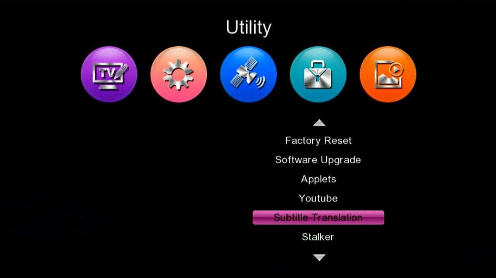
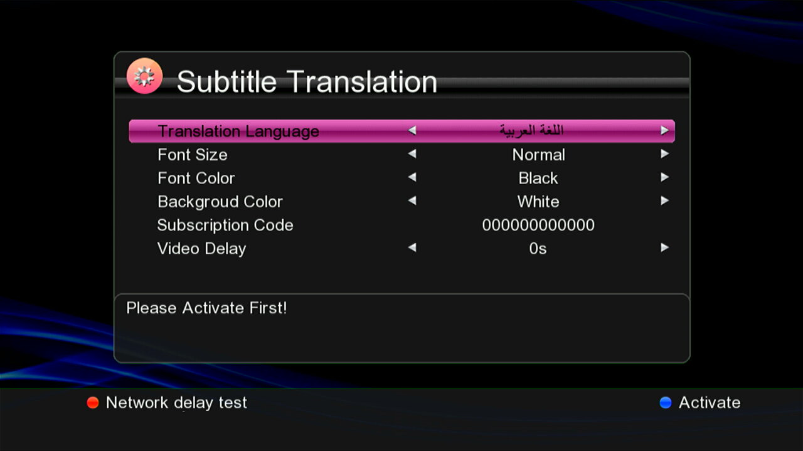
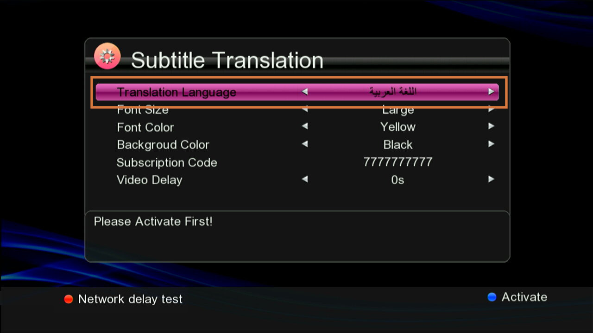
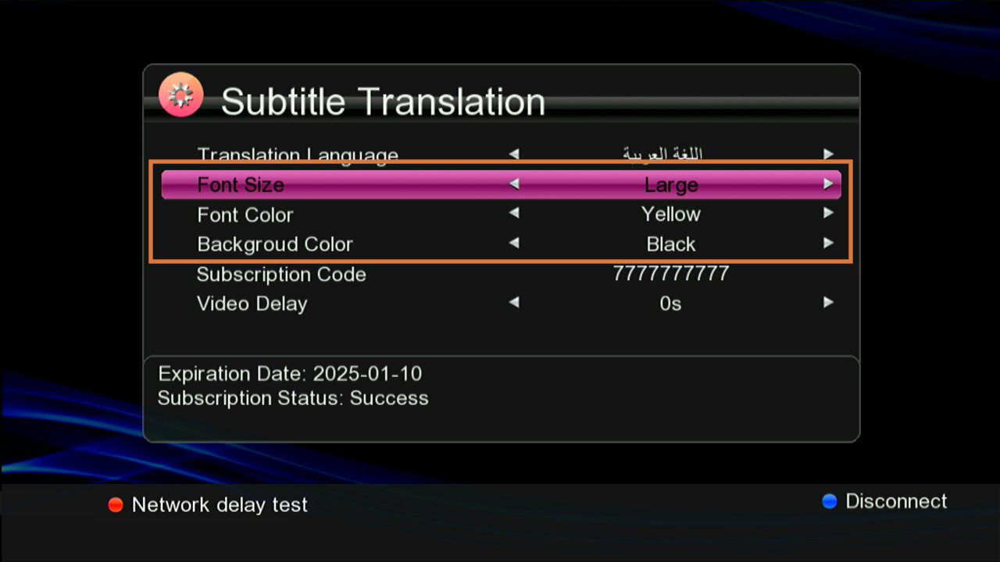
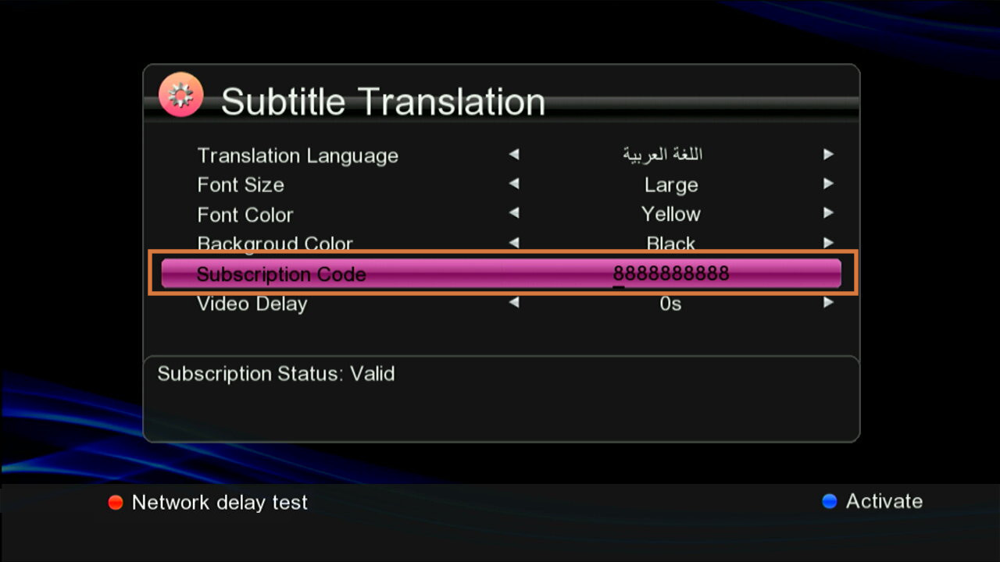
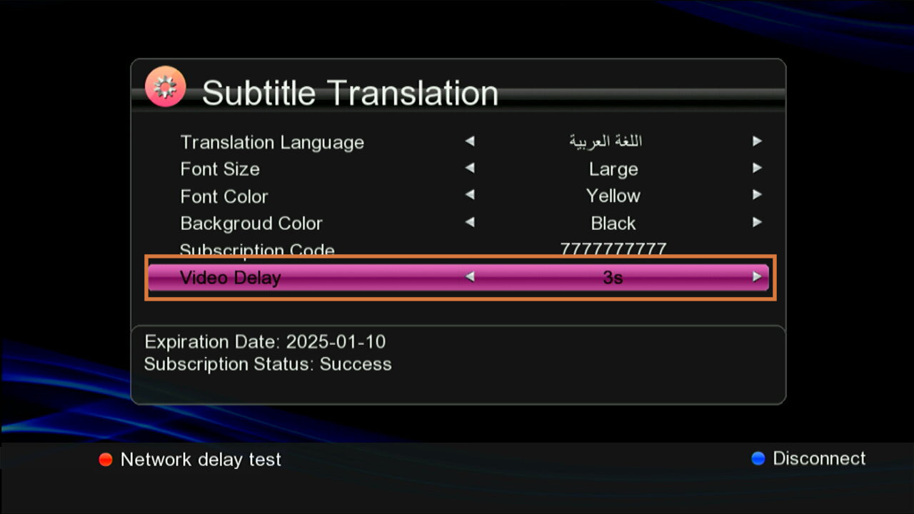
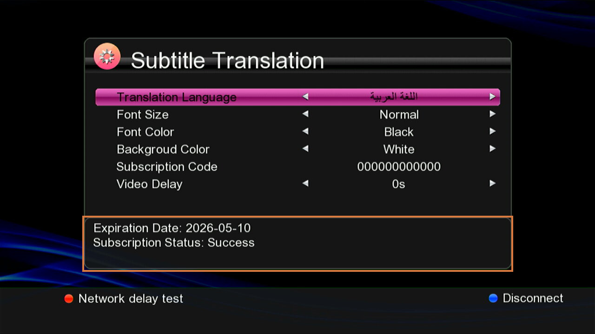
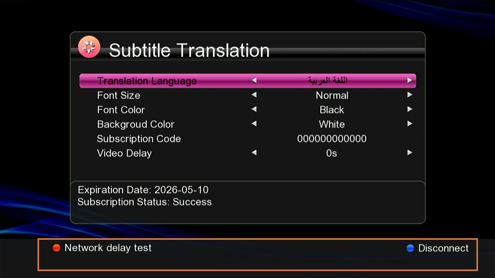
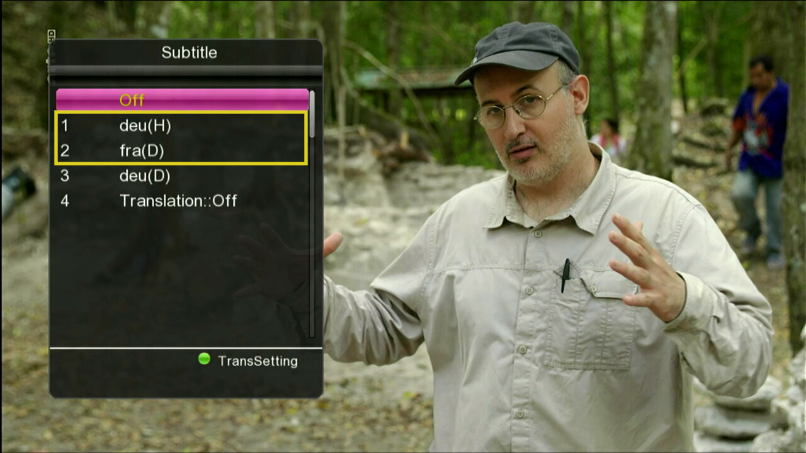

# Subtitle Translation 功能说明

## 概述

Subtitle Translation 功能可实现节目播放过程中字幕的实时在线翻译。系统通过网络服务器，将当前播放节目的 DVB 字幕即时翻译，并同步展示翻译后的内容，确保用户观看体验的流畅性。目前该功能仅支持 DVB 字幕格式的在线翻译服务。字幕翻译服务的收费管理由专门的服务器厂家负责，通过对机顶盒激活账户信息的核验实现计费。

Subtitle Translation功能需要激活账号才能使用对应翻译功能，账号激活捆绑设备ChipSN和MAC地址。正式账号需和服务商沟通提供。内部开发账号申请请查看【Subtitle Translation 功能账号激活指南.pdf】。

本方案中Subtitle Translation 功能分为字幕翻译设置，和在线翻译使能两大部分。

## 字幕翻译设置菜单说明

该设置菜单有两种方式可以进入：

1. 主菜单-> Utility->Subtitle Translation；

   

2. 大画面播放节目，调出Subtitle设置菜单，按绿色按键进入；

   

其中，以上两种进入模式中，从大画面进入设置菜单时，大画面视频不停止，处于后台播放状态。

设置菜单主要包含三大内容：

- 字幕显示设置选项；
- 激活状态栏；
- 激活功能及视频延迟测试功能显示栏。

### 设置选项说明

字幕设置选项中分四类设置信息：

- 翻译字幕语言；
- 字幕显示设置相关；
- 注册码设置；
- 视频延时设置。

#### 翻译字幕语言

选择字幕需要翻译的语言，服务器会根据该选项，将本地字幕翻译成对应语言。

#### 设置信息

字幕显示设置允许设置翻译后的字幕显示模式，包括字幕大小、字幕字体颜色和字幕背景颜色。

1. 字幕大小选项有：Normal, Smail, Large；
2. 字幕字体颜色选项有：Black, Yellow, White, Blue, Green, Red;
3. 字幕背景颜色选项有：White, Black, Yellow, Green, Red, Blue；

字幕字体颜色和背景色建议选择不同颜色，否者显示时撞色或导致显示不清晰。

#### 注册码设置

注册码为服务商提供的账号的激活模式信息，最长10位数字信息，具体功能目前由服务器厂商定义，正式账号模式下该信息才有会用。目前内部测试使用的开发账号按照默认10个0的信息填写即可。

#### 视频延时设置

该功能主要用于视频和翻译字幕显示的同步。由于在线翻译字幕需要网络交互，交互会有时间消耗，可能导致字幕显示延迟，因此需要视频播放延迟以适配字幕。如果设置视频延迟时间不够，翻译字幕依然会显示但是永远会比视频延迟显示。

### 激活状态栏

该部分信息，主要显示本设备账号激活状态。

- 当设备未执行过Activate操作，状态栏显示："Please Activate First!"
- 当设备执行了Activate操作并成功连接服务器，状态栏显示两行信息：
  - 第一行显示本机账号有效期时间；
  - 第二行显示："Subscription Status: Success"
- 当设备执行Activate操作但失败时，状态栏显示："Subscription Status: Invalid"
- 当设备正在执行Activate操作时，状态栏显示："Activating..."

### 激活功能及视频延迟测试功能显示栏

当前显示栏中，提供两个功能，一个是登录激活功能：Activate， 一个是视频延迟测试功能。

#### Activate功能

如果要使用字幕翻译功能，首先需要根据本设备硬件信息申请开发账号，账号激活后，Activate功能才能与服务器进行登录激活，登录后本机才能使用字幕翻译功能。

Activate功能有两种状态：当未登录时，显示Activate信息；当已经登录成功后，显示Disconnect，此时按蓝色键，将断开与服务器的登录激活状态。

#### 视频延迟信息测试功能

本功能计算当前网络环境中一条字幕数据从发送到接收到翻译后数据的整体时间，为用户在配置视频延迟设置信息中提供参考时间，使视频和翻译字幕同步更加精准。

本功能只能在登录记录后才能使用。

## 在线翻译使能步骤

### 当前功能使用步骤

前提：本机联网，本机账号已激活已登录。

1. 选择开启具体语言DVB字幕
2. 开启在线翻译开关
3. 后台自动进行翻译，翻译后的信息与视频同步后显示

#### 开启DVB字幕

在大画面播放带DVB字幕的节目时，按黄色键进入Subtitle设置界面，请选择具体语言的字幕开启字幕功能。

#### 开启在线翻译开关

Subtitle设置界面列表中最后一行为字幕翻译功能使能开关。

若显示为：Translation::Off，表明字幕翻译功能关闭，聚焦该行时按OK键，可开启字幕翻译功能。

若显示为：Translation::On，表明字幕翻译功能已开启，聚焦该行时按OK键，可关闭字幕翻译功能。

未激活登录状态下，或显示请先激活提示。

#### 翻译并显示

开启在线翻译功能后，本机将自动发送所选择的字幕语言信息给服务器，翻译后字幕会根据一定策略与视频进行同步播放。

以下为原DVB字幕信息和翻译后字幕数据显示对比图：

- 原字幕显示

  

- 翻译后字幕显示

  

由于字幕翻译需要消耗一定时间，所以需要设置视频延迟播放，才能和翻译后的字幕进行同步。

翻译字幕和视频同步策略说明：

当视频延迟时间大于字幕翻译消耗时间，字幕显示和视频同步播放。

当视频延迟时间小于字幕翻译消耗时间，字幕显示永远慢于视频播放。

设置视频延迟会消耗本机内存空间，请按需配置。

## 其他说明

### 与其他系统功能的协同说明

1. 目前字幕翻译功能与录制，时移等功能不可同时开启。

2. 切台或重新播放：
   - 系统默认配置下，字幕功能切台或重新播放会自动关闭，当字幕关闭后字幕翻译功能也会同步自动关闭。
   - 当在系统设置::Language::Subtitle Language中配置为具体语言后，节目切台会根据是否存在设置语言情况自动开启字幕，此时若切台前如果字幕翻译为开启状态，则会跟随节目切台开启；但是翻译功能关闭后无法自动开启。

### 演示建议

建议播放提供的测试流进行演示播放。

- HBO2+HD-31082023-0650-0.ts，一个节目，已验证：pol字幕，可翻译成阿拉伯语，英语，法语；eng字幕，可翻译成阿拉伯语，英语，法语；

- deu+fre_subt.ts，一个节目，已验证：deu(H)字幕，可翻译成阿拉伯语，英语，法语；fra(D)字幕，可翻译成阿拉伯语，英语，法语；deu(D)字幕不支持不要演示。

- deu+fre_subt.ts流播放本身卡顿，建议优先演示HBO2+HD-31082023-0650-0.ts。

 

## 修订记录

| 作者    |    日期    |  版本  |        备注         |
| :------ | :--------: | :----: | :-----------------: |
| zhangmq | 2025-01-03 | V0.0.1 | 基于SDK_V2.10.0版本 |
| zhangmq | 2025-05-09 | V1.0.0 | 基于SDK_V2.10.0版本 |

