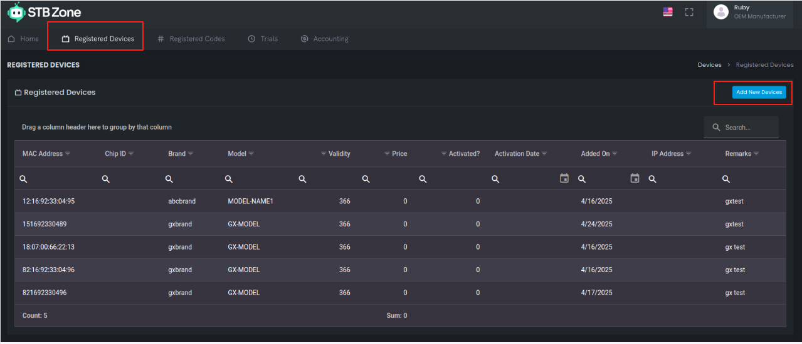
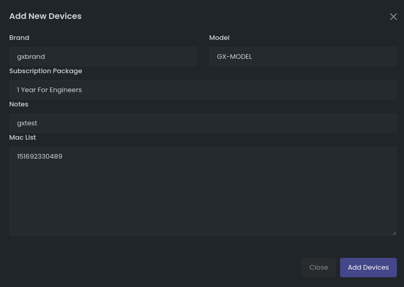

# Subtitle Translation 功能账号激活指南

## 概述

当前Subtitle Translation 功能中，服务商提供的字幕翻译服务的启用依赖于设备账号激活机制。每台接入服务器的设备，均需完成账号激活流程方可使用服务。账号与设备硬件信息深度绑定，通过锁定本机 MAC 地址与 ChipSN 地址，实现设备身份的唯一性识别与精准管理。

账号激活体系包含两种模式：

1. 正式账号模式则面向终端运营商，满足商业运营场景下的稳定使用需求和服务器上收费需求，具体流程这边不展开描述。

2. 开发账号模式专为开发阶段设计，支持内部开发验证与功能调试。目前公版软件使用的都是开发账号模式，服务商为GX分配专用OEM分组，和账号注册网站。工程师可在该网站上自行增加需调试激活的设备账号，每一个开发账号激活后，有7天免费使用时间，超过7天后需要重新进行申请。

另外未激活过的账号，服务器厂家目前默认提供一天有效期方便工厂产线测试使用。

## 开发账号激活步骤

在国芯的公版方案中， ChipSN数据由软件内部自动读取芯片ChipSN数据，但是MAC地址目前由软件自定义的。后续由具体厂家使用时自行设计MAC地址进行维护。

目前测试账号模式，需要提供本机MAC地址去网站激活。测试账号激活网站地址：https://manage.stbzone.com/，登录信息请找先关负责人提供。

网站登录后，进入Registered Deviece中，进行设备账号激活。

点击右上红框中Add  New Devieces， 出现如下页面：

GX的内部测试账号，以下信息中前三条必须按指定信息填写：

- Brand： 填写gxbrand
- Model： 填写GX-MODEL
- Subscription Packeage：选择 1 Year for Engineers
- Notes：可忽略
- Mac List： 填写本次需要激活的设备的MAC地址，可一次填写一个，或者多个，多个账号时一行一个。

填写完整后，点击Add Devices后，即账号添加激活成功。之后可以在Registered Deviece list中，查看到添加的账号信息。带激活过账号的设备，即可成功在设备的Subtitle Translation界面执行Activate，获得成功激活的信息了。

## 其他说明

1.  https://manage.stbzone.com/登录网站，有时候会出现账号不成功的情况， 可以多尝试几次，或者更换浏览器或者过段时间登录进行尝试。由于这个网站使用google的服务，最好翻墙访问。

## 修订记录

| 作者    |    日期    |  版本  |        备注         |
| :------ | :--------: | :----: | :-----------------: |
| zhangmq | 2025-05-09 | V1.0.0 | 基于SDK_V2.10.0版本 |

